<div style="text-align: center">


<h3>Universidad Peruana de Ciencias Aplicadas</h3>

<h4>Ingeniería de Software</h4>

<h5>2025-20</h5>

<h5>1ASI0572 - Desarrollo de Soluciones IOT</h5>

<h5>NRC: 3320</h5>

<h5>Profesor: Marco Antonio Leon Baca</h5>

<h5>"Informe de Trabajo Final"<h5>

<h5>Startup: Tunix</h5>

<h5>Producto: FarmGuard</h5>

</div>

## Team Members 

<div>

<table>
  <thead>
    <tr>
      <th>Código</th>
      <th>Apellidos y Nombres</th>
    </tr>
  </thead>
  <tbody>
    <tr><td>u202019128</td><td>Zarate Castro Jose Daniel</td></tr>
    <tr><td>u20211f984</td><td>Morales Quispe Brayan Smith</td></tr>
    <tr><td>u202014115</td><td>Garayar Mori Oscar Nathaniel</td></tr>
    <tr><td>u202022365</td><td>Jara Benites Quique Vladimir</td></tr>
    <tr><td>u202315945</td><td>Ochoa Colonio Carlos Alberto</td></tr>
  </tbody>
</table>

</div>

<div style="text-align: center">
  <h5>Noviembre, 2025</h5>
</div>

<div style="page-break-after: always;"></div>

### Registro de Informe

| Versión | Fecha | Autor(es) | Descripción de modificación |
| :--- | :--- | :--- | :--- |
| 0.1 | 04/04/25 | Zarate Castro Jose Daniel | Redacción del Perfil Inicial |
| 0.2 | 06/04/25 | Brayan smith morales quispe | Proceso Lean UX, Mapeo de Eventos, Recolección de Testimonios, Contextos Delimitados |
| 0.3 | 09/04/25 | Oscar nathaniel garayar mori | Modelo C4, Encuesta Inicial |
| 0.4 | 10/04/25 | Jara Benites Quique Vladimir | Perfil de Startup, Perfil de Solución, Entrevistas, Mapeo de Impacto, Cartografía de Contexto |
| 0.5 | 11/04/25 | Carlos Alberto Ochoa Colonio | Precisión del Context Mapping, Reconocimiento de Ámbitos Delimitados |
| 0.6 | 12/04/25 | Zarate Castro Jose Daniel | Ajustes en el Impact Mapping, Primeros Casos de Uso |
| 0.7 | 14/04/25 | Brayan smith morales quispe | Ajuste de Hipótesis UX, Preparación de Cuestionarios |
| 0.9 | 20/04/25 | Oscar nathaniel garayar mori | Escenario As-Is, Elaboración de Mapas de Empatía |
| 1.0 | 22/04/25 | Jara Benites Quique Vladimir | Versión final de TB1 |
| 1.1 | 12/09/25 | Carlos Alberto Ochoa Colonio | Elaboración de User Journey Mapping y actualización de User Task Matrix |
| 1.4 | 23/09/25 | Zarate Castro Jose Daniel | Desarrollo de User Stories priorizadas con sus respectivos criterios de aceptación |
| 1.5 | 25/09/25 | Brayan smith morales quispe | Definición estructurada del Product Backlog y priorización mediante MoSCoW |
| 2.0 | 28/09/25 | Oscar nathaniel garayar mori | Finalización de TP1 |
| 2.1 | 02/10/24 | Jara Benites Quique Vladimir | Sprint Planning 1: Preparación del entorno y gestión de tareas |
| 2.2 | 08/10/24 | Carlos Alberto Ochoa Colonio | Implementación de Landing Page, secciones esenciales y pruebas de usabilidad |
| 2.3 | 11/10/24 | Zarate Castro Jose Daniel | Configuración del entorno de desarrollo, gestión de código fuente |
| 2.4 | 14/10/24 | Brayan smith morales quispe | Revisión del Sprint 1, evidencias y pruebas de accesibilidad |
| 2.5 | 16/10/24 | Oscar nathaniel garayar mori | Despliegue de Landing Page y preparación para Sprint 2 |
| 2.6 | 20/10/24 | Jara Benites Quique Vladimir | Sprint Planning 2: Definición de REST Endpoints y configuración UI |
| 2.7 | 23/10/24 | Carlos Alberto Ochoa Colonio | Integración de componentes UI y gestión de grupos |
| 3.0 | 24/10/24 | Zarate Castro Jose Daniel | Finalización de TB2: Implementación de funcionalidades clave de gestión de usuarios y cuentas |


### Project Report Collaboration Insights

**URL del repositorio para el reporte del proyecto:** [Link GitHub](https://github.com/upc-pre-202502-1ASI0572-3320-Tunix/FarmGuard-Unix-Report)

**Link de los repositorios de la oraganización:** [Link GitHub](https://github.com/orgs/upc-pre-202502-1ASI0572-3320-Tunix/repositories)

**TB1**

En esta primera entrega (TB1), el objetivo principal fue ...

| Integrante                        |Tarea|
| ----------------------------------|-----|
| Zarate Castro Jose Daniel         | Bounded Context Subscription & Billing (GENERIC) y Notifications (GENERIC) | 
| Brayan Smith Morales Quispe       | Bounded Context Animal Management (CORE) |
| Oscar Nathaniel Garayar Mori      | Bounded Context IoT Monitoring & Analysis (CORE)|
| Jara Benites Quique Vladimir      | Bounded Context Identity & Access Management (SUPPORTING) y Profile (SUPPORTING)|
| Carlos Alberto Ochoa Colonio      | Entrevistas y validación de dominio|


Este gráfico muestra la cantidad de commits realizados por cada integrante durante el desarrollo del TB1 Tunix.

Estas evidencias reflejan una colaboración equilibrada y efectiva, con cada miembro aportando de manera significativa al avance y desarrollo de la solución.

**TP**

En esta primera entrega (TB1), el objetivo principal fue ...

| Integrante                        |Tarea|
| ----------------------------------|-----|
| Zarate Castro Jose Daniel         | Desarrollo del landing Page | 
| Brayan Smith Morales Quispe       | Capitulo 5 |
| Oscar Nathaniel Garayar Mori      |Diseño Mobile|
| Jara Benites Quique Vladimir      | Capitulo 6|
| Carlos Alberto Ochoa Colonio      | Diseño web|


# Contenido

## Tabla de Contenidos

### Capítulo I: Introducción
- [1.1 Startup Profile](#11-startup-profile)  
  - [1.1.1 Descripción de la Startup](#111-descripción-de-la-startup)  
  - [1.1.2 Perfiles de integrantes del equipo](#112-perfiles-de-integrantes-del-equipo)  
- [1.2 Solution Profile](#12-solution-profile)  
  - [1.2.1 Antecedentes y problemática](#121-antecedentes-y-problemática)  
  - [1.2.2 Lean UX Process](#122-lean-ux-process)  
    - [1.2.2.1 Lean UX Problem Statements](#1221-lean-ux-problem-statements)  
    - [1.2.2.2 Lean UX Assumptions](#1222-lean-ux-assumptions)  
    - [1.2.2.3 Lean UX Hypothesis Statements](#1223-lean-ux-hypothesis-statements)  
    - [1.2.2.4 Lean UX Canvas](#1224-lean-ux-canvas)  
- [1.3 Segmentos Objetivo](#13-segmentos-objetivo)

### Capítulo II: Requirements Elicitation & Analysis
- [2.1 Competidores](#21-competidores)  
  - [2.1.1 Análisis competitivo](#211-análisis-competitivo)  
  - [2.1.2 Estrategias y tácticas frente a competidores](#212-estrategias-y-tácticas-frente-a-competidores)  
- [2.2 Entrevistas](#22-entrevistas)  
  - [2.2.1 Diseño de entrevistas](#221-diseño-de-entrevistas)  
  - [2.2.2 Registro de entrevistas](#222-registro-de-entrevistas)  
  - [2.2.3 Análisis de entrevistas](#223-análisis-de-entrevistas)  
- [2.3 Needfinding](#23-needfinding)  
  - [2.3.1 User Personas](#231-user-personas)  
  - [2.3.2 User Task Matrix](#232-user-task-matrix)  
  - [2.3.3 User Journey Mapping](#233-user-journey-mapping)  
  - [2.3.4 Empathy Mapping](#234-empathy-mapping)  
  - [2.3.5 As-is Scenario Mapping](#235-as-is-scenario-mapping)  
- [2.4 Big Picture EventStorming](#24-big-picture-eventstorming)  
- [2.5 Ubiquitous Language](#25-ubiquitous-language)

### Capítulo III: Requirements Specification
- [3.1 To-Be Scenario Mapping](#31-to-be-scenario-mapping)  
- [3.2 User Stories](#32-user-stories)  
- [3.3 Impact Mapping](#33-impact-mapping)  
- [3.4 Product Backlog](#34-product-backlog)

#### [Capítulo IV: Solution Software Design](#solution-software-design)
  - [4.1 Strategic-Level Domain-Driven Design](#strategic-level-domain-driven-design)
    - [4.1.1 EventStorming](#eventstorming)
      - [4.1.1.1 Candidate Context Discovery](#candidate-context-discovery)
      - [4.1.1.2 Domain Message Flows Modeling](#domain-message-flows-modeling)
      - [4.1.1.3 Bounded Context Canvases](#bounded-context-canvases)
    - [4.1.2 Context Mapping](#context-mapping)
    - [4.1.3 Software Architecture](#software-architecture)
      - [4.1.3.1 System Landscape Diagram](#system-landscape-diagram)
      - [4.1.3.2 Context Level Diagrams](#context-level-diagrams)
      - [4.1.3.3 Container Level Diagrams](#container-level-diagrams)
      - [4.1.3.4 Deployment Diagrams](#deployment-diagrams)
  - [4.2 Tactical-Level Domain-Driven Design](#tactical-level-domain-driven-design)
    - [4.2.1 Bounded Context: Nombre del Contexto](#bounded-context-nombre-del-contexto)
      - [4.2.1.1 Domain Layer](#domain-layer)
      - [4.2.1.2 Interface Layer](#interface-layer)
      - [4.2.1.3 Application Layer](#application-layer)
      - [4.2.1.4 Infrastructure Layer](#infrastructure-layer)
      - [4.2.1.5 Component Level Diagrams](#component-level-diagrams)
      - [4.2.1.6 Code Level Diagrams](#code-level-diagrams)
        - [4.2.1.6.1 Domain Layer Class Diagrams](#domain-layer-class-diagrams)
        - [4.2.1.6.2 Database Design Diagram](#database-design-diagram)

### Capítulo V: Solution UI/UX Design

- [5.1 Style Guidelines](#51-style-guidelines)  
  - [5.1.1 General Style Guidelines](#511-general-style-guidelines)  
  - [5.1.2 Web, Mobile and IoT Style Guidelines](#512-web-mobile-and-iot-style-guidelines)  

- [5.2 Information Architecture](#52-information-architecture)  
  - [5.2.1 Organization Systems](#521-organization-systems)  
  - [5.2.2 Labeling Systems](#522-labeling-systems)  
  - [5.2.3 SEO Tags and Meta Tags](#523-seo-tags-and-meta-tags)  
  - [5.2.4 Searching Systems](#524-searching-systems)  
  - [5.2.5 Navigation Systems](#525-navigation-systems)  

- [5.3 Landing Page UI Design](#53-landing-page-ui-design)  
  - [5.3.1 Wireframe](#531-wireframe)  
  - [5.3.2 Mock-up](#532-mock-up)  

- [5.4 Applications UX/UI Design](#54-applications-uxui-design)  
  - [5.4.1 Wireframes](#541-wireframes)  
  - [5.4.2 Wireflow Diagrams](#542-wireflow-diagrams)  
  - [5.4.3 Mock-ups](#543-mock-ups)  
  - [5.4.4 User Flow Diagrams](#544-user-flow-diagrams)  

- [5.5 Applications Prototyping](#55-applications-prototyping)  


### Capítulo VI: Product Implementation, Validation & Deployment

- [6.1 Software Configuration Management](#61-software-configuration-management)  
  - [6.1.1 Development Environment Configuration](#611-development-environment-configuration)  
  - [6.1.2 Source Code Management](#612-source-code-management)  
  - [6.1.3 Code Style Guide & Conventions](#613-code-style-guide--conventions)  
  - [6.1.4 Deployment Configuration](#614-deployment-configuration)  

- [6.2 Landing Page, Services & Applications Implementation](#62-landing-page-services--applications-implementation)  
  - [6.2.1 Sprint 1](#621-sprint-1)  
    - [6.2.1.1 Sprint Planning 1](#6211-sprint-planning-1)  
    - [6.2.1.2 Aspect Leaders and Collaborators](#6212-aspect-leaders-and-collaborators)  
    - [6.2.1.3 Sprint Backlog 1](#6213-sprint-backlog-1)  
    - [6.2.1.4 Development Evidence](#6214-development-evidence)  
    - [6.2.1.5 Testing Suite Evidence](#6215-testing-suite-evidence)  
    - [6.2.1.6 Execution Evidence](#6216-execution-evidence)  
    - [6.2.1.7 Services Documentation Evidence](#6217-services-documentation-evidence)  
    - [6.2.1.8 Software Deployment Evidence](#6218-software-deployment-evidence)  
    - [6.2.1.9 Team Collaboration Insights](#6219-team-collaboration-insights)   
  - [6.2.2 Sprint 2](#622-sprint-2)  
    - [6.2.2.1 Sprint Planning 2](#6221-sprint-planning-2)  
    - [6.2.2.2 Sprint Backlog 2](#6222-sprint-backlog-2)  
    - [6.2.2.3 Development Evidence](#6223-development-evidence)  
    - [6.2.2.4 Testing Suite Evidence](#6224-testing-suite-evidence)  
    - [6.2.2.5 Execution Evidence](#6225-execution-evidence)  
    - [6.2.2.6 Services Documentation Evidence](#6226-services-documentation-evidence)  
    - [6.2.2.7 Software Deployment Evidence](#6227-software-deployment-evidence)  
    - [6.2.2.8 Team Collaboration Insights](#6228-team-collaboration-insights)  
  - [6.2.3 Sprint 3](#623-sprint-3)  
    - [6.2.3.1 Sprint Planning 3](#6231-sprint-planning-3)  
    - [6.2.3.2 Sprint Backlog 3](#6232-sprint-backlog-3)  
    - [6.2.3.3 Development Evidence](#6233-development-evidence)  
    - [6.2.3.4 Testing Suite Evidence](#6234-testing-suite-evidence)  
    - [6.2.3.5 Execution Evidence](#6235-execution-evidence)  
    - [6.2.3.6 Services Documentation Evidence](#6236-services-documentation-evidence)  
    - [6.2.3.7 Software Deployment Evidence](#6237-software-deployment-evidence)  
    - [6.2.3.8 Team Collaboration Insights](#6238-team-collaboration-insights)  
- [6.3 Validation Interviews](#63-validation-interviews)  
  - [6.3.1 Diseño de Entrevistas](#631-diseño-de-entrevistas)  
  - [6.3.2 Evaluaciones según heurísticas](#632-evaluaciones-según-heurísticas)  
- [6.4 Video About-the-Product](#64-video-about-the-product)  
- [6.5 Aspect Leaders and Collaborators](#65-aspect-leaders-and-collaborators)

### [Anexos](#anexos)

#### [Conclusiones y Recomendaciones](#conclusiones-y-recomendaciones)
  - [Conclusiones del Proyecto](#conclusiones-del-proyecto)
  - [Recomendaciones para trabajos futuros](#recomendaciones-para-trabajos-futuros)
  - [Video About-the-Team](#video-about-the-team)

# Student Outcome 

<table>
  <thead>
    <tr>
        <th>Criterio especifico</th>
        <th>Acciones realizadas</th>
        <th>Conclusiones</th>
    </tr>
  </thead>
  <tbody>
  <tr>
      <td><strong>Trabaja en equipo para 
      proporcionar liderazgo en 
      forma conjunta</strong></td>
      <td>
      <h6><strong>Brayan Smith Morales Quispe</strong></h6>
      TB1:<p>Ayude a organizar y repartir temas a  cada miembro del equipo aparte q ayude cualquier duda de mis compañeros respecto al trabajo.</p>
      TP:<p>Colideró la organización y reparto de tareas (BCs), dio soporte a dudas del equipo y mantuvo la coordinación para cumplir los objetivos del TB1.</p>
    TF:<p>Lideró el desarrollo de la aplicación móvil (Flutter) y la integración final con la nube. Coordinó con el equipo de backend para asegurar que los datos procesados en la capa Edge se visualizaran correctamente en los dispositivos móviles.</p>
      <h6><strong>Jose Daniel Zarate Castro</strong></h6>
      TB1:<p>Apoyé a mi equipo colaborando en las tareas y dando mi ayuda cuando fue necesario para que avanzáramos juntos en los objetivos.</p>
      TP:<p>Colaboró activamente en tareas del equipo y brindó apoyo puntual para mantener el avance conjunto y la responsabilidad distribuida.</p>
TF: <p>Asumió el liderazgo técnico en la lógica de Edge Computing, diseñando los algoritmos de filtrado de datos en el firmware del ESP32 para optimizar el envío de información al backend, guiando al equipo en la gestión de datos</p>
      <h6><strong>Quique Vladimir Jara Benites</strong></h6>
      TB1:<p>Coordiné la distribución de tareas entre los miembros del equipo, promoví la participación activa y resolví dudas técnicas para asegurar el avance conjunto hacia los objetivos del proyecto.</p>
      TP:<p>Coordinó la distribución de tareas, impulsó la participación y resolvió dudas técnicas para sostener el ritmo del equipo.</p>
TF: <p>Dirigió la implementación de la infraestructura en la nube y el despliegue de los servicios (CI/CD). Lideró la configuración de las alertas críticas locales en el dispositivo, asegurando la sincronización entre hardware y software</p>
      <h6><strong>Oscar Nathaniel Garayar Mori</strong></h6>
      TB1:<p>Ejercí liderazgo compartido coordinando con mis compañeros la ejecución de las tareas, resolviendo dudas técnicas cuando fue necesario y motivando al equipo para mantener el ritmo de trabajo. Participé activamente en la toma de decisiones y aseguré que todos los integrantes pudieran aportar al cumplimiento de los objetivos del proyecto</p>
      TP:<p>Coordinó la ejecución, resolvió dudas técnicas y motivó al equipo; participó en decisiones y sostuvo la responsabilidad distribuida.</p>
TF: <p>Ejerció el liderazgo en el ensamblaje del hardware físico y la calibración de sensores. Tomó decisiones clave sobre la arquitectura física del prototipo IoT y resolvió problemas de conectividad eléctrica junto al equipo</p>

<h6><strong>Carlos Alberto Ochoa Colonio</strong></h6>
  <p><strong>TB1:</strong> Lideré la investigación de soluciones tecnológicas similares, aportando información clave para la toma de decisiones del equipo respecto al enfoque del sistema.</p>
  <p><strong>TP:</strong> Coordiné la documentación de los casos de uso, asegurando que los flujos representaran correctamente los procesos definidos por el equipo y fortaleciendo la visión técnica compartida.</p>
  <p><strong>TB2:</strong> Colideró el diseño de la WebApp y apoyó en la definición de los flujos de usuario y el guion para las entrevistas de validación (Sección 6.3), aportando a la visión conjunta del producto final.</p>
      </td>
      <td>
      TB1: El equipo mostró liderazgo compartido al dividir BCs, resolver dudas técnicas y sostener el ritmo de trabajo; las decisiones se tomaron de forma coordinada y con responsabilidad distribuida. <p>
      <br>
      TP: Se ejerció liderazgo compartido al dividir BCs, resolver dudas técnicas y mantener el ritmo; decisiones coordinadas con responsabilidad distribuida<p>
      <br>
      TB2: El liderazgo conjunto fue crucial para la integración de los componentes (Frontend, Backend, DB). Cada miembro lideró su aspecto técnico (IoT, web, DevOps), resolviendo dependencias y tomando decisiones colectivas para asegurar la funcionalidad del prototipo validado en las entrevistas.
<br>
TF: Lideró la fase de validación con usuarios y la refactorización de la interfaz web basada en el feedback recibido. Organizó la documentación final y aseguró que la visión del producto se mantuviera coherente en la presentación final
      </td>

  </tr>
   <tr>
      <td><strong>Crea un entorno colaborativo e 
      inclusivo, establece metas, planifica tareas 
      y cumple objetivos </strong></td>
      <td>
      <h6><strong>Brayan Smith Morales Quispe</strong></h6>
      TB1:<p>Como grupo nos establecimos metas claras hacia donde va nuestro trabajo, la planificacion considero que fue regular puesto que no todo el equipo tiene el tiempo para realizar juntas mas seguidas.</p>
      TP:<p>Participó en la definición de metas y en la planificación básica; favoreció un ambiente inclusivo pese a la limitada frecuencia de reuniones y aportó al cierre de entregables</p>
TF:<p>Lideró el desarrollo de la aplicación móvil (Flutter) y la integración final con la nube. Coordinó con el equipo de backend para asegurar que los datos procesados en la capa Edge se visualizaran correctamente en los dispositivos móviles.</p>
      <h6><strong>Jose Daniel Zarate Castro</strong></h6>
      TB1:<p>Colaboré con mis compañeros creando un buen ambiente de trabajo, ayudando a entender el tema, organizando las tareas y apoyando para que logremos las metas propuestas.</p>
      TP:<p>Contribuyó a un clima de trabajo positivo, ayudó a comprender el tema y a organizar tareas para alcanzar las metas</p>
TF: <p>Asumió el liderazgo técnico en la lógica de Edge Computing, diseñando los algoritmos de filtrado de datos en el firmware del ESP32 para optimizar el envío de información al backend, guiando al equipo en la gestión de datos</p>
      <h6><strong>Quique Vladimir Jara Benites</strong></h6>
      TB1:<p>Fomenté un ambiente colaborativo e inclusivo, ayudando a definir metas claras y participando en la planificación de tareas. Contribuí activamente al cumplimiento de los objetivos del equipo, asegurando que todos los miembros pudieran aportar y avanzar juntos. </p>
      TP:<p>Ayudó a fijar metas claras, participó en la planificación y aseguró la contribución de todos para cumplir los objetivos</p>
TF: <p>Dirigió la implementación de la infraestructura en la nube y el despliegue de los servicios (CI/CD). Lideró la configuración de las alertas críticas locales en el dispositivo, asegurando la sincronización entre hardware y software</p>
      <h6><strong>Oscar Nathaniel Garayar Mori</strong></h6>
      TB1:<p>Apoyé en la definición de metas claras junto con el equipo, proponiendo una planificación realista de las tareas. Contribuí a organizar las actividades de manera que cada miembro tuviera claridad en sus responsabilidades y el tiempo necesario para cumplirlas, fomentando un ambiente inclusivo y colaborativo</p>
      TP:<p>Propuso planificación realista, clarificó responsabilidades y fomentó la inclusión para cumplir con los entregables</p>
TF: <p>Ejerció el liderazgo en el ensamblaje del hardware físico y la calibración de sensores. Tomó decisiones clave sobre la arquitectura física del prototipo IoT y resolvió problemas de conectividad eléctrica junto al equipo</p>
<h6><strong>Carlos Alberto Ochoa Colonio</strong></h6>
  <p><strong>TB1:</strong> Participé en la definición de los objetivos iniciales y en la estructuración del plan de trabajo, asegurando que las tareas estuvieran alineadas con la visión general del equipo.</p>
  <p><strong>TP:</strong> Brindé soporte en la gestión del avance del proyecto, reforzando la planificación y ayudando a cumplir los plazos establecidos en la entrega parcial.</p>
  <p><strong>TB2:</strong> Colaboró en la planificación y ejecución de las entrevistas de validación (Sección 6.3.2) y en el establecimiento de metas para el Sprint 2, ayudando a cumplir los objetivos de diseño y usabilidad de la WebApp.</p>
      </td>
      <td>
      TB1:Se establecieron metas y planificación básica; aunque el tiempo de reuniones fue limitado, se mantuvo un entorno inclusivo y se cumplieron entregables del TB1 con contribución de todos.<p>
      <br>
      TP: Se establecieron metas y una planificación básica; aunque el tiempo de reuniones fue limitado, se sostuvo un entorno inclusivo y se cumplieron los entregables<p>
      <br>
      TB2: Se consolidó el entorno colaborativo mediante la ejecución de Sprints (Sprint 2) y la realización de entrevistas de validación (Sección 6.3). La planificación de tareas fue más precisa, permitiendo al equipo cumplir con las metas de implementación del prototipo funcional y la recolección de feedback directo de los usuarios.
<br>
TF: Lideró la fase de validación con usuarios y la refactorización de la interfaz web basada en el feedback recibido. Organizó la documentación final y aseguró que la visión del producto se mantuviera coherente en la presentación final
      </td>
  </tr>

  </tbody>
</table>

# Capítulo I: Introducción  

## 1.1 Startup Profile  

### 1.1.1 Descripción de la Startup  

**Nombre de la startup:** Tunix

**Producto:** FarmGuard

**Sector:** Ganadería y Veterinaria

**Descripción:**

Somos Tunix, una startup universitaria que busca transformar la manera en que los ganaderos y veterinarios gestionan la salud y el bienestar de los animales. A través de soluciones tecnológicas innovadoras, ofrecemos herramientas que permiten un control eficiente y en tiempo real del estado de los animales, sus historiales médicos y tratamientos.

Nuestra propuesta se apoya en tecnologías emergentes como el Internet de las Cosas (IoT), que facilitan el monitoreo continuo, la automatización de procesos y la generación de alertas preventivas. Esto no solo optimiza la productividad y reduce costos, sino que también garantiza el cumplimiento de estándares de calidad y bienestar animal.

FarmGuard se posiciona como una solución integral, accesible y centrada en el usuario, diseñada para satisfacer las necesidades específicas de granjas y veterinarias, promoviendo una gestión más sostenible y responsable.

### 1.1.2 Perfiles de integrantes del equipo

<table style="border-collapse: collapse; border: 1px solid #ddd;">
  <tr>
    <th colspan="2">Perfiles de integrantes del equipo</th>
  </tr>
  <tr>
    <td>
      <strong>Carlos Alberto Ochoa Colonio</strong><br>
      Soy un estudiante y actualmente me encuentro en el noveno ciclo de la carrera de ingeniería de software.
    </td>
    <td>
      
    </td>
  </tr>
  <tr>
    <td>
      <strong>Zarate Castro Jose Daniel</strong><br>
        Estudiante de Ingeniería de Software (9.º ciclo) con experiencia en análisis de datos y automatizaciones.
    </td>
    <td>
      
    </td>
  </tr>
  <tr>
    <td>
      <strong>Garayar Mori Oscar Nathaniel</strong><br>
      Soy un estudiante y actualmente me encuentro en el noveno ciclo de la carrera de ingeniería de software.
    </td>
    <td>
      
    </td>
  </tr>
  <tr>
    <td>
      <strong>Jara Benites Quique Vladimir</strong>
        Estudiante de octavo ciclo de la carrera Ingeniería de Software, tengo conocimientos técnicos en Java, Js y python. Asimismo, para el desarrollo en equipo, cuento con habilidades como participación comunicativa, creatividad, resolución de problemas, adaptabilidad y toma de decisiones
    </td>
    <td>
     
    </td>
  </tr>
  <tr>
    <td>
      <strong>Brayan Smith Morales Quispe</strong><br>
      Soy estudiante de ingeniería de software de la upc 8.º ciclo que le gusta el desarrollo web, desarrollo de videojuegos y aplicaciones moviles.
    </td>
    <td>
      
    </td>
  </tr>
</table>

## 1.2 Solution Profile  

### 1.2.1 Antecedentes y problemática

### Descripción de la problemática
Nuestro software está enfocado en el sector veterinario y ganadero, este busca facilitar el control de estado de los animales en los diferentes rubros mencionados, evitar el riesgo de perder información crítica, duplicar información u omitir tratamientos, lo que puede provocar problemas de salud en los animales y generando perdidas económicas.

#### Técnica de las 5 ‘W’s y 2 ‘H’s

#### What?

**¿Cuál es el problema?**

El problema identificado es la falta de un sistema que permita llevar un control total y en tiempo real de la salud de los animales. Esto provoca dificulta el seguimiento preciso del estado de cada animal, historial de vacunas y tratamientos médicos. Como resultado, los ganaderos y veterinarios enfrentan riesgos como la duplicación de información, administración de tratamientos incorrectos o innecesarios y la omisión de tratamientos especiales, lo que compromete la salud de los animales


#### When?

**¿Cuándo sucede el problema?**

Sucede al momento que una veterinaria o granja requiere monitorear una cantidad grande o selecta de animales, sin tener que recurrir a documentos físicos o digitales que hacen el monitoreo más lento y menos eficaz.  


#### Where?


**¿Dónde surge el problema?**

El problema surge en granjas y veterinarias que manejan múltiples registros de animales y carecen de un sistema adecuado para gestionarlos de manera eficiente.

#### Who?

**¿Quiénes están involucrados?**

Los principales afectados son los dueños de granjas o veterinarios que manejan multiples registros de animales sobre su estado de salud en tiempo real.


#### Why?

**¿Cuál es la causa del problema?**

La causa del problema está en la complejidad de gestionar múltiples registros y monitorear a un gran número de animales en diferentes granjas y veterinarias. Esto dificulta mantener un control preciso y actualizado del estado de salud de cada animal, lo que es esencial para garantizar su bienestar.

#### How?

**¿Cómo se lleva a cabo los hechos?**

Los hechos se desarrollan cuando se utilizan diferentes métodos desconectados entre si, como registros en papel, hojas de cálculo o software no integrado, para gestionar la información de los animales en granjas y veterinarias. Esta falta de integración provoca que los datos estén dispersos y no se comuniquen entre sí, lo que complica mantener un control preciso y actualizado del estado de salud de cada animal.

#### How much?

**¿Cuál es la magnitud del problema?**
 

La magnitud del problema es grande, ya que afecta a la capacidad de las granjas y/o veterinarias para llevar un control sobre la salud de los animales. Que trae como consecuencia la baja salud de los animales, reducción de productividad, incrementos de los costos, cumplimientos regulatorios de cada pais.


### 1.2.2 Lean UX Process  

#### 1.2.2.1  Lean UX Problem Statements

Nuestro entorno evidencia problemas graves al llevar un registro de salud y monitoreo, sobre los animales que son parte de nuestra vida diaria como los domésticos atendidos en veterinarias y los de granjas.

Hemos observado un factor crítico que afecta al control de la salud de los animales, el cual puede perjudicar tanto a los animales domésticos atendidos en veterinarias como animales de granjas. 

**¿Cómo pueden las veterinarias y granjas llevar a cabo un monitoreo y registro de salud adecuados y eficientes de los animales?**


#### 1.2.2.2  Lean UX Assumptions

### Business Assumptions
* Los usuarios necesitan una aplicación del control de estado de una granja, que destaque por su seguridad y soporte técnico continuo.
* La principal necesidad de mis clientes es gestionar de manera eficaz y óptima los distintos procesos que se requieren para mantener una granja.
* La aplicación será redituable gracias a que existirá una membresía que mejora los tiempos de respuesta de soporte técnico y el acceso a la totalidad de las funciones de la aplicación sin ninguna restricción.
* A través de distintas estrategias de marketing obtendré distintos usuarios dispuestos a utilizar la aplicación.
* La aplicación será fácil de utilizar para los usuarios ya que integrará una interfaz intuitiva y agradable a la vista.
### User Assumptions
* Los usuarios aceptarán compartir cierta cantidad de información fundamental para el correcto control de la granja dentro de la aplicación. 
* Los usuarios pagarán una membresía que mejora la experiencia en la aplicación al desbloquear todas las funciones disponibles.
* Los usuarios más fieles tendrán la oportunidad de acceder a nuevas funciones antes de ser publicadas en las versiones oficiales de la aplicación.
* Los usuarios entregarán su confianza a la aplicación para poder aprovecharla al máximo, utilizando las distintas características para la gestión segura, eficaz y óptima de sus granjas.

#### 1.2.2.3  Lean UX Hypothesis Statements

* Si le ofrecemos una plataforma de control y gestión de granjas a usuarios del sector interesados, podemos tener un grupo inicial de usuarios para poder experimentar nuevas funciones y brindarles beneficios exclusivos para fortalecer la fidelidad entre el usuario y nuestra startup.
* Si la membresía que ofrecemos contiene beneficios interesantes y atractivos, los usuarios accedarán a pagar la mensualidad a cambio de disfrutar de las funciones exclusivas.
* Si las decisiones de marketing son correctas, apropiadas y enfocadas en el sector correcto, el aumento de registros en la aplicación será mucho mayor a la prevista.
* Si la startup garantiza que la información de los usuarios estará encriptada y segura, la fidelidad de los usuarios aumentará. Como consecuencia, la aplicación adquirirá una reputación positiva. 


#### 1.2.2.4  Lean UX Canvas


## 1.3 Segmentos objetivo 

El primer segmento objetivo en el que la aplicación va a enfocarse es en productos agropecuarios dispuestos a gestionar sus granjas utilizando la aplicación de nuestra startup.

De la Encuesta Nacional Agropecuaria realizada en 2022 por el INEI a 32992 unidades agropecuarias, se conoce que el 59,8% es menor a 60 años, dando un margen importante de granjeros que posiblemente poseen conocimiento de las cualidades de los diversos dispositivos tecnológicos en la actualidad y tenga el interés de trasladar sus gestiones a medios digitales. De este grupo, el 6,6% de los productos agropecuarios especializados han recibido capacitación, por lo que la aplicación también puede servir como herramienta de aprendizaje para los productores interesados en aprender más tópicos fundamentales acerca de la gestión y control de crianza de animales.

El segundo segmento objetivo son las veterinarias de todo el país. La razón de esta elección es porque en el Perú existe un sistema deficiente del manejo de historias médicas, un documento totalmente determinante para la obtención y emisión de información de la salud de cualquier animal. En consecuencia, la desinformación en estos documentos fundamentales pueden perjudicar aún más la salud de animales que ya se encuentran padeciendo algún mal.

---

# Capítulo II: Requirements Elicitation & Analysis  

## 2.1 Competidores  

### 2.1.1 Análisis competitivo  

<table>
  <tr>
    <th colspan="7" style="vertical-align: top;"><b>Competitive Analysis Landscape</b></th>
  </tr>
  <tr>
    <td colspan="2" rowspan="2">¿Por qué llevar a cabo este análisis?</td>
    <td colspan="5">Este análisis es vital para identificar cómo tu startup puede diferenciarse en un mercado competitivo, permitiéndote ofrecer una solución más efectiva y destacada en la gestión y prevención de problemas de salud animal</td>
  </tr>
  <tr>
    <td colspan="5"></td>
  </tr>
  <tr>
    <td colspan="3">Competidores</td>
    <td colspan="1" style="vertical-align: top;" style="font-weight: bold;">
        FarmGuard
        <br>
        <div style="text-align: center; margin-top: 10px;">
                
        </div>
    <td colspan="1" style="vertical-align: top;" style="font-weight: bold;">
    FarmLogs
    <div style="text-align: center; margin-top: 20px;">
                
        </div>
    </td>
    <td colspan="1" style="vertical-align: top;" style="font-weight: bold;">
      Herdwatch
      <div style="text-align: center; margin-top: 40px;">
                
            </div>
      </td>
    <td colspan="1" style="vertical-align: top;" style="font-weight: bold;" >
      AgriWebb
      <div style="text-align: center; margin-top: 20px;">
                
            </div>
    </td>
  </tr>
  <tr>
    <td colspan="1" rowspan="2"><p>Perfil</p></td>
    <td colspan="2">Overview</td>
    <td colspan="1" style="vertical-align: top;">Tunix está enfocada en el sector veterinario y ganadero, proporcionando un software que facilita el control de la salud de los animales, evitando la pérdida de información crítica, la duplicación de datos y la omisión de tratamientos, lo que puede causar problemas de salud y pérdidas económicas.</td>
    <td colspan="1" style="vertical-align: top;">FarmLogs es una plataforma digital para la gestión agrícola, que permite a los agricultores monitorear cultivos, suelos y recursos, optimizando sus operaciones</td>
    <td colspan="1" style="vertical-align: top;">Herdwatch es una aplicación enfocada en la gestión de granjas, diseñada para rastrear la salud y productividad del ganado, cumpliendo con las regulaciones del sector</td>
    <td colspan="1" style="vertical-align: top;">AgriWebb proporciona un software de gestión de ganado con un fuerte enfoque en la trazabilidad, productividad y bienestar animal, utilizando datos en tiempo real para mejorar las decisiones agrícolas</td>
  </tr>
  <tr>
    <td colspan="2">Ventaja competitiva</td>
    <td colspan="1" style="vertical-align: top;">Nuestra solucion se destaca por su enfoque integral en la prevención y el monitoreo continuo de la salud animal, asegurando que toda la información esté centralizada y actualizada en tiempo real, lo que minimiza riesgos y optimiza la gestión</td>
    <td colspan="1" style="vertical-align: top;">Su enfoque en la gestión integral de recursos agrícolas lo convierte en una herramienta poderosa para operaciones más grandes que requieren un control total sobre sus cultivos y suelos</td>
    <td colspan="1" style="vertical-align: top;">Su mayor fortaleza es la conformidad regulatoria, permitiendo a los agricultores cumplir fácilmente con las normativas, mientras optimizan la eficiencia operativa y aseguran una trazabilidad completa del ganado</td>
    <td colspan="1" style="vertical-align: top;">Su ventaja competitiva radica en la trazabilidad y optimización de la producción, ayudando a los agricultores a maximizar la eficiencia y mejorar la salud y productividad del ganado</td>
  </tr>
  <tr>
    <td colspan="1" rowspan="2"><p>Perfil de Marketing</p></td>
    <td colspan="2">Mercado objetivo</td>
    <td colspan="1" style="vertical-align: top;">Tunix se enfoca en veterinarias y granjas que necesitan una solución efectiva para el monitoreo y control de la salud de sus animales, así como en productores agropecuarios que buscan digitalizar sus procesos.</td>
    <td colspan="1" style="vertical-align: top;">FarmLogs se dirige a grandes operaciones agrícolas y agricultores que buscan optimizar la gestión de sus cultivos y recursos agrícolas</td>
    <td colspan="1" style="vertical-align: top;">Herdwatch se enfoca en agricultores y veterinarios que requieren un sistema eficaz para el seguimiento de la salud y la productividad del ganado</td>
    <td colspan="1" style="vertical-align: top;">AgriWebb se dirige a agricultores que buscan optimizar la trazabilidad, productividad y bienestar del ganado a través de una plataforma digital.</td>
  </tr>
  <tr>
    <td colspan="2">Estrategias de marketing</td>
    <td colspan="1" style="vertical-align: top;"> La estrategia incluye campañas educativas y de capacitación, marketing digital en redes sociales, y alianzas con asociaciones del sector veterinario y ganadero</td>
    <td colspan="1" style="vertical-align: top;">FarmLogs utiliza marketing digital enfocado en contenido educativo sobre eficiencia agrícola y productividad, además de realizar alianzas con grandes distribuidores de productos agrícolas</td>
    <td colspan="1" style="vertical-align: top;">Herdwatch utiliza campañas dirigidas a través de asociaciones agrícolas y veterinarias, destacando su conformidad con normativas y su facilidad de uso</td>
    <td colspan="1" style="vertical-align: top;">AgriWebb se enfoca en marketing digital dirigido, destacando casos de éxito y la optimización de la producción como sus principales atractivos</td>
  </tr>
  <tr>
    <td colspan="1" rowspan="3"><p>Perfil de Producto</p></td>
    <td colspan="2">Productos & Servicios</td>
    <td colspan="1" style="vertical-align: top;">Ofrece un software integral para la gestión de la salud animal, con seguimiento de tratamientos, vacunaciones y monitoreo en tiempo real, junto con soporte técnico continuo y actualizaciones regulares.</td>
    <td colspan="1" style="vertical-align: top;">Ofrece una plataforma integral para el monitoreo de cultivos, gestión de suelos y recursos, incluyendo herramientas de planificación y análisis agrícola.</td>
    <td colspan="1" style="vertical-align: top;">Proporciona una aplicación que permite el registro y monitoreo del ganado, facilitando el cumplimiento de normativas y optimizando la productividad.</td>
    <td colspan="1" style="vertical-align: top;">Ofrece un software de gestión de ganado que permite a los agricultores rastrear y optimizar cada aspecto de la producción ganadera</td>
  </tr>
  <tr>
    <td colspan="2">Precios & Costos</td>
    <td colspan="1" style="vertical-align: top;">Modelo freemium con una versión básica gratuita y una membresía premium que desbloquea todas las funcionalidades avanzadas, disponible con planes mensuales o anuales.</td>
    <td colspan="1" style="vertical-align: top;">Funciona bajo un modelo de suscripción, con diferentes niveles de servicio dependiendo del tamaño de la operación agrícola y las funcionalidades requeridas.</td>
    <td colspan="1" style="vertical-align: top;">Ofrece un modelo de suscripción con diferentes planes basados en la cantidad de ganado y las necesidades específicas de la granja.</td>
    <td colspan="1" style="vertical-align: top;">Funciona bajo un modelo de suscripción, con planes que varían según la cantidad de ganado y las funcionalidades adicionales requeridas</td>
  </tr>
  <tr>
    <td colspan="2">Canales de distribución (Web y/o Móvil)</td>
    <td colspan="1" style="vertical-align: top;">La plataforma está disponible tanto en web como en dispositivos móviles, garantizando accesibilidad y monitoreo desde cualquier lugar.</td>
    <td colspan="1" style="vertical-align: top;">Disponible tanto en web como en dispositivos móviles, permitiendo a los agricultores acceder a sus datos y gestionar sus operaciones desde cualquier lugar.</td>
    <td colspan="1" style="vertical-align: top;">Disponible tanto en web como en aplicaciones móviles, lo que permite a los usuarios registrar datos y monitorear el ganado en tiempo real desde cualquier lugar.</td>
    <td colspan="1" style="vertical-align: top;">Disponible en plataformas web y móviles, asegurando que los agricultores puedan gestionar sus operaciones ganaderas en tiempo real desde cualquier dispositivo.</td>
  </tr>
  <tr>
    <td colspan="1" rowspan="5"><p>Análisis SWOT</p></td>
    <td colspan="6">Realice esto para su startup y sus competidores. Sus fortalezas deberían apoyar sus oportunidades y contribuir a lo que ustedes definen como su posible ventaja competitiva.</td>
  </tr>
  <tr>
    <td colspan="2">Fortalezas</td>
    <td colspan="1" style="vertical-align: top;">Integración total de datos en tiempo real, enfoque preventivo para evitar problemas de salud animal, y accesibilidad desde múltiples dispositivos.</td>
    <td colspan="1" style="vertical-align: top;">Su enfoque integral en la gestión de recursos agrícolas y su capacidad para ofrecer análisis avanzados hacen de FarmLogs una herramienta poderosa para grandes agricultores</td>
    <td colspan="1" style="vertical-align: top;">Su capacidad para asegurar la conformidad regulatoria y su enfoque en la trazabilidad lo hace indispensable para granjas que necesitan cumplir con estrictas normativas.</td>
    <td colspan="1" style="vertical-align: top;">Su enfoque en la trazabilidad y la optimización de la producción permite a los usuarios maximizar la eficiencia y la rentabilidad de sus operaciones ganaderas</td>
  </tr>
  <tr>
    <td colspan="2">Debilidades</td>
    <td colspan="1" style="vertical-align: top;">Falta de reconocimiento inicial en el mercado y una posible curva de aprendizaje para usuarios menos familiarizados con la tecnología</td>
    <td colspan="1" style="vertical-align: top;">Puede no ser la mejor opción para pequeñas granjas o operaciones que se centran exclusivamente en la ganadería.</td>
    <td colspan="1" style="vertical-align: top;">Puede ser menos atractivo para agricultores que buscan una solución más completa que incluya otros aspectos de la gestión agrícola</td>
    <td colspan="1" style="vertical-align: top;">Puede ser menos útil para agricultores que buscan una solución más amplia que incluya la gestión de cultivos o recursos agrícolas además del ganado</td>
  </tr>
  <tr>
    <td colspan="2">Oportunidades</td>
    <td colspan="1" style="vertical-align: top;">Creciente digitalización en el sector agropecuario y posibilidad de expansión internacional en mercados con necesidades similares</td>
    <td colspan="1" style="vertical-align: top;">Expansión en mercados internacionales con un enfoque en la agricultura de precisión y la adopción de tecnologías avanzadas</td>
    <td colspan="1" style="vertical-align: top;">Expansión en mercados donde las regulaciones son estrictas, pero la adopción tecnológica es baja, lo que crea una gran necesidad de soluciones como Herdwatch.</td>
    <td colspan="1" style="vertical-align: top;">Adopción en mercados emergentes donde la trazabilidad del ganado se está volviendo un requisito esencial, pero las herramientas tecnológicas aún son limitadas.</td>
  </tr>
  <tr>
    <td colspan="2">Amenazas</td>
    <td colspan="1" style="vertical-align: top;">Competidores que ofrecen soluciones más integradas que combinan el manejo de ganado con otras funciones agrícolas</td>
    <td colspan="1" style="vertical-align: top;">Competencia de otras plataformas de gestión agrícola que ofrecen herramientas más específicas para el manejo de ganado o integraciones más profundas con maquinaria agrícola</td>
    <td colspan="1" style="vertical-align: top;">Competidores que ofrecen soluciones más integradas que combinan el manejo de ganado con otras funciones agrícolas</td>
    <td colspan="1" style="vertical-align: top;">Competencia de soluciones más generalizadas que ofrecen una gama más amplia de funcionalidades, incluyendo la integración de cultivos y gestión de recursos.</td>
  </tr>
</table>

### 2.1.2 Estrategias y tácticas frente a competidores  

- *Diferenciación de la plataforma:* 
#### Ofrecer funcionalidades específicas para la gestión y monitoreo detallado de la salud animal, como alertas personalizadas para tratamientos y vacunas, así como integración con dispositivos de monitoreo en tiempo real. Esto permitirá a la startup destacarse frente a competidores que pueden tener un enfoque más generalista o menos especializado en ganadería.
- *Comunidad activa:* 
#### Construir y fomentar una comunidad de usuarios mediante foros en línea, grupos en redes sociales y eventos educativos. Promover la interacción entre usuarios para compartir mejores prácticas y experiencias puede mejorar la fidelidad y el compromiso, al mismo tiempo que proporciona retroalimentación valiosa para el desarrollo continuo del producto.
- *Marketing dirigido:* 
#### Implementar campañas de marketing dirigidas a productores agropecuarios específicos y veterinarios mediante la segmentación en redes sociales, publicaciones en revistas especializadas y asistencia a eventos del sector. Aprovechar los datos demográficos y las necesidades específicas del mercado objetivo para diseñar mensajes personalizados y efectivos.
- *Monetización creativa:*
#### Ofrecer un modelo de suscripción con diferentes niveles de membresía que proporcionen acceso a funciones exclusivas, soporte prioritario y capacitación adicional. Además, explorar opciones como servicios de consultoría personalizada o módulos adicionales que puedan ser adquiridos a la carta, brindando flexibilidad y valor añadido a los clientes.

## 2.2 Entrevistas  
En esta sección se han definido todas las preguntas que se plantearan en el momento de
realizar las preguntas a los diferentes segmentos objetivos

### 2.2.1 Diseño de entrevistas


#### 1. Contexto Inicial – Gestión y monitoreo de animales

**1.1** ¿Cómo gestionas actualmente la salud y el bienestar de tus animales?
→ ¿Usas herramientas específicas o métodos tradicionales? (Registros en papel, Excel, software especializado)

**1.2** ¿Qué tan frecuente realizas un seguimiento del estado de salud de tus animales?
→ ¿Qué información consideras más importante monitorear?

#### 2. Motivaciones y deseos

**2.1** ¿Qué mejoras te gustaría implementar en la gestión de tus animales?
→ (Por ejemplo: reducir costos, optimizar tratamientos, mejorar la productividad)

**2.2** ¿Qué tan importante es para ti contar con datos en tiempo real sobre tus animales?
→ ¿Por qué?

#### 3. Sentimientos y frustraciones

**3.1** ¿Te ha pasado que pierdes información crítica sobre tus animales?
→ ¿Cómo te afecta esto en tu trabajo diario?

**3.2** ¿Qué dificultades encuentras al gestionar múltiples registros de animales?
→ ¿Qué impacto tienen estas dificultades en la salud de los animales y en tu productividad?

#### 4. Presentación de la Solución – FarmGuard

**4.1** ¿Qué te parece la idea de tener un sistema que automatice el monitoreo y registro de la salud de tus animales?
→ ¿Te suena útil o innecesario para ti en este momento?

**4.2** ¿Preferirías que el sistema te ofrezca reportes simples y directos, o con gráficos interactivos y análisis predictivos? ¿Por qué?

**4.3** ¿Te interesa recibir alertas preventivas sobre posibles problemas de salud en tus animales? ¿Por qué?

#### 5. Cierre – Evaluación personal

**5.1** De acuerdo a lo visto y hablado anteriormente:
→ ¿Qué características de FarmGuard te llamaron más la atención?

**5.2** Imagina que usas FarmGuard todos los días por seis meses:
→ ¿Qué cambios crees que notarías en la gestión y productividad de tu granja o veterinaria?


### 2.2.2 Registro de entrevistas

**Segmento 1:** Sector veterinario

<table border=1>
  <tr>
    <td>
      <b>Nombres y apellidos:</b> Jeniffer Espinoza <br>
      <b>Edad: </b> 25 años <br>
      <b>Distrito:</b> El Rímac <br>
      <b>Duración:</b> 12 minutos
    </td>
    <td align=center>
      
    </td>
  </tr>
  <tr>
    <td colspan=2>
      <b>Enlace:</b> <a href="https://youtu.be/4rA6GmkG5IAI">https://youtu.be/4rA6GmkG5IA</a>
      <br>
      <b>Resumen:</b> Jennifer Espinoza, veterinaria de 25 años con cinco años de experiencia y residente en El Rímac, compartió en la entrevista los principales retos en la gestión de la salud animal en su clínica, donde actualmente se usan métodos tradicionales como Excel y fichas en papel. Señaló dificultades para detectar enfermedades en etapas tempranas, pérdidas de información crítica y problemas de productividad al manejar múltiples registros. Manifestó la necesidad de un sistema centralizado que permita reducir costos, optimizar tratamientos preventivos, contar con datos en tiempo real y recibir alertas preventivas. Considera que una plataforma IoT como la propuesta por el proyecto FarmGuard sería muy útil, ya que mejoraría la trazabilidad de medicamentos y diagnósticos, incrementaría la productividad, reduciría errores y reforzaría la confianza de los clientes en la veterinaria.
    </td>
  </tr>
</table>

<table border=1>
  <tr>
    <td>
      <b>Nombres y apellidos:</b> Gonzalo Melendez <br>
      <b>Edad: </b> 20 años <br>
      <b>Distrito:</b> Villa María del Triunfo <br>
      <b>Duración:</b> 10 minutos
    </td>
    <td align=center>
      
    </td>
  </tr>
  <tr>
    <td colspan=2>
      <b>Enlace:</b> <a href="https://youtu.be/LW4GK6DLWUY">https://youtu.be/LW4GK6DLWUY</a>
      <br>
      <b>Resumen:</b> Gonzalo Meléndez, estudiante de veterinaria de San Marcos que realiza prácticas en una clínica, explicó que actualmente la gestión de la salud animal se hace de manera tradicional, principalmente con registros en Excel y papel, lo que ocasiona pérdidas de información, duplicidad de datos y retrasos en diagnósticos. Señaló la importancia de contar con datos en tiempo real para actuar de forma preventiva y manifestó interés en optimizar tratamientos, digitalizar historiales clínicos y reducir costos. Considera que un sistema IoT como el propuesto por FarmGuard sería muy útil, ya que permitiría automatizar el monitoreo, centralizar registros, generar reportes simples y gráficos para distintos niveles de análisis, y recibir alertas preventivas. Con su implementación, espera mejoras en la eficiencia de diagnósticos, reducción de papeleo, mayor productividad y mejor gestión de la información en la clínica.
    </td>
  </tr>
</table>

<table border=1>
  <tr>
    <td>
      <b>Nombres y apellidos:</b> Daniel Aguilar <br>
      <b>Edad: </b> 22 años <br>
      <b>Distrito:</b> Surco <br>
      <b>Duración:</b> 14 minutos
    </td>
    <td align=center>
      
    </td>
  </tr>
  <tr>
    <td colspan=2>
      <b>Enlace:</b> <a href="https://youtu.be/18nHKZ1QWi4">https://youtu.be/18nHKZ1QWi4</a>
      <br>
      <b>Resumen:</b> Daniel Aguilar, asistente veterinario que complementa su experiencia con cursos de especialización, explicó que actualmente la gestión de la salud animal en su centro se realiza con métodos tradicionales como registros en papel y hojas de Excel, lo que genera desorden, pérdida de información y retrasos en la atención. Considera fundamental contar con datos en tiempo real, especialmente para animales hospitalizados, y resaltó la necesidad de organizar mejor la información, reducir tiempos y facilitar el seguimiento de los casos. Mostró gran interés en la propuesta de la plataforma FarmGuard, señalando que la automatización del monitoreo, los registros digitales y las alertas preventivas serían de gran ayuda para evitar errores y enfocarse más en la atención directa de los animales. Prefiere inicialmente reportes simples para facilitar la adaptación del personal, pero reconoce el valor futuro de gráficos y análisis predictivos. Con la implementación de la solución, espera una veterinaria más organizada, con mayor eficacia, menor pérdida de tiempo, mejor seguimiento a los clientes y mayor confianza de los dueños en el servicio.
    </td>
  </tr>
</table>

<table border=1>
  <tr>
    <td>
      <b>Nombres y apellidos:</b> Paul Lugo <br>
      <b>Edad: </b> 28 años <br>
      <b>Distrito:</b> El Rímac <br>
      <b>Duración:</b> 21 minutos
    </td>
    <td align=center>
      
    </td>
  </tr>
  <tr>
    <td colspan=2>
      <b>Enlace:</b> <a href="https://youtu.be/sYGL4oX_X6E">https://youtu.be/sYGL4oX_X6E</a>
      <br>
      <b>Resumen:</b> Paul Lugo Pérez, médico veterinario y dueño de la clínica Star Pets en El Rímac, comentó que actualmente la gestión de la salud animal en su centro se realiza de forma manual, combinando dispositivos médicos de distintos fabricantes con registros en papel o tablet, lo que genera pérdida de información, duplicidad de datos y dificultad para dar un seguimiento constante, especialmente en pacientes internados. Destacó la importancia de contar con datos en tiempo real y de centralizar la información de múltiples dispositivos en una sola plataforma, ya que la acción rápida es clave para salvar la vida de los animales. Considera que la propuesta de la plataforma FarmGuard sería de gran utilidad, sobre todo por la centralización de datos, la generación de reportes simples en tiempo real y la posibilidad de recibir alertas inmediatas sobre anomalías. Si bien no ve tan necesario el uso de alertas preventivas dentro de la clínica, reconoce su valor para pacientes monitoreados en casa. Estima que con la implementación de esta solución su veterinaria lograría mayor precisión en diagnósticos, mejor capacidad de respuesta del personal y una gestión más eficiente y confiable.
    </td>
  </tr>
</table>

**Segmento 2:** Sector ganadero

<table border=1>
  <tr>
    <td>
      <b>Nombres y apellidos:</b> Juan Calisaya <br>
      <b>Edad: </b> 23 años <br>
      <b>Distrito:</b> Villa María del Triunfo <br>
      <b>Duración:</b> 13 minutos
    </td>
    <td align=center>
      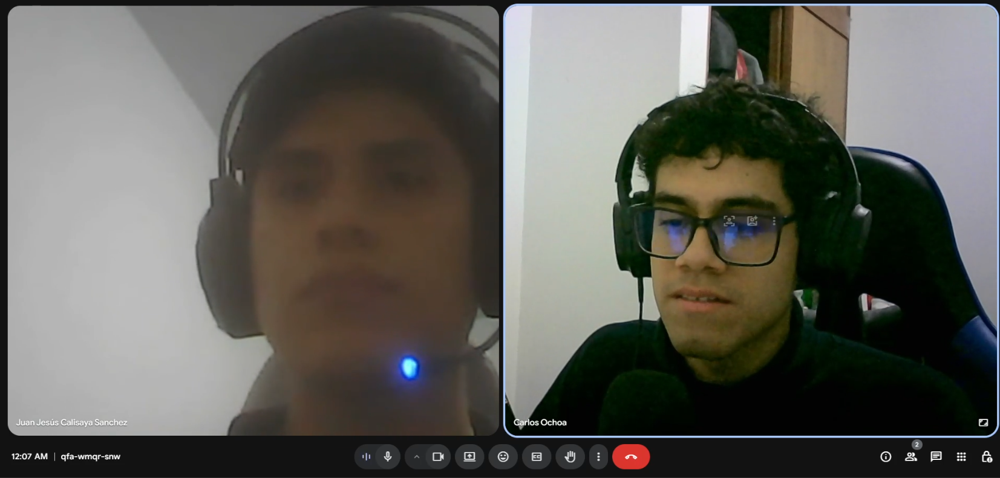
    </td>
  </tr>
  <tr>
    <td colspan=2>
      <b>Enlace:</b> <a href="https://youtu.be/_BnMEeOQpSU">https://youtu.be/_BnMEeOQpSU</a>
      <br>
      <b>Resumen:</b> Juan Calisaya, de 23 años y residente en Villa María del Triunfo, apoya en la pequeña granja de sus padres y explicó que actualmente gestiona la salud animal de forma manual, usando cuadernos para registrar vacunas, medicamentos y tratamientos. Revisa diariamente a los animales observando alimentación, peso y comportamiento, aunque reconoce que su falta de experiencia y el uso de libretas generan pérdidas de información, errores y dificultades para organizar múltiples registros, lo que impacta en su productividad y puede afectar la salud de los animales. Señaló que le gustaría mejorar la organización, reducir costos y tener un mejor control de los datos sin depender de la memoria. Considera que una plataforma IoT como FarmGuard sería muy útil, sobre todo por la centralización de información, reportes simples y alertas preventivas que lo ayudarían a reaccionar a tiempo y aprender a manejar mejor la granja. Destacó también el valor de funcionalidades como monitoreo en tiempo real y localización vía GPS para animales alejados. Estima que con esta solución lograría mayor organización, menos errores en vacunas y tratamientos, ahorro de gastos y más confianza en su labor de apoyo en la granja.
    </td>
  </tr>
</table>

Entrevista 2:


Nombres: Olga

Apellidos: Garcia

Edad: 55

Lugar de residencia: Huancayo

entrevista 3 Link: https://drive.google.com/file/d/1eYbbus1opsrqHmcKDbPyuulvNm6NzLuB/view?usp=sharing

Evidencia de la entrevista:

Resumen de la entrevista: Olga es una criadora de cuys y gallinas en la provincia de huancayo, ella tiene problemas con el monitoreo y control de sus animales puesto que usa un sistema de registro a papel con llevando perdida de informacion importante ademas considera que al haber una tecnologia en mercado que le ayudara con su trabajo haria uso de esta misma.

### 2.2.3 Análisis de entrevistas  

## 2.3 Needfinding  

### 2.3.1 User Personas  

Se realiza un análisis de las respuestas brindadas por nuestros entrevistados, dividiéndose en los 2 segmentos definidos anteriormente por el equipo de trabajo.

*SEGMENTO 1: Cuidadores de animales en terrenos de productores agropecuarios*

.png)

*SEGMENTO 2: Veterinarias*

  

### 2.3.2 User Task Matrix  

A continuación se pueden apreciar los User Task Matrix de los segmentos objetivos.

<table align="center" border="1" width="90%" style="text-align:center;">
    <tr>
        <td></td>
        <td colspan=2>
            <b>User Persona</b>
        </td>
    </tr>
    <tr>
        <td></td>
        <td colspan=2>
            Segmento Objetivo: Cuidadores de animales en terrenos de productores agropecuarios <br> <b></b> 
        </td>
    </tr>
    <tr>
        <td>
            <b>Task</b>
        </td>
        <td>
            <b>Frequency</b>
        </td>
        <td>
            <b>Importance</b>
        </td>
    </tr>
    <tr>
        <td>
            Tener información sobre los animales que se disponen
        </td>
        <td>
            Always
        </td>
        <td>
            High
        </td>
    </tr>
    <tr>
        <td>
            Registrar novedades rápidas en el animal cuidado
        </td>
        <td>
            Sometimes
        </td>
        <td>
            Medium
        </td>
    </tr>
    <tr>
        <td>
            Registrar recetas de medicamentos
        </td>
        <td>
            Sometimes
        </td>
        <td>
            High
        </td>
    </tr>
    <tr>
        <td>
            Gestión de dieta de animales
        </td>
        <td>
            Usually
        </td>
        <td>
            High
        </td>
    </tr>
    <tr>
        <td>
            Consultar las guías/tutoriales de la aplicación
        </td>
        <td>
            Rarely
        </td>
        <td>
            Low
        </td>
    </tr>
    <tr>
        <td>
            Registro de costos operativos en la granja o terreno
        </td>
        <td>
            Usually
        </td>
        <td>
            High
        </td>
    </tr>
  </thead>
</table>

</br></br>

<table align="center" border="1" width="90%" style="text-align:center;">
    <tr>
        <td></td>
        <td colspan=2>
            <b>User Persona</b>
        </td>
    </tr>
    <tr>
        <td></td>
        <td colspan=2>
            Segmento Objetivo: Veterinarias<br> <b></b>  
        </td>
    </tr>
    <tr>
        <td>
            <b>Task</b>
        </td>
        <td>
            <b>Frequency</b>
        </td>
        <td>
            <b>Importance</b>
        </td>
    </tr>
    <tr>
        <td>
            Registro de la historia clínica del animal
        </td>
        <td>
            Always
        </td>
        <td>
            High
        </td>
    </tr>
    <tr>
        <td>
            Gestión de vacunación del animal
        </td>
        <td>
            Always
        </td>
        <td>
            High
        </td>
    </tr>
    <tr>
        <td>
            Programación de citas médicas y revisiones
        </td>
        <td>
            Sometimes
        </td>
        <td>
            High
        </td>
    </tr>
  </thead>
</table>

</br></br>

### 2.3.3 User Journey Mapping  

A continuación se pueden apreciar los User Journey Mapping de los segmentos objetivos.

*Cuidadores de animales en terrenos de productores agropecuarios*

  

*Veterinarias*

  


### 2.3.4 Empathy Mapping  

A continuación se pueden apreciar los Empathy Mapping de los segmentos objetivos.

*Cuidadores de animales en terrenos de productores agropecuarios*


*Veterinarias*


## 2.4 Big Picture EventStorming  


## 2.5 Ubiquitous Language  

Este será el lenguaje que se utilizará para distintos elementos de la aplicación que encapsulan distintas funciones o permiten un mejor reconocimiento del significado.

***User:*** Professional animal caretaker looking for an animal management and control app

***User:*** Veterinarian with medical history record issues

***Member:*** User part of the premium membership that has different benefits

***Membership:*** Subscription that allows you to unlock benefits that will improve the user experience of the application

***Medical Record:*** Document that records all of an animal's medical history

***Management:*** Total animal control, with each of the elements that make up the application

Implementation example: When a **user** acquires a **membership**, he unlocks different benefits for being an exclusive **member** of the application.

---

# Capítulo III: Requirements Specification  

## 3.1 User Stories  

En la sección de historias de usuarios, detallaremos las diversas necesidades y requerimientos de nuestros usuarios y veterinarios. Cada historia de usuario representará un escenario o una función que la plataforma debe proporcionar para cumplir con nuestro objetivo principal: ofrecer una solución completa para la gestión de la salud animal.

Proporcionar a los usuarios herramientas efectivas para el monitoreo, registro y análisis de la salud de los animales en granjas y clínicas veterinarias es el objetivo principal. Esto permitirá a los dueños de granjas y veterinarios tomar decisiones informadas y reducir los riesgos asociados con la salud animal. Al detallar estas historias de usuario, podremos comprender mejor cómo la plataforma satisfará las necesidades de ambos grupos y ofrecer una solución completa y eficiente para la administración de la salud de los animales.

<!-- ===================== TABLA DE ÉPICAS ===================== -->
<table>
  <thead>
    <tr>
      <th>Epic ID</th>
      <th>Nombre del Epic</th>
      <th>Descripción</th>
    </tr>
  </thead>
  <tbody>
    <tr>
      <td>EP-01</td>
      <td>Gestión y Monitoreo de Animales (IoT)</td>
      <td>Digitalización integral de la granja: animales, indicadores, historial, vacunas, sensores, insumos, geocercas y mapa.</td>
    </tr>
    <tr>
      <td>EP-02</td>
      <td>Notificaciones y Alertas</td>
      <td>Mensajería proactiva ante cambios y eventos críticos de salud.</td>
    </tr>
    <tr>
      <td>EP-03</td>
      <td>Identidad y Acceso</td>
      <td>Registro, autenticación y control de acceso por roles.</td>
    </tr>
    <tr>
      <td>EP-04</td>
      <td>Gestión de Perfiles de Usuario</td>
      <td>Creación y mantenimiento de la información del usuario.</td>
    </tr>
    <tr>
      <td>EP-05</td>
      <td>Landing Page</td>
      <td>Sitio público con propuesta de valor, planes, equipo y contacto.</td>
    </tr>
    <tr>
      <td>EP-06</td>
      <td>Gestión de Suscripciones y Pagos</td>
      <td>Alta, activación y cancelación de suscripciones (web y móvil).</td>
    </tr>
  </tbody>
</table>

<br>

<!-- ===================== TABLA DE USER STORIES (GHERKIN) ===================== -->
<table>
  <thead>
    <tr>
      <th>#</th>
      <th>User Story ID</th>
      <th>Título</th>
      <th>Descripción (User Story)</th>
      <th>Criterios de aceptación (Gherkin)</th>
      <th>Epic</th>
    </tr>
  </thead>
  <tbody>
    <!-- EP-01 -->
    <tr>
      <td>1</td>
      <td>US01</td>
      <td>Gestión digital de los animales</td>
      <td>Como productor quiero registrar y actualizar animales para consultar su información desde cualquier dispositivo.</td>
      <td>
        <ul>
          <li><strong>Scenario 1</strong><br>
            Given un usuario autenticado y el formulario con campos obligatorios completos<br>
            When guarda el nuevo animal<br>
            Then el sistema crea el registro y lo muestra en la lista
          </li>
          <li><strong>Scenario 2</strong><br>
            Given un animal existente<br>
            When el usuario edita datos válidos y guarda<br>
            Then el sistema actualiza el registro y confirma el cambio
          </li>
        </ul>
      </td>
      <td>EP-01</td>
    </tr>
    <tr>
      <td>2</td>
      <td>US02</td>
      <td>Monitoreo de indicadores clave</td>
      <td>Como productor quiero ver temperatura, peso y otros indicadores en tiempo real para decidir mejor.</td>
      <td>
        <ul>
          <li><strong>Scenario 1</strong><br>
            Given sensores conectados y operativos<br>
            When el usuario abre el panel de monitoreo<br>
            Then se muestran indicadores actualizados en tiempo real
          </li>
          <li><strong>Scenario 2</strong><br>
            Given un sensor sin envío de datos<br>
            When el panel intenta cargar su lectura<br>
            Then se muestra el mensaje "Sensor sin datos"
          </li>
        </ul>
      </td>
      <td>EP-01</td>
    </tr>
    <tr>
      <td>3</td>
      <td>US03</td>
      <td>Integración con equipos y sensores</td>
      <td>Como productor quiero vincular sensores/dispositivos para automatizar el monitoreo.</td>
      <td>
        <ul>
          <li><strong>Scenario 1</strong><br>
            Given un dispositivo válido y credenciales de vinculación<br>
            When se completa el proceso de enlace<br>
            Then el sistema comienza a recibir lecturas del dispositivo
          </li>
          <li><strong>Scenario 2</strong><br>
            Given reglas automáticas configuradas<br>
            When llega un evento de dispositivo (p.ej., vacunación registrada)<br>
            Then el sistema crea el registro correspondiente sin intervención manual
          </li>
        </ul>
      </td>
      <td>EP-01</td>
    </tr>
    <tr>
      <td>4</td>
      <td>US04</td>
      <td>Gestión de vacunas del animal</td>
      <td>Como productor quiero registrar y consultar vacunas para controlar el calendario sanitario.</td>
      <td>
        <ul>
          <li><strong>Scenario 1</strong><br>
            Given un animal válido y los datos de vacuna (tipo, fecha)<br>
            When el usuario registra la vacuna<br>
            Then la vacuna queda guardada en el historial del animal
          </li>
          <li><strong>Scenario 2</strong><br>
            Given una vacuna con fecha de revacunación configurada a 7 días<br>
            When se cumple el umbral de aviso<br>
            Then el sistema envía un recordatorio al usuario
          </li>
        </ul>
      </td>
      <td>EP-01</td>
    </tr>
    <tr>
      <td>5</td>
      <td>US05</td>
      <td>Visualización del estado del animal</td>
      <td>Como productor quiero ver un resumen del estado actual de cada animal.</td>
      <td>
        <ul>
          <li><strong>Scenario 1</strong><br>
            Given un animal con lecturas recientes<br>
            When el usuario abre la ficha del animal<br>
            Then se muestra estado, última lectura y alertas activas
          </li>
          <li><strong>Scenario 2</strong><br>
            Given datos con antigüedad mayor a X horas<br>
            When se consulta la ficha<br>
            Then se indica "Datos desactualizados"
          </li>
        </ul>
      </td>
      <td>EP-01</td>
    </tr>
    <tr>
      <td>6</td>
      <td>US06</td>
      <td>Historial médico del animal</td>
      <td>Como productor quiero consultar el historial médico para analizar tratamientos y eventos.</td>
      <td>
        <ul>
          <li><strong>Scenario 1</strong><br>
            Given un animal con registros médicos<br>
            When el usuario abre el historial<br>
            Then se listan eventos con fecha, tipo y responsable
          </li>
          <li><strong>Scenario 2</strong><br>
            Given un filtro por rango de fechas<br>
            When el usuario aplica el filtro<br>
            Then se muestran solo los registros del rango seleccionado
          </li>
        </ul>
      </td>
      <td>EP-01</td>
    </tr>
    <tr>
      <td>7</td>
      <td>US07</td>
      <td>Gestión de insumos</td>
      <td>Como productor quiero registrar alimentos y medicinas para controlar inventario y consumo.</td>
      <td>
        <ul>
          <li><strong>Scenario 1</strong><br>
            Given un nuevo insumo con datos completos<br>
            When se guarda el registro<br>
            Then el stock aumenta y se registra el movimiento
          </li>
          <li><strong>Scenario 2</strong><br>
            Given un umbral de stock crítico<br>
            When el stock iguala o cae por debajo del umbral<br>
            Then el sistema muestra la alerta "Stock bajo"
          </li>
        </ul>
      </td>
      <td>EP-01</td>
    </tr>
    <tr>
      <td>8</td>
      <td>US08</td>
      <td>Delimitar área (geocerca)</td>
      <td>Como productor quiero definir áreas de movimiento y recibir alertas si salen de la zona.</td>
      <td>
        <ul>
          <li><strong>Scenario 1</strong><br>
            Given un polígono de geocerca definido y guardado<br>
            When se activa la supervisión<br>
            Then el sistema monitorea entradas y salidas del área
          </li>
          <li><strong>Scenario 2</strong><br>
            Given un animal dentro del área<br>
            When el animal cruza el límite<br>
            Then el sistema envía una alerta inmediata al usuario
          </li>
        </ul>
      </td>
      <td>EP-01</td>
    </tr>
    <tr>
      <td>9</td>
      <td>US09</td>
      <td>Mapa de animales</td>
      <td>Como productor quiero visualizar en un mapa la ubicación actual de mis animales.</td>
      <td>
        <ul>
          <li><strong>Scenario 1</strong><br>
            Given dispositivos con GPS activos<br>
            When el usuario abre el mapa<br>
            Then se muestran marcadores en tiempo real por animal
          </li>
          <li><strong>Scenario 2</strong><br>
            Given un animal sin señal de ubicación<br>
            When el mapa intenta posicionarlo<br>
            Then se muestra el estado "Sin localización"
          </li>
        </ul>
      </td>
      <td>EP-01</td>
    </tr>
    <!-- EP-02 -->
    <tr>
      <td>10</td>
      <td>US10</td>
      <td>Notificaciones por cambios</td>
      <td>Como productor quiero recibir notificaciones cuando cambien datos relevantes de un animal.</td>
      <td>
        <ul>
          <li><strong>Scenario 1</strong><br>
            Given un usuario suscrito a un animal<br>
            When se actualiza su estado o información clave<br>
            Then el sistema envía una notificación al usuario
          </li>
          <li><strong>Scenario 2</strong><br>
            Given notificaciones desactivadas por el usuario<br>
            When ocurre un cambio<br>
            Then el sistema no envía ninguna notificación
          </li>
        </ul>
      </td>
      <td>EP-02</td>
    </tr>
    <tr>
      <td>11</td>
      <td>US11</td>
      <td>Alertas de emergencia</td>
      <td>Como productor quiero alertas inmediatas ante anomalías de salud para actuar rápido.</td>
      <td>
        <ul>
          <li><strong>Scenario 1</strong><br>
            Given umbrales de salud configurados<br>
            When una lectura excede el umbral crítico<br>
            Then el sistema envía una alerta crítica (push/email)
          </li>
          <li><strong>Scenario 2</strong><br>
            Given una alerta recibida<br>
            When el usuario la abre<br>
            Then se muestran pasos recomendados y contactos de soporte
          </li>
        </ul>
      </td>
      <td>EP-02</td>
    </tr>
    <!-- EP-03 -->
    <tr>
      <td>12</td>
      <td>US12</td>
      <td>Creación de cuenta</td>
      <td>Como usuario quiero registrarme para acceder a la plataforma.</td>
      <td>
        <ul>
          <li><strong>Scenario 1</strong><br>
            Given un correo permitido y datos válidos<br>
            When el usuario completa el registro<br>
            Then el sistema crea la cuenta y envía verificación
          </li>
          <li><strong>Scenario 2</strong><br>
            Given un correo no permitido<br>
            When intenta registrarlo<br>
            Then el sistema muestra "Correo no válido"
          </li>
        </ul>
      </td>
      <td>EP-03</td>
    </tr>
    <tr>
      <td>13</td>
      <td>US13</td>
      <td>Autenticación/IAM por roles</td>
      <td>Como usuario quiero iniciar sesión y tener permisos según mi rol.</td>
      <td>
        <ul>
          <li><strong>Scenario 1</strong><br>
            Given credenciales válidas<br>
            When el usuario inicia sesión<br>
            Then accede al sistema con el rol correcto asignado
          </li>
          <li><strong>Scenario 2</strong><br>
            Given un rol sin permiso para una acción<br>
            When intenta ejecutarla<br>
            Then el sistema responde "Acceso denegado"
          </li>
        </ul>
      </td>
      <td>EP-03</td>
    </tr>
    <!-- EP-04 -->
    <tr>
      <td>14</td>
      <td>US14</td>
      <td>Completar perfil de usuario</td>
      <td>Como usuario quiero completar mi perfil con datos personales/profesionales.</td>
      <td>
        <ul>
          <li><strong>Scenario 1</strong><br>
            Given todos los campos obligatorios completos<br>
            When el usuario guarda el perfil<br>
            Then el sistema actualiza y confirma la operación
          </li>
          <li><strong>Scenario 2</strong><br>
            Given campos obligatorios faltantes<br>
            When intenta guardar<br>
            Then el sistema muestra "Faltan datos"
          </li>
        </ul>
      </td>
      <td>EP-04</td>
    </tr>
    <tr>
      <td>15</td>
      <td>US15</td>
      <td>Visualizar y editar mi perfil</td>
      <td>Como usuario quiero ver y editar mi perfil para mantener mis datos actualizados.</td>
      <td>
        <ul>
          <li><strong>Scenario 1</strong><br>
            Given un usuario autenticado<br>
            When abre la pantalla de perfil<br>
            Then ve sus datos vigentes
          </li>
          <li><strong>Scenario 2</strong><br>
            Given cambios válidos en el perfil<br>
            When guarda los cambios<br>
            Then el sistema confirma la actualización
          </li>
        </ul>
      </td>
      <td>EP-04</td>
    </tr>
    <!-- EP-05 -->
    <tr>
      <td>16</td>
      <td>US16</td>
      <td>Página de inicio (Landing)</td>
      <td>Como visitante quiero ver la propuesta de valor de la app.</td>
      <td>
        <ul>
          <li><strong>Scenario 1</strong><br>
            Given un visitante en la landing<br>
            When la página carga<br>
            Then se muestran héroe, CTA y beneficios clave
          </li>
          <li><strong>Scenario 2</strong><br>
            Given un recurso de portada que falla<br>
            When ocurre el error<br>
            Then se muestran contenidos alternativos sin romper la página
          </li>
        </ul>
      </td>
      <td>EP-05</td>
    </tr>
    <tr>
      <td>17</td>
      <td>US17</td>
      <td>Sección “Beneficios”</td>
      <td>Como visitante quiero explorar beneficios antes de registrarme.</td>
      <td>
        <ul>
          <li><strong>Scenario 1</strong><br>
            Given un visitante en desktop<br>
            When hace clic en "Beneficios"<br>
            Then la página hace scroll y se muestran tarjetas con descripciones
          </li>
          <li><strong>Scenario 2</strong><br>
            Given un visitante en móvil<br>
            When abre el menú y selecciona "Beneficios"<br>
            Then navega a la sección sin errores
          </li>
        </ul>
      </td>
      <td>EP-05</td>
    </tr>
    <tr>
      <td>18</td>
      <td>US18</td>
      <td>Planes disponibles</td>
      <td>Como visitante quiero ver planes y precios para evaluar la suscripción.</td>
      <td>
        <ul>
          <li><strong>Scenario 1</strong><br>
            Given la sección de planes<br>
            When se carga<br>
            Then se muestran nombre, precio y descripción por plan
          </li>
          <li><strong>Scenario 2</strong><br>
            Given el botón "Suscribirme"<br>
            When el visitante hace clic<br>
            Then el sistema redirige al flujo de alta correspondiente
          </li>
        </ul>
      </td>
      <td>EP-05</td>
    </tr>
    <tr>
      <td>19</td>
      <td>US19</td>
      <td>Sección “Equipo”</td>
      <td>Como visitante quiero conocer al equipo para generar confianza.</td>
      <td>
        <ul>
          <li><strong>Scenario 1</strong><br>
            Given un visitante en desktop<br>
            When llega a la sección "Equipo"<br>
            Then se muestran fotos, nombres y roles
          </li>
          <li><strong>Scenario 2</strong><br>
            Given un visitante en móvil<br>
            When hace scroll<br>
            Then las tarjetas se ajustan al ancho del dispositivo
          </li>
        </ul>
      </td>
      <td>EP-05</td>
    </tr>
    <tr>
      <td>20</td>
      <td>US20</td>
      <td>Sobre la App y Videos</td>
      <td>Como visitante quiero ver explicación y videos para entender el producto.</td>
      <td>
        <ul>
          <li><strong>Scenario 1</strong><br>
            Given la sección "Sobre la App"<br>
            When el visitante llega a la sección<br>
            Then se muestra el texto descriptivo
          </li>
          <li><strong>Scenario 2</strong><br>
            Given una miniatura de video<br>
            When el visitante hace clic<br>
            Then el video se reproduce en un modal embebido
          </li>
        </ul>
      </td>
      <td>EP-05</td>
    </tr>
    <tr>
      <td>21</td>
      <td>US21</td>
      <td>Sección FAQ</td>
      <td>Como visitante quiero resolver dudas frecuentes sin contactar soporte.</td>
      <td>
        <ul>
          <li><strong>Scenario 1</strong><br>
            Given un acordeón de preguntas<br>
            When el visitante expande una pregunta<br>
            Then se muestra su respuesta sin colapsar las demás
          </li>
          <li><strong>Scenario 2</strong><br>
            Given un dispositivo móvil<br>
            When el visitante toca una pregunta<br>
            Then la respuesta se despliega con animación suave
          </li>
        </ul>
      </td>
      <td>EP-05</td>
    </tr>
    <tr>
      <td>22</td>
      <td>US22</td>
      <td>Formulario de contacto</td>
      <td>Como visitante quiero enviar un mensaje desde la landing y recibir confirmación.</td>
      <td>
        <ul>
          <li><strong>Scenario 1</strong><br>
            Given nombre, correo y mensaje completos<br>
            When el visitante envía el formulario<br>
            Then se muestra "Gracias, responderemos pronto"
          </li>
          <li><strong>Scenario 2</strong><br>
            Given campos obligatorios vacíos<br>
            When intenta enviar<br>
            Then se resaltan los campos y se muestra el error correspondiente
          </li>
        </ul>
      </td>
      <td>EP-05</td>
    </tr>
    <!-- EP-06 -->
    <tr>
      <td>23</td>
      <td>US23</td>
      <td>Alta de suscripción en web</td>
      <td>Como usuario quiero registrar y activar mi suscripción desde la web.</td>
      <td>
        <ul>
          <li><strong>Scenario 1</strong><br>
            Given un plan seleccionado y pago aprobado<br>
            When el usuario confirma el alta<br>
            Then el sistema crea la suscripción con estado "activa"
          </li>
          <li><strong>Scenario 2</strong><br>
            Given un pago rechazado<br>
            When el usuario intenta activar<br>
            Then el sistema muestra el error y mantiene el estado "pendiente"
          </li>
        </ul>
      </td>
      <td>EP-06</td>
    </tr>
    <tr>
      <td>24</td>
      <td>US24</td>
      <td>Alta de suscripción en móvil</td>
      <td>Como usuario quiero registrar y activar mi suscripción desde la app móvil.</td>
      <td>
        <ul>
          <li><strong>Scenario 1</strong><br>
            Given un plan disponible en la app y pago aprobado<br>
            When el usuario confirma el alta<br>
            Then la suscripción se crea y se envía confirmación push
          </li>
          <li><strong>Scenario 2</strong><br>
            Given una desconexión temporal<br>
            When se procesa el alta<br>
            Then el sistema reintenta o permite reintento manual manteniendo consistencia
          </li>
        </ul>
      </td>
      <td>EP-06</td>
    </tr>
    <tr>
      <td>25</td>
      <td>US25</td>
      <td>Cancelación de suscripción en web</td>
      <td>Como usuario quiero cancelar mi suscripción desde la web y conocer la fecha fin.</td>
      <td>
        <ul>
          <li><strong>Scenario 1</strong><br>
            Given una suscripción activa<br>
            When el usuario confirma la cancelación<br>
            Then el estado cambia a "cancelada" y se muestra la fecha de término
          </li>
          <li><strong>Scenario 2</strong><br>
            Given una suscripción ya cancelada<br>
            When el usuario intenta cancelar de nuevo<br>
            Then el sistema informa que no hay suscripción activa
          </li>
        </ul>
      </td>
      <td>EP-06</td>
    </tr>
    <tr>
      <td>26</td>
      <td>US26</td>
      <td>Cancelación de suscripción en móvil</td>
      <td>Como usuario quiero cancelar mi suscripción desde la app móvil con confirmación clara.</td>
      <td>
        <ul>
          <li><strong>Scenario 1</strong><br>
            Given una suscripción activa en la app<br>
            When el usuario confirma la cancelación<br>
            Then el estado pasa a "cancelada" y se envía confirmación
          </li>
          <li><strong>Scenario 2</strong><br>
            Given un error de red durante la cancelación<br>
            When ocurre el error<br>
            Then el sistema permite reintentar y no duplica operaciones
          </li>
        </ul>
      </td>
      <td>EP-06</td>
    </tr>
  </tbody>
</table>


## 3.2 Impact Mapping  

La sección de Impact Mapping analizará las consecuencias más amplias y los objetivos estratégicos que buscamos lograr con la implementación de esta aplicación. En lugar de concentrarnos en detalles técnicos o funcionalidades específicas, el Impact Mapping nos ayudará a comprender cómo funciona.

Nuestro proyecto ayudará a lograr objetivos más grandes y cómo tendrá un impacto positivo en varios grupos de interés. Este Impact Mapping nos ayudará a identificar cómo las características de la aplicación se relacionan con los resultados deseados, lo que nos permitirá tomar decisiones informadas sobre qué aspectos priorizar y cómo medir el éxito a largo plazo.


## 3.3 Product Backlog  


<table border="1" cellspacing="0" cellpadding="6">
  <thead>
    <tr>
      <th>#Orden</th>
      <th>User Story ID</th>
      <th>Título</th>
      <th>Epic</th>
      <th>Prioridad</th>
      <th>Story Points</th>
    </tr>
  </thead>
  <tbody>
    <!-- EP-01 -->
    <tr>
      <td>1</td>
      <td>US01</td>
      <td>Gestión digital de los animales</td>
      <td>EP-01</td>
      <td>Alta</td>
      <td>5</td>
    </tr>
    <tr>
      <td>2</td>
      <td>US02</td>
      <td>Monitoreo de indicadores clave</td>
      <td>EP-01</td>
      <td>Alta</td>
      <td>5</td>
    </tr>
    <tr>
      <td>3</td>
      <td>US03</td>
      <td>Integración con equipos y sensores</td>
      <td>EP-01</td>
      <td>Alta</td>
      <td>8</td>
    </tr>
    <tr>
      <td>4</td>
      <td>US04</td>
      <td>Gestión de vacunas del ganado</td>
      <td>EP-01</td>
      <td>Alta</td>
      <td>3</td>
    </tr>
    <tr>
      <td>5</td>
      <td>US05</td>
      <td>Visualización del estado del animal</td>
      <td>EP-01</td>
      <td>Media</td>
      <td>3</td>
    </tr>
    <tr>
      <td>6</td>
      <td>US06</td>
      <td>Historial médico del animal</td>
      <td>EP-01</td>
      <td>Media</td>
      <td>5</td>
    </tr>
    <tr>
      <td>7</td>
      <td>US07</td>
      <td>Gestión de insumos</td>
      <td>EP-01</td>
      <td>Alta</td>
      <td>5</td>
    </tr>
    <tr>
      <td>8</td>
      <td>US08</td>
      <td>Delimitar área (geocerca)</td>
      <td>EP-01</td>
      <td>Media</td>
      <td>5</td>
    </tr>
    <tr>
      <td>9</td>
      <td>US09</td>
      <td>Mapa de animales</td>
      <td>EP-01</td>
      <td>Media</td>
      <td>5</td>
    </tr>
    <!-- EP-02 -->
    <tr>
      <td>10</td>
      <td>US10</td>
      <td>Notificaciones por cambios</td>
      <td>EP-02</td>
      <td>Alta</td>
      <td>3</td>
    </tr>
    <tr>
      <td>11</td>
      <td>US11</td>
      <td>Alertas de emergencia</td>
      <td>EP-02</td>
      <td>Alta</td>
      <td>5</td>
    </tr>
    <!-- EP-03 -->
    <tr>
      <td>12</td>
      <td>US12</td>
      <td>Creación de cuenta</td>
      <td>EP-03</td>
      <td>Alta</td>
      <td>3</td>
    </tr>
    <tr>
      <td>13</td>
      <td>US13</td>
      <td>Autenticación/IAM por roles</td>
      <td>EP-03</td>
      <td>Alta</td>
      <td>5</td>
    </tr>
    <!-- EP-04 -->
    <tr>
      <td>14</td>
      <td>US14</td>
      <td>Completar perfil de usuario</td>
      <td>EP-04</td>
      <td>Media</td>
      <td>3</td>
    </tr>
    <tr>
      <td>15</td>
      <td>US15</td>
      <td>Visualizar y editar mi perfil</td>
      <td>EP-04</td>
      <td>Media</td>
      <td>2</td>
    </tr>
    <!-- EP-05 -->
    <tr>
      <td>16</td>
      <td>US16</td>
      <td>Página de inicio (Landing)</td>
      <td>EP-05</td>
      <td>Media</td>
      <td>2</td>
    </tr>
    <tr>
      <td>17</td>
      <td>US17</td>
      <td>Sección “Beneficios”</td>
      <td>EP-05</td>
      <td>Baja</td>
      <td>2</td>
    </tr>
    <tr>
      <td>18</td>
      <td>US18</td>
      <td>Planes disponibles</td>
      <td>EP-05</td>
      <td>Media</td>
      <td>3</td>
    </tr>
    <tr>
      <td>19</td>
      <td>US19</td>
      <td>Sección “Equipo”</td>
      <td>EP-05</td>
      <td>Baja</td>
      <td>2</td>
    </tr>
    <tr>
      <td>20</td>
      <td>US20</td>
      <td>Sobre la App y Videos</td>
      <td>EP-05</td>
      <td>Baja</td>
      <td>3</td>
    </tr>
    <tr>
      <td>21</td>
      <td>US21</td>
      <td>Sección FAQ</td>
      <td>EP-05</td>
      <td>Baja</td>
      <td>2</td>
    </tr>
    <tr>
      <td>22</td>
      <td>US22</td>
      <td>Formulario de contacto</td>
      <td>EP-05</td>
      <td>Media</td>
      <td>2</td>
    </tr>
    <!-- EP-06 -->
    <tr>
      <td>23</td>
      <td>US23</td>
      <td>Alta de suscripción en web</td>
      <td>EP-06</td>
      <td>Alta</td>
      <td>5</td>
    </tr>
    <tr>
      <td>24</td>
      <td>US24</td>
      <td>Alta de suscripción en móvil</td>
      <td>EP-06</td>
      <td>Alta</td>
      <td>5</td>
    </tr>
    <tr>
      <td>25</td>
      <td>US25</td>
      <td>Cancelación de suscripción en web</td>
      <td>EP-06</td>
      <td>Media</td>
      <td>3</td>
    </tr>
    <tr>
      <td>26</td>
      <td>US26</td>
      <td>Cancelación de suscripción en móvil</td>
      <td>EP-06</td>
      <td>Media</td>
      <td>3</td>
    </tr>
  </tbody>
</table>


# Capítulo IV: Solution Software Design  

## 4.1 Strategic-Level Domain-Driven Design  

### 4.1.1 Design-Level EventStorming  

#### 4.1.1.1 Candidate Context Discovery

Para el event storming el equipo completo se reunio por alrededor de 2 horas para poder definir cada una de las funcionalidades que tendra el sistema, los pasos fueron los siguientes:
1. Unstructured Exploration
   
2. Timelines
   
   
3. Paint points
   
   
   
4. Pivotal Points
   
   
5. Commands
   
   
   
6. Policies
   
   
   
7. Read Models
   
   
   
8. External Systems
   
   
   
9. Aggregates
   
   
   
10. Bounded Contexts
     

#### 4.1.1.2 Domain Message Flows Modeling  

**Domain: Identity and Access Management (IAM)**
Se describe el flujo de autenticación que permite al usuario acceder a la funcionalidad principal de la aplicación.
El proceso inicia cuando el usuario abre la aplicación e ingresa sus credenciales en la pantalla de inicio de sesión mediante el command Iniciar sesión.
El sistema de autenticación valida los datos proporcionados y, si son correctos, emite el event Acceso concedido, permitiendo el ingreso a la aplicación.
Una vez autenticado, el usuario puede continuar navegando y acceder a las funcionalidades habilitadas según su perfil.
En caso de que las credenciales sean inválidas, el sistema emite el event Acceso denegado, devolviendo un mensaje de error y evitando la apertura de sesión.

 

#### 4.1.1.3 Bounded Context Canvases  

### 4.1.2 Context Mapping  

**IAM - Profile (Customer/Supplier)**
El contexto de Profile depende de la autenticación y gestión de identidades que provee IAM. En este patrón, IAM actúa como supplier de credenciales y datos básicos de usuario, mientras que Profile es el customer que consume esta información para construir y mantener los perfiles.

 

**Subscription - IAM (con Anti-Corruption Layer – ACL)**
El contexto de Subscription necesita información de usuarios autenticados por IAM. Para evitar depender directamente del modelo de IAM, se define un Anti-Corruption Layer que traduce y adapta los datos, garantizando independencia evolutiva entre ambos contextos.


**Animal Management - IoT Monitoring (Shared Kernel – SK)**
Ambos contextos comparten un núcleo común de conceptos (por ejemplo, identificadores de animales y la vinculación con sensores). El uso de un Shared Kernel asegura consistencia en estos elementos críticos, aunque implica coordinación entre los equipos de ambos contextos para gestionar cambios.


**Notifications (Open Host Service – OHS)**
Notifications funciona como un servicio compartido que expone una interfaz estándar (Open Host Service) para que otros contextos (Subscription, Animal Management, IoT Monitoring, IAM) puedan publicar mensajes y alertas sin necesidad de acoplarse a su implementación interna. Esto centraliza la gestión de envíos y asegura consistencia en la comunicación hacia el usuario final.


### 4.1.3 Software Architecture  

#### 4.1.3.1 Software Architecture System Landscape Diagram
.png)  

#### 4.1.3.2 Software Architecture Context Level Diagrams 

.png)  

#### 4.1.3.3 Software Architecture Container Level Diagrams 
.png)   

#### 4.1.3.4 Software Architecture Deployment Diagrams  

%20(1).png)  

## 4.2 Tactical-Level Domain-Driven Design  

### 4.2.1 Bounded Context: <Bounded Animal Management>

## Diccionario de Clases
 
 ### Clase: `Section`
 
 Representa un al conjunto de animales que tiene un veterinario o ganadero.
 
 | Nombre      | Section                                                                                                          |
 | ----------- | ------------------------------------------------------------------------------------------------------------------- |
 | Relaciones  | Animal,Veterinarian, Vaccine,Disease, Medication                                                                                                              |
 | Descripción |  Agrupa animales y administra su ciclo de vida (creación, actualización, eliminación), reasignación e invitaciones de acceso.  |
 
 ##### Atributos
 
 | Nombre         | Tipo de Dato | Visibilidad |
 | -------------- | ------------ | ----------- |
 | Id             | int          | private     |
 | Animals[]      | Array        | private     |
 | ProfileId      | int          | private     |
 | CreatedAt      | datetime     | private     |
 | UpdatedAt      | datetime     | private     |
 | IsActive       | bool         | private     |

 
 ##### Métodos
 
  - `Create(): Section`
  - `Update(profileId?:int): void`
  - `Delete(): void`
  - `AddAnimal(animal:Animal): void`
  - `RemoveAnimal(animalId:int): void`
  - `ReassignAnimal(animalId:int, targetSectionId:int): void`
  - `InviteVeterinarian(vetId:int): Invitation`
  - `AcceptInvitation(invitationId:int): AccessGrant`
  - `GrantAccess(vetId:int): AccessGrant`
  - `RevokeAccess(vetId:int): void`
  - `ListAnimals(): Animal[]`
 
 ---

 ### Clase: `Animal`

Entidad principal: un animal dentro de una `Section`.

| Nombre      | Animal |
| ----------- | ------ |
| Relaciones  | Section, MedicalHistory, FoodDiary |
| Descripción | Identidad básica del animal y vínculo con historiales médico y de alimentación. |

##### Atributos

| Nombre        | Tipo de Dato         | Visibilidad |
| ------------- | -------------------- | ----------- |
| Id            | int                  | private     |
| TagCode       | string               | private     |
| Name          | string               | private     |
| BirthDate     | date                 | private     |
| Sex           | string               | private     |
| Species       | string               | private     |
| ImageUrl      | string               | private     |
| UrlIot        | string               | private     |
| SectionId     | int                  | private     |
| MedicalHistory| MedicalHistory       | private     |
| FoodDiary     | FoodDiary            | private     |
| Status        | string               | private     |
| CreatedAt     | datetime             | private     |
| UpdatedAt     | datetime             | private     |


##### Métodos

- `AssignToSection(sectionId:int): void`
- `UpdateProfile(fields:object): void`
- `GetMedicalHistory(): MedicalHistory`
- `GetFoodDiary(): FoodDiary`

---

### Clase: `MedicalHistory`

Historial médico longitudinal del animal (gestionado por veterinario).

| Nombre      | MedicalHistory |
| ----------- | ---------------|
| Relaciones  | Animal, Veterinarian, Treatment, VaccinationRecord, DiseaseDiagnosis, Medication |
| Descripción | Registro de diagnósticos, vacunas y tratamientos; conserva modificaciones y anulaciones. |

##### Atributos

| Nombre           | Tipo de Dato               | Visibilidad |
| ---------------- | -------------------------- | ----------- |
| Id               | int                         | private     |
| AnimalId         | int                         | private     |
| Vaccinations[]   | Vaccine[]                   | private     |
| Treatments[]     | Treatment[]                 | private     |
| Diagnoses[]      | DiseaseDiagnosis[]          | private     |
| LastUpdatedBy    | int (VeterinarianId)        | private     |
| LastUpdatedAt    | datetime                    | private     |

##### Métodos

- `AddVaccination(record:Vaccine): void`
- `ModifyVaccination(recordId:int, changes:object): void`
- `AnnulVaccination(recordId:int, reason:string): void`
- `RemoveVaccination(recordId:int, reason:string): void`
- `AddTreatment(t:Treatment): void`
- `ModifyTreatment(treatmentId:int, changes:object): void`
- `CloseTreatment(treatmentId:int): void`
- `RemoveTreatment(treatmentId:int, reason:string): void`
- `AddDiagnosis(d:DiseaseDiagnosis): void`
- `ModifyDiagnosis(diagnosisId:int, changes:object): void`
- `RemoveDiagnosis(diagnosisId:int, reason:string): void`


---


<!--Clases bases-->

### Clase: `Treatment`

Tratamiento veterinario registrado/cerrado/modificado.

| Nombre      | Treatment |
| ----------- | --------- |
| Relaciones  | MedicalHistory, Medication |
| Descripción | Indica protocolo terapéutico, dosis y estado. |

##### Atributos

| Nombre        | Tipo de Dato | Visibilidad |
| ------------- | ------------ | ----------- |
| Id            | int          | private     |
| MedicalHistoryId | int       | private     |
| Title         | string       | private     |
| Notes         | string       | private     |
| StartDate     | date         | private     |
| EndDate       | date?        | private     |
| Medications[] | Medication[] | private     |
| Status        | string (open|closed) | private |

##### Métodos

- `Close(): void`
- `Modify(changes:object): void`
- `Remove(reason:string): void`
---

### Clase: `DiseaseDiagnosis`

Diagnóstico de enfermedad.

| Nombre      | DiseaseDiagnosis |
| ----------- | ---------------- |
| Relaciones  | MedicalHistory, Disease |
| Descripción | Registro de diagnóstico con severidad y estado. |

##### Atributos

| Nombre       | Tipo de Dato | Visibilidad |
| ------------ | ------------ | ----------- |
| Id           | int          | private     |
| DiseaseId    | int          | private     |
| Severity     | string       | private     |
| Notes        | string       | private     |
| DiagnosedAt  | datetime     | private     |
| PerformedBy  | int (VeterinarianId) | private |
| Status       | string (active|modified|removed) | private |

##### Métodos
- `Modify(changes:object): void`
- `Remove(reason:string): void`

---

### Clase: `Vaccine` (catálogo)

| Nombre      | Vaccine |
| ----------- | ------- |
| Relaciones  | VaccinationRecord |
| Descripción | Catálogo de vacunas. |

##### Atributos

| Nombre       | Tipo de Dato | Visibilidad |
| ------------ | ------------ | ----------- |
| Id           | int          | private     |
| Name         | string       | private     |
| Manufacturer | string       | private     |
| Schema       | string       | private     |

---


### Clase: `Medication` (catálogo)

| Nombre      | Medication |
| ----------- | ---------- |
| Relaciones  | Treatment |
| Descripción | Catálogo de medicamentos y principios activos. |

##### Atributos

| Nombre            | Tipo de Dato | Visibilidad |
| ----------------- | ------------ | ----------- |
| Id                | int          | private     |
| Name              | string       | private     |
| ActiveIngredient  | string       | private     |
| DoseDefault       | string       | private     |
| RouteDefault      | string       | private     |

---


#### 4.2.1.1 Domain Layer 
Dentro del dominio de Animal Management (gestión de animales y salud), se concentran las entidades y servicios que permiten identificar a cada animal, administrarlo dentro de una Section (rebaño/lote), y mantener su Historial Médico y Bitácora de Alimentación, controlando además el acceso de veterinarios y generando notificaciones de cambios relevantes.

Este dominio es crítico para garantizar la integridad clínica y trazabilidad: registrar diagnósticos, vacunas y tratamientos (con modificaciones, cierres o anulaciones con motivo); asegurar que los usuarios autorizados (veterinarios) puedan actuar; y que cada animal disponga de su información actualizada (incluida su imagen).

  ### Aggregate Root

  - Animal → contiene referencias a su MedicalHistory (3 arrays) y FoodDiary.
  - Section → agrupa Animal(es) y gestiona accesos (invitaciones/permisos a veterinarios).

  ### Entities

  - Animal (Id, TagCode, Name, BirthDate, Sex, Species, Breed, ImageUrl, SectionId, Status).

  - MedicalHistory (AnimalId, Vaccinations[], Treatments[], Diagnoses[], LastUpdatedBy, LastUpdatedAt).

    - VaccinationRecord (VaccineId, Dose, Lot, Site, AppliedAt, PerformedBy, Status, Notes).

    - Treatment (Title, Notes, StartDate, EndDate?, Medications[], PerformedBy, Status).

    - DiseaseDiagnosis (DiseaseId, Severity, Notes, DiagnosedAt, PerformedBy, Status).

  - FoodDiary / FoodEntry (alimento, cantidad/unidad, GivenAt, notas).

  - Veterinarian, Invitation, AccessGrant (acceso controlado por sección).

  #### Value Object:

  - TagCode, ImageUrl, Dose, Severity, Status

#### 4.2.1.2 Interface Layer  

  ## Controladores del Sistema

  ### Gestión de Animales
  - `AnimalsController`

  ### Secciones
  - `SectionsController`

  ### Historial Médico
  - `MedicalHistoryController`

  ### Vacunaciones
  - `VaccinationsController`

  ### Tratamientos
  - `TreatmentsController`

  ### Diagnósticos
  - `DiagnosesController`

  ### Alimentación
  - `FeedingController`

  ### Acceso de Veterinarios
  - `AccessController` _(invitaciones/permisos de veterinarios)_

  ##  Comandos de Escritura

  ###  Gestión de Animales
  - `RegisterAnimalCommand`
  - `UpdateAnimalCommand`
  - `ReassignAnimalCommand`

  ###  Imagen del Animal
  - `UploadAnimalImageCommand`

  ###  Vacunación
  - `ApplyVaccineCommand`
  - `ModifyVaccinationCommand`
  - `AnnulVaccinationCommand`
  - `RemoveVaccinationCommand`

  ###  Tratamientos
  - `RegisterTreatmentCommand`
  - `ModifyTreatmentCommand`
  - `CloseTreatmentCommand`
  - `RemoveTreatmentCommand`

  ###  Diagnóstico de Enfermedades
  - `DiagnoseDiseaseCommand`
  - `ModifyDiagnosisCommand`
  - `RemoveDiagnosisCommand`

  ###  Registro de Alimentación
  - `RegisterFeedingEntryCommand`
  - `ModifyFeedingEntryCommand`
  - `DeleteFeedingEntryCommand`

  ###  Acceso de Veterinarios
  - `InviteVeterinarianCommand`
  - `GrantAccessCommand`
  - `RevokeAccessCommand`


  ## Queries (Lectura)

  ### Animales
  - `GetAnimalByIdQuery`
  - `ListAnimalsBySectionQuery`
  - `SearchAnimalsQuery`

  ### Historial Médico
  - `GetMedicalHistoryQuery` _(retorna 3 arrays)_
  - `GetVaccinationsQuery`
  - `GetTreatmentsQuery`
  - `GetDiagnosesQuery`

  ### Alimentación
  - `GetFoodEntriesQuery`

  ### Secciones
  - `GetSectionByIdQuery`
  - `ListSectionsByOwnerQuery`

  ### Catálogos
  - `GetCatalogVaccineQuery`
  - `GetCatalogMedicationQuery`
  - `GetCatalogDiseaseQuery`

#### 4.2.1.3 Application Layer  

  ## Servicios del Sistema

  ### CommandServices
  Servicios encargados de ejecutar acciones que modifican el estado del sistema.

  - `AnimalCommandService.cs`  
    _Registro, actualización y reasignación de animales_

  - `MedicalCommandService.cs`  
    _Gestión de vacunas, tratamientos y diagnósticos_

  - `FoodCommandService.cs`  
    _Registro y modificación del diario de alimentación_

  - `SectionAccessCommandService.cs`  
    _Invitaciones y permisos para veterinarios_

  ---

  ### QueryServices
  Servicios dedicados a la lectura y consulta de datos.

  - `AnimalQueryService.cs`  
    _Consulta de animales por ID, sección o búsqueda_

  - `MedicalHistoryQueryService.cs`  
    _Retorna arrays de `Vaccinations[]`, `Treatments[]`, `Diagnoses[]`_

  - `FoodQueryService.cs`  
    _Consulta de entradas alimenticias_

  - `SectionQueryService.cs`  
    _Consulta de secciones por ID o propietario_

  ---

  ### OutboundServices
  Servicios que interactúan con sistemas externos o recursos fuera del dominio principal.

  - `ExternalNotificationService.cs`  
    _Manejo de eventos y envío de notificaciones externas_

  - `ImageStorageService.cs`  
    _Subida y eliminación de imágenes de animales_


#### 4.2.1.4 Infrastructure Layer  

  ## Repositorios

  ### Animales
  - `AnimalRepository` _(implements `IAnimalRepository`)_

  ### Secciones
  - `SectionRepository` _(implements `ISectionRepository`)_

  ### Historial Médico
  - `MedicalHistoryRepository` _(implements `IMedicalHistoryRepository`)_

  ### Catálogos
  - `CatalogRepository` _(maneja catálogos de Vacunas, Medicamentos y Enfermedades)_

  ###  Acceso de Veterinarios
  - `VeterinarianAccessRepository` _(gestiona Invitaciones y Concesión de Accesos)_


#### 4.2.1.5 Bounded Context Software Architecture Component Level Diagrams  
A continuacion se mostrara el diagrama de componentes de nuestro sistema.


   

#### 4.2.1.6 Bounded Context Software Architecture Code Level Diagrams  
##### 4.2.1.6.1 Bounded Context Domain Layer Class Diagrams

A continuacion se mostrara el diagrama de clases de nuestro sistema.


  

##### 4.2.1.6.2 Bounded Context Database Design Diagram  


A continuacion se mostrara el diagrama de base de datos de nuestro sistema.


 

### 4.2.2 Bounded Context: IoT Monitoring & Analysis

#### 4.2.2.1 Domain Layer


- **Value Objects**
  - `SensorStatus` → Valor que define el estado de un sensor: Activo, Inactivo, Vinculado o Desvinculado.  
  - `GeoCoordinates` → Valor que encapsula la latitud y longitud de las áreas de tránsito.  
  - `IndicatorValue` → Valor numérico o categórico que representa la medición obtenida por un sensor (ejemplo: 70 bpm, 38 °C).

- **Commands**
  - `LinkSensorCommand` → Orden para asociar un sensor IoT a un animal específico.  
  - `UnlinkSensorCommand` → Orden para eliminar la asociación de un sensor previamente vinculado.  
  - `DefineTransitAreaCommand` → Orden para registrar un área geográfica en el sistema.  
  - `ActivateSensorCommand` → Orden para habilitar un sensor IoT y comenzar el monitoreo.  
  - `ProcessSensorDataCommand` → Orden que procesa los datos capturados por los sensores en tiempo real.

- **Queries**
  - `GetAnimalIndicatorsQuery` → Consulta que obtiene los valores actuales de los indicadores de un animal.  
  - `GetActiveSensorsQuery` → Consulta que lista los sensores activos y vinculados en el sistema.  
  - `GetAnalysisHistoryQuery` → Consulta que recupera el historial de análisis e indicadores críticos detectados.

- **Domain Services**
  - `AnalysisPolicyService` → Servicio que define y aplica las reglas para determinar cuándo un indicador pasa de estado normal a crítico.  
  - `NotificationService` → Servicio que genera y envía las alertas al ganadero cuando se detecta un evento crítico.  
  - `SensorSynchronizationService` → Servicio que asegura la correcta sincronización de datos entre los sensores IoT y el sistema central.

#### 4.2.2.2 Interface Layer  

En esta capa se definen los **controladores de backend** que exponen la lógica de aplicación mediante endpoints REST.  

- **SensorController**
  - `POST /sensors/link` → Vincular un sensor IoT a un animal.
  - `DELETE /sensors/unlink/{sensorId}` → Desvincular un sensor.
  - `PUT /sensors/sync/{sensorId}` → Sincronizar datos de un sensor.
  - `GET /sensors/{sensorId}` → Obtener detalles de un sensor específico.
  - `GET /sensors` → Listar sensores activos.

- **AnimalController**
  - `POST /animals` → Registrar un animal en el sistema.
  - `GET /animals/{animalId}` → Consultar información de un animal.
  - `GET /animals` → Listar todos los animales registrados.
  - `GET /animals/{animalId}/indicators` → Obtener indicadores del animal en tiempo real.

- **AreaDeTransitoController**
  - `POST /areas` → Definir un área de tránsito para los animales.
  - `GET /areas/{areaId}` → Consultar detalles de un área.
  - `PUT /areas/{areaId}` → Actualizar coordenadas de un área.
  - `DELETE /areas/{areaId}` → Eliminar un área de tránsito.

- **AnalisisController**
  - `POST /analysis/process` → Ejecutar el análisis de datos provenientes de sensores.
  - `GET /analysis/indicators` → Obtener indicadores clave verificados.
  - `GET /analysis/history` → Consultar el historial de análisis realizados.

- **NotificacionController**
  - `POST /notifications/critical` → Enviar notificación por indicador crítico.
  - `GET /notifications` → Listar notificaciones enviadas.

#### 4.2.2.3 Application Layer
Esta capa coordina las operaciones del dominio, gestionando la orquestación de **commands** y **queries**.  
Implementa los servicios definidos en el **Domain Layer**.

**Command Service Implementations**
1. `SensorCommandServiceImpl` → Implementación de `LinkSensorCommand`, `UnlinkSensorCommand`, `ActivateSensorCommand` y `ProcessSensorDataCommand`.  
2. `TransitAreaCommandServiceImpl` → Implementación de `DefineTransitAreaCommand`.  

**Query Service Implementations**
1. `AnimalQueryServiceImpl` → Implementación de `GetAnimalIndicatorsQuery`.  
2. `SensorQueryServiceImpl` → Implementación de `GetActiveSensorsQuery`.  
3. `AnalysisQueryServiceImpl` → Implementación de `GetAnalysisHistoryQuery`.  

#### 4.2.2.4 Infrastructure Layer
Esta capa proporciona la implementación técnica para la persistencia de datos y acceso a recursos externos.

**Repositories**
1. `SensorRepository` → Guarda, actualiza y recupera entidades `Sensor` desde la base de datos.  
2. `AnimalRepository` → Permite la persistencia y recuperación de entidades `Animal`.  
3. `TransitAreaRepository` → Almacena y gestiona áreas de tránsito (`TransitArea`) definidas en el sistema.  
4. `IndicatorRepository` → Registra y consulta los valores de indicadores (`IndicatorValue`).  
5. `HistoryRepository` → Administra la lista persistente del historial de indicadores (`IndicatorHistory`).  


#### 4.2.2.5 Bounded Context Software Architecture Component Level Diagrams  

  

#### 4.2.2.6 Bounded Context Software Architecture Code Level Diagrams  

##### 4.2.2.6.1 Bounded Context Domain Layer Class Diagrams  

  
---

##### 4.2.2.6.2 Bounded Context Database Design Diagram  

A continuacion se mostrara el diagrama de base de datos de nuestro sistema.

<p>
   
 </p>

## 4.2.3 Bounded Context: <Bounded Payment Management>

### Diccionario de Clases

---

### Clase: `Payment`
Entidad principal (Aggregate Root): representa un pago dentro del sistema.  

| Nombre      | Payment |
| ----------- | ------- |
| Relaciones  | Customer, PaymentMethod, Transaction |
| Descripción | Gestiona los pagos realizados por clientes, incluyendo estado, método y referencia externa. |

#### Atributos

| Nombre           | Tipo de Dato       | Visibilidad |
| ---------------- | ------------------ | ----------- |
| Id               | int                | private     |
| CustomerId       | int                | private     |
| Amount           | Amount             | private     |
| Currency         | Currency           | private     |
| Status           | PaymentStatus      | private     |
| ExternalReference| ExternalReference  | private     |
| CreatedAt        | datetime           | private     |
| UpdatedAt        | datetime           | private     |

#### Métodos

- `static Create(customerId:int, amount:Amount, currency:Currency, reference:ExternalReference): Payment`
- `ChangeAmount(newAmount: Amount): void`
- `ChangePaymentMethod(newMethod: PaymentMethod): void`
- `MarkAsCancelled(): void`
- `MarkAsProcessed(transaction: Transaction): void`
- `MarkAsRefunded(transaction: Transaction): void`


  
---

### Clase: `Transaction`
Entidad dependiente del agregado `Payment`. Representa el resultado de la operación en el sistema externo.  

| Nombre      | Transaction |
| ----------- | ----------- |
| Relaciones  | Payment     |
| Descripción | Contiene información del resultado de la transacción en el sistema externo. |

#### Atributos

| Nombre        | Tipo de Dato       | Visibilidad |
| ------------- | ------------------ | ----------- |
| Id            | int                | private     |
| PaymentId     | int                | private     |
| Status        | TransactionStatus  | private     |
| ResponseCode  | string             | private     |
| Message       | string             | private     |
| ExternalId    | string             | private     |
| CreatedAt     | datetime           | private     |

#### Métodos

- `RecordResponse(response:object): void`
- `MarkSuccess(): void`
- `MarkFailed(): void`

---

### 4.2.3.1 Domain Layer
- **Aggregate Root**: `Payment` → contiene una colección/referencia a `Transaction`.  
- **Entities**: `Payment`, `Transaction` (dentro del agregado `Payment`).  
- **Value Objects**: `Amount`, `Currency`, `PaymentStatus`, `TransactionStatus`, `ExternalReference`.  
- **Domain Events**:  
  - `PaymentCreatedEvent`  
  - `PaymentProcessedEvent`  
  - `PaymentCancelledEvent`  
  - `PaymentRefundedEvent`  

---

### 4.2.3.2 Interface Layer

#### Controladores del Sistema
- `PaymentsController`

#### Comandos de Escritura
- `CreatePaymentCommand`
- `ProcessPaymentCommand`
- `CancelPaymentCommand`
- `RefundPaymentCommand`

#### Queries (Lectura)
- `GetPaymentByIdQuery`
- `ListPaymentsByCustomerQuery`
- `GetPaymentStatusQuery`

> **Nota**: Todos los comandos y queries trabajan con **DTOs** (`PaymentDto`, `TransactionDto`, etc.) en lugar de exponer entidades de dominio directamente.

---

### 4.2.3.3 Application Layer

#### CommandServices
- `PaymentCommandService`  
  _Gestiona creación de pagos, procesamiento de transacciones, cancelaciones y reembolsos. Publica eventos de dominio._

#### QueryServices
- `PaymentQueryService`  
  _Consulta pagos y estados de transacciones a través de repositorios y devuelve DTOs._

#### OutboundServices
- `IPaymentGateway` (puerto)  
- `ExternalPaymentGatewayService` _(adaptador que implementa `IPaymentGateway`)_  
  _Encapsula la comunicación con el proveedor externo de pagos._  

#### EventHandlers
- `PaymentEventHandler`  
  _Orquesta integración con el gateway externo en respuesta a eventos de dominio._

---

### 4.2.3.4 Infrastructure Layer

#### Repositorios
- `PaymentRepository` _(implements `IPaymentRepository`)_  
  _Gestiona el agregado `Payment` junto con sus transacciones asociadas._  

> Si se requieren consultas específicas de transacciones (ej. conciliación), se podrá crear un `TransactionReadRepository` especializado solo para reporting.


#### 4.2.3.5 Bounded Context Software Architecture Component Level Diagrams  

A continuacion se mostrara el diagrama de componentes de nuestro sistema.

<p>
   
 </p>

#### 4.2.3.6 Bounded Context Software Architecture Code Level Diagrams  
##### 4.2.3.6.1 Bounded Context Domain Layer Class Diagrams

A continuacion se mostrara el diagrama de clases de nuestro sistema.

<p>
   
 </p>

##### 4.2.3.6.2 Bounded Context Database Design Diagram  

A continuacion se mostrara el diagrama de base de datos de nuestro sistema.

<p>
   
 </p>

# Capítulo V: Solution UI/UX Design

## 5.1 Style Guidelines

* __Brand Overview.-__ La necesidad del monitoreo de los animales por parte de los productores agropecuarios y veterinarios.

* __Brand Name.-__ El nombre de nuestro aplicacion web es FarmGuard. La creacion de este nombre se debe al juntar palabras relacionadas con la idea de nuestra solucion, siendo estas **Farm**  (Traducido es granja) y **Guard** (Traducido es guardia ). Palabras que creemos que expresan nuestro objetivo de la aplicacion que es vigilar o monitoreo de los animales. 

* __Logo.-__ Logo en diferentes tonalidades para el uso en diferentes productos de nuestra solucion.

**Logo con diferentes Colores**


**Logo Coloreado**


* __Fonts.-__ El tipo de tipografia de letra elegido fue Roboto debido a su legibilidad, claridad, versatilidad y integracion facil gracias a Google Fonts. A continuacion se mostrara los tamaños de letras que se usara en los diferentes tipos de etiquetas que contenga texto.


* __Colores.-__ El color escogido fue el verde __#4ADE80__ debidom a que queremos expresar salud, cuidado, bienestar a nuestros usuarios que monitorean a sus animales.


* __Tonos de comunicacion.-__ El tipo de lenguaje a emplear sera serio y formal.


### 5.1.1 General Style Guidelines

La aplicacion web se adaptará a todo tipo de dispositivos tecnologicos usados por nuestros segmentos objetivos, garantizando la usabilidad se mantenga en todo momento. Esto ofrecera una experiencia de usuario satisfactoria y coherente, independientemente del dispositivo que use el usuario en ese momento.


Se utilizará un patron Z para el diseño de nuestra landing page, dado que queremos que el usuario mire primero nuestro logo para luego proceder con las opciones del navbar, donde luego vea el contenido de cada seccion y termine con el texto que contiene cada una de las secciones.


Para la aplicacion web pensamos usar el patron F porque queremos que el usuario vea las opciones disponibles para navegar para luego proceder con sus respectivas busquedas y usos en la aplicacion web.


### 5.1.2 Web, Mobile and IoT Style Guidelines

## Web Interface Guidelines

La versión web de FarmGuard fue diseñada con un enfoque funcional, limpio y centrado en el usuario, buscando que productores agropecuarios y veterinarios puedan acceder fácilmente a la información del sistema sin requerir experiencia técnica previa.  
El diseño se orienta hacia la claridad visual, eficiencia y rapidez de uso, garantizando que la navegación sea intuitiva en cualquier dispositivo.

### Imágenes
Se utilizan recursos visuales relacionados con la actividad ganadera y el entorno rural, como íconos de animales, corrales y sensores ambientales.  
Estas imágenes fortalecen el propósito del sistema y mantienen una coherencia visual con la identidad de marca.  
El logotipo de FarmGuard y la foto de perfil del usuario permanecen visibles en la barra superior, reforzando la identidad del producto en todo momento.

### Botones
Los botones siguen una estructura visual uniforme y fácilmente reconocible:

- Lápiz: permite modificar información o registros.  
- Tacho: se asocia a acciones de eliminación.  
- Ojo: muestra detalles del elemento seleccionado.  
- Campana: despliega alertas o recordatorios.  

Cada botón usa una paleta cromática funcional (verde para confirmar, rojo para eliminar, gris para acciones neutras) que ayuda al usuario a comprender el tipo de acción sin leer texto adicional.

### Ventanas emergentes (Pop-ups)
Las confirmaciones de acciones relevantes, como registrar, actualizar o eliminar animales, se presentan en ventanas emergentes adaptativas.  
Estas incluyen tres opciones estándar: Aceptar, Cancelar y Cerrar (X).  
El diseño es responsivo, garantizando legibilidad tanto en pantallas amplias como en portátiles.

### Patrón de lectura
El diseño aplica el patrón F, guiando la mirada del usuario desde la parte superior —donde se encuentra el logotipo y el menú principal— hacia los módulos de datos y paneles de control.  
Esto favorece una lectura natural y jerarquizada, permitiendo identificar rápidamente indicadores clave sobre la salud y ubicación de los animales.


## Mobile Interface Guidelines

La interfaz móvil de FarmGuard conserva la identidad visual y la estructura lógica del entorno web, pero está adaptada a pantallas pequeñas y condiciones de uso en campo.  
Se priorizan la rapidez de interacción, la legibilidad y la eficiencia en zonas de baja conectividad.

### Imágenes
Las imágenes e íconos se optimizan para una carga ágil y visualización nítida bajo diferentes condiciones de iluminación.  
Se evita la sobrecarga visual y se mantienen elementos coherentes con la identidad general del sistema.

### Botones
Los botones se amplían para mejorar la accesibilidad táctil, permitiendo una operación cómoda con una sola mano.  
Los mismos íconos y colores que en la versión web garantizan consistencia entre plataformas.

### Ventanas emergentes
Los pop-ups móviles son más compactos y aparecen únicamente cuando se requiere confirmar una acción importante (por ejemplo, enviar un aviso veterinario o registrar una alerta sanitaria).  
Su diseño evita cubrir contenido esencial como mapas o listados.

### Navegación
La navegación móvil se organiza mediante sidebar con secciones clave:  
Inicio, Animales, Alertas y Perfil.  
Las transiciones y animaciones son suaves y discretas, ofreciendo una experiencia continua y agradable.


## IoT Interface Guidelines

En el ecosistema de FarmGuard, los dispositivos IoT están diseñados para la recolección automática de datos ambientales y fisiológicos, como temperatura, ubicación y ritmo cardíaco de los animales.  
Toda la interacción con el usuario se realiza a través de las plataformas web o móvil, ya que los sensores operan de manera autónoma.

### Interacción física mínima
Los sensores incluyen un único botón de encendido/apagado, lo que permite su uso en campo sin necesidad de conexión directa ni conocimientos técnicos.  
La sincronización con la plataforma se realiza de forma automática mediante redes  Wi-Fi.

### Indicadores visuales
Cada dispositivo incorpora luces LED que comunican su estado:

- Verde: funcionamiento correcto.  
- Rojo: error o desconexión.  
- Azul: proceso de sincronización.  

Estos indicadores proporcionan una referencia visual inmediata, incluso sin acceso a la aplicación digital.


## 5.2 Information Architecture

### 5.2.1 Organization Systems

## Landing Page

Para la landing page usaremos un sistema jerarquico visual, puesto que este tipo de organizacion es ideal para paginas con secciones e identificar informacion mas importante en el citio.


## Aplicación Web (Veterinarios y Ganaderos)

La aplicación web de **FarmGuard** presenta una arquitectura de navegación jerárquica con componentes secuenciales y matriciales, adaptada a los diferentes perfiles de usuario (veterinario y ganadero).  
La estructura de la interfaz se organiza a través del menú lateral principal (sidebar), que centraliza las secciones de trabajo y mantiene la coherencia visual del sistema.


### 1. Estructura Jerárquica

La jerarquía se refleja en el **sidebar principal**, donde las secciones están organizadas de lo general a lo específico, permitiendo una navegación rápida y predecible.

**Estructura del Menú:**

- **Inicio:**  
  Vista principal que muestra el resumen del estado general de los animales, alertas recientes, y accesos directos a las acciones más frecuentes.  

- **Section**  
  - **Animales:** Lista jerárquica con todos los animales registrados. Al seleccionar uno, se despliega su perfil con información detallada (edad, peso, especie, historial médico y estado actual).  
  - **Historiales Médicos:** Muestra todos los registros clínicos asociados a cada animal. Desde aquí, el usuario puede acceder a detalles específicos de cada diagnóstico o tratamiento.

- **Gestión de Comida**  
  - **Comidas:** Presenta un listado de las comidas programadas por especie, cantidad y frecuencia. Al seleccionar una comida, se accede a los detalles del plan alimenticio y las fechas de aplicación.

- **Invitar Veterinario:**  
  Permite al ganadero invitar profesionales al sistema mediante correo electrónico o código de invitación. Esta jerarquía facilita la incorporación de nuevos usuarios dentro del mismo entorno de trabajo.

- **Administración de Integrantes:**  
  Módulo jerárquico que permite gestionar los roles y permisos de los usuarios dentro de la granja digital (veterinarios, asistentes, supervisores).

- **Configuración:**  
  Espacio para la personalización del perfil, ajustes de notificaciones, idioma y preferencias del sistema.

- **Perfil de Usuario (Juan Pérez - Ganadero):**  
  Sección inferior fija que identifica al usuario activo y brinda acceso directo a su perfil personal, sin alterar la navegación principal.


### 2. Estructura Secuencial

La aplicación utiliza flujos secuenciales en las acciones que requieren **registro o actualización de información**, guiando al usuario paso a paso.

- **Agregar Animal:**  
  Flujo guiado que solicita los datos del animal (especie, raza, edad, identificación, estado de salud).  
  El usuario avanza progresivamente hasta completar todos los campos necesarios antes de guardar.

- **Registrar Vacuna:**  
  Proceso estructurado en etapas: selección del animal → tipo de vacuna → fecha → veterinario responsable → confirmación.  
  Este orden asegura consistencia y evita omisiones en el registro.

- **Programar Comida:**  
  Secuencia que permite definir un plan alimenticio siguiendo pasos ordenados: tipo de alimento, dosis, frecuencia y animales asignados.


### 3. Estructura Matricial

En módulos donde se requiere **comparar o analizar información en paralelo**, se aplica una estructura matricial.

- **Exploracion de Animales:**  
  Muestra una tabla con diferentes animales y sus características (edad, especie, peso, estado de salud).  
  Permite seleccionar múltiples registros para administrarlos.

- **Control de Vacunación:**  
  Presenta una vista tipo matriz con los animales en filas y las vacunas en columnas, mostrando visualmente el estado de cumplimiento (aplicada, pendiente o vencida).

---
### 5.2.2 Labeling Systems

A continuación se detalla el sistema de etiquetado que se aplica en las diferentes secciones del **Landing Page** y la **Aplicación Web** de FarmGuard.  
El objetivo de este sistema es mantener una comunicación clara, coherente y fácilmente comprensible para los distintos perfiles de usuario (ganaderos y veterinarios), garantizando uniformidad en la terminología empleada dentro del sistema.

#### Landing Page

**Inicio / Home:**  
Sección principal que presenta un banner con una frase representativa del propósito del sistema. Incluye un mensaje introductorio sobre los beneficios de la plataforma y un botón de acceso directo hacia la aplicación.

**Beneficios / Benefits:**  
Espacio donde se explican las ventajas específicas para cada tipo de usuario. Se muestran de forma segmentada, destacando los beneficios que obtendrán ganaderos y veterinarios al utilizar la aplicación.

**Planes / Plans:**  
Presenta los diferentes planes de suscripción disponibles, junto con una descripción breve de cada uno y su respectivo precio. Se incluyen botones de acción que facilitan la selección o contratación del plan.

**Contáctanos / Contact Us:**  
Sección que muestra los canales de comunicación oficiales del proyecto (correo electrónico, redes sociales, formulario de contacto). Permite al visitante enviar mensajes o solicitudes de información de manera directa.

**Nosotros / About Us:**  
Brinda información sobre el equipo desarrollador de FarmGuard, su rol en el proyecto y la misión general del sistema. Refuerza la transparencia y la identidad del equipo ante los usuarios.


#### Aplicación Web (Veterinarios y Ganaderos)

**Inicio / Home:**  
Vista principal que muestra notificaciones recientes, estadísticas sobre el estado de salud del ganado y gráficos comparativos del número de animales registrados. Sirve como panel de control general del usuario.

**Animales / Animals:**  
Sección que lista todos los animales registrados en el sistema con sus respectivos datos (nombre, especie, edad, peso, estado de salud). Permite agregar nuevos registros y acceder al perfil detallado de cada animal.

**Historiales Médicos / Medical Records:**  
Módulo que centraliza la información clínica de los animales. Incluye diagnósticos, tratamientos, fechas de atención y el veterinario responsable de cada caso.

**Gestión de Comida / Food Management:**  
Permite administrar la alimentación de los animales, registrar comidas por tipo y programar planes nutricionales personalizados. Incluye opciones para editar o eliminar registros previos.

**Invitar Veterinario / Invite Veterinarian:**  
Opción que permite al ganadero invitar a profesionales veterinarios a unirse a la plataforma mediante correo electrónico o código de acceso, fortaleciendo la colaboración dentro del sistema.

**Administración de Integrantes / Members Management:**  
Sección destinada a gestionar los usuarios asociados a una granja digital. Permite asignar roles, editar permisos y visualizar la lista completa de integrantes activos.

**Configuración / Settings:**  
Espacio donde el usuario puede personalizar su experiencia en la plataforma: cambiar idioma, ajustar notificaciones, actualizar su perfil y modificar preferencias del sistema.

**Perfil de Usuario / User Profile:**  
Ubicado en la parte inferior del menú lateral, muestra la información básica del usuario (nombre, rol y foto). Permite acceder a su perfil personal sin interrumpir la navegación principal.

### 5.2.3 SEO Tags and Meta Tags

# Metadata and ASO Configuration – FarmGuard

```html
<!-- Charset -->
<meta charset="UTF-8">
```
```html
<!-- Description -->
<meta name="description" content="FarmGuard es una solución IoT que permite a ganaderos y veterinarios monitorear la salud, alimentación y bienestar del ganado de forma inteligente y en tiempo real."/>
```

```html
<!-- Keywords -->
<meta name="keywords" content="ganadería, animales, salud animal, veterinaria, IoT, monitoreo, alimentación, bienestar, tecnología agropecuaria, gestión de granjas"/>
```

```html
<!-- Copyright and Author -->
<meta name="author" content="Equipo Tunix" />
<meta name="copyright" content="Copyright © 2025 Tunix - Todos los derechos reservados" />
```

```html
<!-- Viewport -->
<meta name="viewport" content="width=device-width, initial-scale=1.0">
```

## ASO (App Store Optimization)

**App Title:**  
FarmGuard Mobile

**App Keywords:**  
Ganadería, veterinaria, animales, IoT, monitoreo, salud, alimentación, bienestar animal, gestión agropecuaria, granja inteligente

**App Subtitle:**  
Supervisa la salud y el bienestar de tus animales en tiempo real.

**App Description:**  
FarmGuard Mobile es la aplicación complementaria del sistema IoT **FarmGuard**.  
Permite a ganaderos y veterinarios supervisar en tiempo real los datos de salud, ubicación y alimentación del ganado desde su dispositivo móvil.  
Incluye alertas instantáneas, registros veterinarios y reportes automáticos de cada animal.  
*(Requiere dispositivo IoT FarmGuard sincronizado con la cuenta del usuario.)*

### 5.2.4 Searching Systems

En esta seccion, se presentara el sistema de busqueda que implementaremos en la aplicacion. Para que los usuarios puedan buscar la informacion que desean.

Para la busqueda de nuestra aplicacion usaremos (Patron Search Filters). Por el motivo que permite hacer busquedas por filtros sobre un respectivo contenido.


### 5.2.5 Navigation Systems

A continuacion, presentaremos el sistema de navegacion con el que contara FarmGuard que permititra al usuario navegar en el landing page y app web.

## Landing Page
En este caso usaremos un solo sistema de navegacion, siendo este Navigation Tabs puesto que permite tener una vista rapida de las opciones de la aplicacion para interactuar tanto para el landing page, como ejemplo la imagen que hay debajo siendo esta un sidebar con las diversas partes de los sistemas


# App Mobile y Web

En este caso usaremos un solo sistema de navegacion, siendo este Horizontal Dropdown Menu.


## 5.3 Landing Page UI Design

### 5.3.1 Wireframe
Incluye los esquemas estructurales iniciales de la página de inicio, destacando la jerarquía visual, disposición de bloques y zonas interactivas.

### 5.3.2 Mock-up
Presenta la versión visual final del diseño de la landing page, mostrando el uso de color, tipografía y componentes de interfaz definidos en las guías de estilo.


## 5.4 Applications UX/UI Design

### 5.4.1 Wireframes
Muestra los bosquejos estructurales de las vistas principales de la aplicación web, móvil e IoT.

### 5.4.2 Wireflow Diagrams
Integra diagramas de flujo visual que relacionan pantallas, interacciones y decisiones del usuario.

### 5.4.3 Mock-ups
Exhibe las representaciones visuales finales de las interfaces de usuario, con los estilos y componentes definitivos.

### 5.4.4 User Flow Diagrams
Describe los recorridos del usuario (User Journey) y sus interacciones dentro de los sistemas de la solución.


## 5.5 Applications Prototyping
Presenta los prototipos funcionales interactivos de las plataformas (web, móvil, IoT), detallando el uso de herramientas como Figma, Adobe XD o similares, y su validación con usuarios.

---

# Capítulo VI: Product Implementation, Validation & Deployment

## 6.1 Software Configuration Management

### 6.1.1 Development Environment Configuration

Para el desarrollo de **FarmGuard**, se configuró un entorno de trabajo distribuido y multiplataforma, con herramientas y frameworks modernos que permiten una integración fluida entre los diferentes componentes del ecosistema (backend, frontend web y aplicación móvil).  
A continuación, se detallan los entornos, SDKs y frameworks utilizados:

#### Backend – .NET 8 (API RESTful)
- **Framework principal:** .NET 8 (ASP.NET Core)
- **Lenguaje:** C#
- **Patrón arquitectónico:** Domain-Driven Design (DDD) con separación en capas (Domain, Application, Infrastructure, Interface)
- **ORM:** Entity Framework Core 8
- **Base de datos:** MySQL 8
- **Pruebas:** xUnit y Swagger para testing y documentación de endpoints
- **IDE:** Visual Studio 2022 / Visual Studio Code
- **Gestor de dependencias:** NuGet
- **Configuración del entorno:**
  - SDK: .NET 8 SDK
  - Versiones controladas mediante `global.json`
  - Configuración de `launchSettings.json` para entornos de desarrollo y producción

#### Frontend Web – Vue.js 3
- **Framework:** Vue.js 3 con Composition API
- **Lenguaje:** JavaScript/TypeScript
- **Herramienta de construcción:** Vite
- **UI Framework:** Vuetify 3 / TailwindCSS (según compatibilidad)
- **Gestor de paquetes:** npm / pnpm
- **IDE:** Visual Studio Code
- **Integración:** Consumo directo de la API REST de .NET 8 a través de Axios
- **Configuración del entorno:**
  - Variables de entorno definidas en `.env.development` y `.env.production`
  - Scripts configurados en `package.json` para ejecución local y build productivo

#### Aplicación Móvil – Flutter
- **Framework:** Flutter 3.24
- **Lenguaje:** Dart
- **Arquitectura:** MVVM (Model–View–ViewModel)
- **Gestor de dependencias:** `pubspec.yaml`
- **IDE:** Android Studio / Visual Studio Code
- **SDK:** Flutter SDK + Android SDK (nivel 34)
- **Testing:** Flutter Test & Widget Test
- **Integración:** Consumo del backend mediante HTTP/Dio para peticiones REST y Firebase Storage para manejo de imágenes
- **Configuración del entorno:**
  - Simuladores Android (Pixel 7) y emuladores iOS
  - Variables de entorno configuradas mediante `.env` y `flutter_dotenv`

#### Control de versiones y colaboración
- **Repositorio GitHub:** Organización `upc-pre-202502-1ASI0572-3320-Tunix`
- **Flujo de trabajo:** GitFlow
- **Commits:** Estilo *Conventional Commits*
- **Ramas principales:**
  - `main`: versión estable
  - `develop`: rama de desarrollo
  - `feature/*`, `hotfix/*`: ramas específicas por tarea

#### Entorno de despliegue
- **Backend:** Azure App Service / Railway / Render (según disponibilidad)
- **Frontend:** Vercel / Netlify
- **Base de datos:** MySQL Cloud (Plan gratuito o académico)
- **Integración continua:** GitHub Actions para build y testing automático

En conjunto, esta configuración proporciona un entorno de desarrollo robusto, portable y escalable, garantizando una experiencia consistente entre los entornos de desarrollo, pruebas y despliegue.


### 6.1.2 Source Code Management

Para la gestión del código fuente del proyecto **FarmGuard**, se utiliza la plataforma **GitHub**, bajo una organización pública denominada **upc-pre-202502-1ASI0572-3320-Tunix**, donde se alojan los diferentes repositorios que conforman la solución.

#### Estructura de repositorios
El ecosistema del proyecto se encuentra dividido en cuatro repositorios principales, cada uno enfocado en un componente del sistema:
- **FarmGuard-Backend:** Contiene la API REST desarrollada con .NET 8 y la lógica de negocio principal.
- **farmguard-frontend:** Incluye la aplicación web desarrollada con Vue.js 3.
- **FarmGuard-LandingPage:** Abarca el sitio web estático informativo y promocional.
- **FarmGuard-Unix-Report:** Repositorio del informe técnico elaborado en Markdown y administrado mediante control de versiones.


##### Estrategia de ramificación: GitFlow
El proyecto adopta el modelo de trabajo **GitFlow**, el cual permite mantener un flujo ordenado y colaborativo. Las ramas principales son:

- **main:** Contiene la versión estable y liberable del proyecto.
- **develop:** Rama base para el desarrollo continuo y la integración de nuevas características.
- **feature/***: Ramas dedicadas a nuevas funcionalidades o bounded contexts específicos, como por ejemplo:
  - `feature/animal-management`
  - `feature/iam`
  - `feature/iot-monitoring`
  - `feature/notification`
  - `feature/profile`
- **fix/***: Ramas destinadas a la corrección de errores detectados en desarrollo o pruebas (por ejemplo, `fix/bounded-core`).
- **release/*** y **hotfix/***: Se crean de forma temporal cuando se requiere generar versiones previas al despliegue o corregir incidencias en producción.

Cada integrante del equipo trabaja en su propia rama `feature/` o `fix/` asociada a un bounded context, y posteriormente realiza un *pull request* hacia `develop` para su revisión e integración.


##### Convenciones de commits
Se utiliza el estándar **Conventional Commits**, garantizando uniformidad y trazabilidad en el historial de cambios.  
Los principales tipos de commits utilizados son:
- `feat`: para nuevas funcionalidades.
- `fix`: para correcciones de errores.
- `docs`: para actualizaciones de documentación.
- `refactor`: para mejoras internas del código.
- `chore`: para tareas de mantenimiento o configuración.
- `test`: para incorporación o mejora de pruebas unitarias.


### 6.1.3 Source Code Style Guide & Conventions

El equipo estableció una guía de estilo y convenciones de código para asegurar coherencia, mantenibilidad y calidad en el desarrollo de la solución FarmGuard.  
Cada componente del ecosistema sigue los principios de diseño más adecuados a su contexto: **Domain-Driven Design (DDD)** para el backend y frontend, y **Clean Architecture** para la aplicación móvil.  
Estas prácticas garantizan la separación de responsabilidades, escalabilidad y facilidad de evolución del sistema.

#### Estándares generales
- Se aplican los principios de **Clean Code** y **SOLID**.
- Nombres claros y descriptivos para clases, métodos y variables.
- Indentación de 4 espacios, evitando tabulaciones.
- Comentarios únicamente cuando la lógica no sea evidente.
- Revisión de código mediante *pull requests* y validación automática de estilo con linters.
- Uso de **.editorconfig** en todos los repositorios para unificar formato y convenciones.

---

#### Backend (.NET 8 – C# con Domain-Driven Design)
El backend implementa una arquitectura **DDD** en cuatro capas: **Domain**, **Application**, **Infrastructure** e **Interface**, separando claramente la lógica de negocio, los casos de uso y los mecanismos de persistencia.

- **Convenciones de nombres:**
  - Clases y métodos: `PascalCase`
  - Variables y propiedades privadas: `camelCase`
  - Constantes: `UPPER_SNAKE_CASE`
- **Estructura de carpetas:**
  - `Domain/`: Entidades, agregados, value objects, eventos y repositorios.
  - `Application/`: Casos de uso (commands y queries), DTOs y servicios de aplicación.
  - `Infrastructure/`: Implementaciones concretas de repositorios, conexión a base de datos y adaptadores externos.
  - `Interface/`: Controladores, endpoints y configuración del API.
- **Buenas prácticas:**
  - Se aplican principios de **Inversión de Dependencias** mediante interfaces.
  - Se mantiene una clase por archivo.
  - Se usan comentarios XML para documentar métodos públicos.
  - Validación de estilo automática con *Analyzers* y *Roslyn rulesets*.

---

#### Frontend Web (Vue.js 3 – DDD adaptado a frontend)
El frontend sigue una estructura inspirada en **DDD**, donde cada módulo representa un *bounded context* con componentes, servicios y modelos coherentes con el dominio.

- **Estructura de carpetas:**
  - `src/domain/`: Modelos y entidades del dominio.
  - `src/application/`: Casos de uso, validaciones y lógica de interacción.
  - `src/infrastructure/`: Servicios de API y almacenamiento local.
  - `src/interface/`: Vistas, componentes y rutas.
- **Convenciones de nombres:**
  - Componentes Vue: `PascalCase` (`AnimalCard.vue`)
  - Archivos: `kebab-case`
  - Variables y funciones: `camelCase`
- **Buenas prácticas:**
  - Uso de **Prettier** y **ESLint** para formato y validación de código.
  - Componentes con responsabilidad única (máximo ~300 líneas).
  - Uso de `props` tipadas y nombres de eventos claros.
  - Estilos aislados en `<style scoped>` para evitar colisiones.

---

#### Aplicación Móvil (Flutter / Dart – Clean Architecture)
La aplicación móvil adopta **Clean Architecture**, separando capas de presentación, dominio y datos, para mantener independencia de frameworks y escalabilidad del código.

- **Estructura de carpetas:**
  - `lib/domain/`: Entidades, interfaces y casos de uso.
  - `lib/data/`: Repositorios e implementaciones concretas de fuentes de datos (API o almacenamiento local).
  - `lib/presentation/`: Vistas (UI), controladores y viewmodels (patrón MVVM).
  - `lib/core/`: Constantes, temas y utilidades compartidas.
- **Convenciones de nombres:**
  - Clases y widgets: `UpperCamelCase`
  - Variables, funciones y métodos: `lowerCamelCase`
  - Constantes: `lowerCamelCase` con prefijo `const`
- **Buenas prácticas:**
  - Uso de `const` en widgets inmutables.
  - Separación estricta entre lógica de negocio y presentación.
  - Análisis estático con `flutter analyze` y formateo con `dart format`.
  - Prohibido el uso de variables globales no controladas o sin tipo explícito.

---

#### Landing Page (HTML, CSS, JavaScript)
El sitio web informativo mantiene una estructura ligera y semántica, optimizada para rendimiento y SEO.

- **Estructura y estilo:**
  - HTML5 semántico (`<header>`, `<main>`, `<footer>`).
  - Convención **BEM (Block–Element–Modifier)** para CSS.
  - Variables CSS globales para paleta y tipografía en `:root`.
  - Validación mediante W3C Validator y Stylelint.
- **Buenas prácticas:**
  - Evitar estilos inline.
  - Código modular en JavaScript.
  - Optimización de recursos estáticos e imágenes antes del despliegue.

---

La aplicación de estas convenciones asegura la calidad del código, la estandarización entre equipos y la sostenibilidad del proyecto FarmGuard a largo plazo.


### 6.1.4 Deployment Configuration

El proceso de despliegue de la solución FarmGuard se diseñó bajo un enfoque continuo e incremental, garantizando la integración fluida entre los entornos de desarrollo, pruebas y producción.  
La configuración considera la naturaleza distribuida del sistema (Backend, Frontend Web, Landing Page y Aplicación Móvil) y busca mantener la trazabilidad y estabilidad del software mediante pipelines automatizados.

---

#### Entornos de despliegue

Se definieron tres entornos principales dentro del ciclo de vida de la aplicación:

| Entorno | Descripción | Propósito |
|----------|--------------|------------|
| **Development (local)** | Entorno de desarrollo local en cada equipo. Ejecuta servicios con configuraciones de prueba y bases de datos SQLite o MySQL locales. | Permitir el desarrollo individual, pruebas unitarias y debugging. |
| **Staging (pre-producción)** | Entorno de validación intermedia alojado en la nube, conectado a la base de datos de pruebas. | Validar nuevas versiones antes del despliegue final y realizar pruebas de integración. |
| **Production** | Entorno público, estable y desplegado en servicios cloud. Utiliza la base de datos principal y configuración segura. | Proveer acceso a usuarios finales y recolectar métricas de uso. |

Cada entorno cuenta con variables y credenciales específicas definidas en archivos `.env` separados, no incluidos en el repositorio público por motivos de seguridad.

---

#### Configuración de despliegue por componente

**1. Backend (.NET 8 – API RESTful)**
- **Infraestructura:** Desplegada en **Azure App Service** (alternativamente, Render o Railway).
- **Base de datos:** MySQL Cloud (plan gratuito académico o instancia gestionada).
- **Gestión de entornos:**
  - Variables configuradas en `appsettings.{Environment}.json`.
  - Conexiones protegidas mediante `Azure Key Vault` o variables de entorno.
- **Pipeline de CI/CD:**
  - Compilación automatizada con `dotnet build`.
  - Ejecución de pruebas (`dotnet test`).
  - Despliegue automático en `develop` (staging) y manual en `main` (production).
- **Scripts relevantes:**
  - `deploy.yml` (pipeline GitHub Actions)
  - `start.sh` para inicialización local en Linux.

---

**2. Frontend Web (Vue.js 3)**
- **Infraestructura:** Desplegada en **Vercel** o **Netlify**.
- **Integración:** Consumo directo de la API REST del backend.
- **Variables de entorno:**
  - `.env.development` para entorno local.
  - `.env.production` con endpoints y claves de despliegue.
- **Pipeline automatizado:**
  - Ejecución de `npm run build` y pruebas de lint.
  - Previsualización automática en ramas de `feature/` y `develop`.
  - Publicación automática desde `main` al entorno productivo.
- **Archivos clave:**
  - `vercel.json` o `netlify.toml` para configuración de dominio y rutas.

---

**3. Landing Page (HTML, CSS, JS)**
- **Infraestructura:** Servida como sitio estático en **GitHub Pages**.
- **Automatización:**
  - Pipeline con GitHub Actions (`pages.yml`) que publica cada cambio en `main`.
  - Integración con dominio institucional o subdominio público.
- **Optimización:**
  - Minificación automática de archivos CSS/JS antes del despliegue.
  - Validación W3C y Stylelint previas a publicación.

---

**4. Aplicación Móvil (Flutter – Clean Architecture)**
- **Entornos configurados:**
  - `dev` (para pruebas internas con conexión al backend staging).
  - `prod` (para compilaciones firmadas y publicación en Play Store).
- **Pipeline de integración:**
  - Compilación automática con `flutter build apk --flavor dev` para pruebas internas.
  - Validación de dependencias con `flutter analyze` y `dart test`.
- **Distribución:**
  - Entrega de versiones preliminares mediante **Firebase App Distribution**.
  - Publicación final en Google Play Console bajo canal cerrado.
- **Gestión de credenciales:**
  - Firmas almacenadas de forma cifrada (`key.properties`, `keystore.jks`) fuera del repositorio.

---

#### Credenciales y seguridad
- Las credenciales de despliegue (tokens, claves API, contraseñas de base de datos) se gestionan mediante **GitHub Secrets** y no se exponen en ningún archivo del repositorio.
- Los `.env` locales se incluyen en el archivo `.gitignore` para evitar su sincronización.
- Los permisos de los entornos de despliegue están asignados a los integrantes del equipo de forma controlada a través de GitHub Roles.

---

Cada pipeline se activa mediante *push* o *pull request* hacia las ramas `develop` y `main`, asegurando control y trazabilidad en el ciclo de despliegue continuo.

---

En conjunto, esta configuración garantiza que la entrega de software de FarmGuard sea confiable, reproducible y segura en todos los entornos, cumpliendo con las buenas prácticas de DevOps y la rúbrica establecida para el trabajo final.


## 6.2 Landing Page, Services & Applications Implementation

### 6.2.1 Sprint 1

#### 6.2.1.1 Sprint Planning 1

A continuación se presenta la planificación del Sprint 1, donde el equipo definió el alcance, los objetivos y las tareas principales a desarrollar.  
En esta iteración se trabajará de forma integrada sobre la **Landing Page**, la **WebApp** (interfaz interactiva de gestión) y la **primera versión del Backend** basado en .NET 8, buscando disponer de una versión funcional mínima (MVP) de la plataforma **FarmGuard**.

| Sprint #                             | Sprint 1                                                                                                                                                                                                                                                                                                                                                              |
|--------------------------------------|-----------------------------------------------------------------------------------------------------------------------------------------------------------------------------------------------------------------------------------------------------------------------------------------------------------------------------------------------------------------------|
| **Sprint planning <br> background**  |                                                                                                                                                                                                                                                                                                                                                                       |
| **Date**                             | 2025/08/30                                                                                                                                                                                                                                                                                                                                                            |
| **Time**                             | 5:00 PM                                                                                                                                                                                                                                                                                                                                                               |
| **Location**                         | Llamada grupal en la plataforma Discord                                                                                                                                                                                                                                                                                                                               |
| **Prepared By**                      | Brayan Smith Morales Quispe                                                                                                                                                                                                                                                                                                                                           |
| **Attendees <br> (to planning meeting)** | José Daniel Zárate Castro, Brayan Smith Morales Quispe, Oscar Nathaniel Garayar Mori, Quique Vladimir Jara Benites y Carlos Alberto Ochoa Colonio                                                                                                                                                                                                                    |
| **Sprint Goal & User Stories**       |                                                                                                                                                                                                                                                                                                                                                                       |
| **Sprint 1 Goal**                    | Desarrollar la primera versión funcional de **FarmGuard**, incluyendo: <br> - Una **Landing Page** informativa que comunique la propuesta de valor. <br> - Una **WebApp** inicial con autenticación y dashboard básico. <br> - Un **Backend** en .NET 8 con endpoints iniciales para usuarios y reportes. <br> Este sprint permitirá contar con una versión desplegada que evidencie la integración entre los módulos y siente las bases para las futuras iteraciones. |
| **Sprint 1 Velocity**                | 24                                                                                                                                                                                                                                                                                                                                                                    |
| **Sum of story points**              | 24                                                                                                                                                                                                                                                                                                                                                                    |


#### 6.2.1.2 Aspect Leaders and Collaborators

El siguiente LACX (Leadership-and-Collaboration Matrix) identifica a los líderes y colaboradores en los principales aspectos abordados durante el Sprint 1, considerando los componentes clave del producto: Landing Page, WebApp y Backend.

<div style="font-size:70%;">

| **Team Member** <br> Last Name, First Name | **GitHub Username** | **Landing Page** <br> L/C | **WebApp (Frontend)** <br> L/C | **Backend (.NET 8)** <br> L/C | **Database / ORM** <br> L/C | **Deployment & DevOps** <br> L/C | **Documentation / Report** <br> L/C |
|:------------------------------------------:|:-------------------:|:--------------------------:|:-------------------------------:|:-----------------------------:|:----------------------------:|:---------------------------------:|:----------------------------------:|
| **Zárate Castro, José Daniel**             | danielzarate20      | C                         | L                              | C                            | C                           | C                                | C                                 |
| **Morales Quispe, Brayan Smith**           | brayan-smithmq      | L                         | C                              | C                            | L                           | C                                | L                                 |
| **Garayar Mori, Oscar Nathaniel**          | oscargarayar        | C                         | C                              | L                            | C                           | C                                | C                                 |
| **Jara Benites, Quique Vladimir**          | quiquevladimir      | C                         | C                              | C                            | C                           | L                                | C                                 |
| **Ochoa Colonio, Carlos Alberto**          | carlosochoac        | C                         | L                              | C                            | C                           | C                                | C                                 |

</div>

<div style="text-align: center; font-size:85%; margin-top: 0.5rem;">

**Nota.** L = *Leader* (responsable principal del aspecto).  
C = *Collaborator* (apoya el desarrollo del aspecto).

</div>


#### 6.2.1.3 Sprint Backlog 1

El Sprint Backlog 1 fue construido a partir del Product Backlog priorizado, incluyendo las historias de usuario correspondientes a las funcionalidades principales de gestión y visualización. 
Cada historia contiene sus tareas (work-items), descripciones, estimaciones y responsables designados.

<table>
  <tr>
    <td><b>Sprint #</b></td>
    <td colspan="7"><b>Sprint 1</b></td>
  </tr>
  <tr>
    <td colspan="2"><b>User Story</b></td>
    <td colspan="2"><b>Work-Item / Task</b></td>
    <td><b>Description</b></td>
    <td><b>Estimation (Hours)</b></td>
    <td><b>Assigned To</b></td>
    <td><b>Status</b></td>
  </tr>
  <tr>
    <td><b>Id</b></td>
    <td><b>Title</b></td>
    <td><b>Id</b></td>
    <td><b>Title</b></td>
    <td></td>
    <td></td>
    <td></td>
    <td></td>
  </tr>

  <!-- Gestión de animales -->
  <tr>
    <td>US01</td>
    <td>Gestionar animales registrados</td>
    <td>T01</td>
    <td>Implementar CRUD de animales</td>
    <td>Desarrollar API y vistas para crear, editar, listar y eliminar animales.</td>
    <td>8</td>
    <td>Oscar / José</td>
    <td>In-Process</td>
  </tr>
  <tr>
    <td>US02</td>
    <td>Registrar historial médico</td>
    <td>T02</td>
    <td>Implementar módulo de salud</td>
    <td>Permitir registrar diagnósticos, vacunas y tratamientos veterinarios.</td>
    <td>7</td>
    <td>Oscar / Brayan</td>
    <td>To-do</td>
  </tr>
  <tr>
    <td>US03</td>
    <td>Gestionar insumos agropecuarios</td>
    <td>T03</td>
    <td>Desarrollar CRUD de insumos</td>
    <td>Registrar productos (alimentos, medicinas, herramientas) con stock y vencimiento.</td>
    <td>6</td>
    <td>José / Quique</td>
    <td>To-do</td>
  </tr>

  <!-- Módulos de usuario -->
  <tr>
    <td>US04</td>
    <td>Creación de cuenta y autenticación</td>
    <td>T04</td>
    <td>Implementar registro y login</td>
    <td>Desarrollar endpoints y formulario para crear cuentas y acceder con JWT.</td>
    <td>6</td>
    <td>Carlos / Brayan</td>
    <td>In-Process</td>
  </tr>
  <tr>
    <td>US05</td>
    <td>Gestión de roles y permisos</td>
    <td>T05</td>
    <td>Configurar IAM básico</td>
    <td>Implementar roles (Administrador, Veterinario, Productor) y control de acceso.</td>
    <td>8</td>
    <td>Brayan / Oscar</td>
    <td>To-do</td>
  </tr>
  <tr>
    <td>US06</td>
    <td>Perfil de usuario</td>
    <td>T06</td>
    <td>Completar y editar perfil</td>
    <td>Agregar formulario editable con información del usuario y validaciones.</td>
    <td>4</td>
    <td>Carlos / José</td>
    <td>To-do</td>
  </tr>

  <!-- Mapa y notificaciones -->
  <tr>
    <td>US07</td>
    <td>Visualizar mapa de animales</td>
    <td>T07</td>
    <td>Integrar mapa estático</td>
    <td>Implementar mapa base (sin IoT) para visualizar áreas delimitadas.</td>
    <td>5</td>
    <td>Quique / José</td>
    <td>To-do</td>
  </tr>
  <tr>
    <td>US08</td>
    <td>Notificaciones de cambios</td>
    <td>T08</td>
    <td>Configurar alertas locales</td>
    <td>Enviar alertas de cambios en registros de animales o vacunas.</td>
    <td>4</td>
    <td>Brayan / Carlos</td>
    <td>To-do</td>
  </tr>

  <!-- Landing Page -->
  <tr>
    <td>US09</td>
    <td>Landing Page informativa</td>
    <td>T09</td>
    <td>Sección de beneficios</td>
    <td>Mostrar ventajas de FarmGuard para pequeños productores.</td>
    <td>3</td>
    <td>Brayan</td>
    <td>Done</td>
  </tr>
  <tr>
    <td>US09</td>
    <td>Landing Page informativa</td>
    <td>T10</td>
    <td>Sección equipo y “sobre la app”</td>
    <td>Presentar al equipo Tunix y los objetivos del proyecto.</td>
    <td>3</td>
    <td>Carlos</td>
    <td>Done</td>
  </tr>
  <tr>
    <td>US09</td>
    <td>Landing Page informativa</td>
    <td>T11</td>
    <td>Sección FAQ y formulario de contacto</td>
    <td>Agregar preguntas frecuentes y formulario de contacto simple.</td>
    <td>4</td>
    <td>José / Quique</td>
    <td>In-Process</td>
  </tr>

  <!-- Despliegue -->
  <tr>
    <td>US10</td>
    <td>Despliegue inicial del sistema</td>
    <td>T12</td>
    <td>Configurar CI/CD</td>
    <td>Automatizar compilación y despliegue en Vercel (frontend) y Azure (backend).</td>
    <td>6</td>
    <td>Quique</td>
    <td>To-do</td>
  </tr>
</table>


#### 6.2.1.4 Development Evidence

A continuación se presenta un resumen de los commits realizados durante el Sprint 1, evidenciando el progreso en las diferentes áreas del proyecto FarmGuard.

| Repository                        | Branch               | Commit Id | Commit Message                                       | Commit Message Body                                                                                     | Committed on (Date) |
|-----------------------------------|----------------------|------------|------------------------------------------------------|----------------------------------------------------------------------------------------------------------|---------------------|
| FarmGuard-Backend                 | main                 | b856c56    | merge: integrate develop into main                   | Fusión de la rama `develop` con los módulos de animales, historial y almacenamiento.                    | 01/10/2025          |
| FarmGuard-Backend                 | develop              | e711c4a    | fix: fixed medical history of animals                | Corrección de la entidad `MedicalHistory` y relaciones con `Animal.cs`.                                 | 01/10/2025          |
| FarmGuard-Backend                 | develop              | 31b64cf    | add: added service StorageService.cs                 | Creación del servicio para manejo de archivos multimedia y documentos.                                  | 30/09/2025          |
| FarmGuard-Backend                 | develop              | c7d8db4    | fix: fixed dates of animal                           | Ajuste de atributos de fecha y formato ISO en entidad Animal.                                           | 30/09/2025          |
| FarmGuard-Backend                 | develop              | 4ad4485    | fix: mapped entities and relations                   | Corrección de mapeo entre `Animal`, `Vaccine`, y `InventoryItem`.                                       | 30/09/2025          |
| FarmGuard-Backend                 | develop              | b555fef    | fix: fixed attributes of Animal.cs                   | Normalización de propiedades y validaciones en la entidad `Animal`.                                     | 30/09/2025          |
| FarmGuard-Backend                 | feature/inventory    | fc647d5    | fix: renamed inventory section                       | Renombrado de `Inventory` a `SuppliesSection` para mayor claridad de dominio.                           | 29/09/2025          |
| FarmGuard-Backend                 | feature/vaccine      | 7c9e2b3    | feat: add VaccineController and repository           | Implementación del módulo de gestión de vacunas y endpoints CRUD.                                       | 29/09/2025          |
| FarmGuard-Backend                 | feature/auth         | a8d921e    | feat: add authentication and role-based access       | Configuración de autenticación JWT y sistema IAM por roles.                                             | 28/09/2025          |
| FarmGuard-Backend                 | feature/profile      | 1d3a9bb    | feat: add UserProfileService and update endpoint     | Creación de servicio y controlador para completar y editar perfil de usuario.                           | 28/09/2025          |
| FarmGuard-Backend                 | feature/notification | 89b2cfe    | feat: add notification event publisher               | Implementación de eventos de notificación en cambios de registros.                                      | 27/09/2025          |
| FarmGuard-Backend                 | main                 | 8af2060    | chore: commit initial                                | Configuración inicial del proyecto con estructura DDD.                                                  | 05/09/2025          |
| farmguard-frontend                | main                 | 3c2c3d9    | chore: commit initial                                | Estructura base del proyecto Vue 3 con router y servicios compartidos.                                  | 05/09/2025          |
| farmguard-frontend                | feature/animals      | f4b21b3    | feat: add AnimalView and CRUD logic                  | Implementación de vistas y servicios para la gestión digital de animales.                               | 28/09/2025          |
| farmguard-frontend                | feature/vaccines     | 14a7db2    | feat: add VaccinesView and service integration       | Módulo visual y conexión con API para control sanitario y vacunas.                                      | 29/09/2025          |
| farmguard-frontend                | feature/profile      | 2e5d3ab    | feat: add profile view and edit component            | Sección para completar y actualizar perfil de usuario.                                                  | 29/09/2025          |
| farmguard-frontend                | feature/notifications| 64c8e13    | feat: add notifications component                    | Implementación de alertas visuales ante cambios en registros.                                           | 30/09/2025          |
| farmguard-frontend                | feature/map          | 91b0a7e    | feat: add static map component                       | Integración de mapa estático para visualización de zonas y animales.                                    | 30/09/2025          |
| FarmGuard-LandingPage             | main                 | c03ee42    | feat(css): improve landing page styles and responsiveness | Mejoras de diseño y adaptación responsive en la landing page.                                           | 13/09/2025          |
| FarmGuard-LandingPage             | main                 | 241ed1e    | feat(js): update landing page logic and interactions | Ajuste de lógica y eventos interactivos en la página principal.                                        | 13/09/2025          |
| FarmGuard-LandingPage             | main                 | 22e7558    | feat: add about us section                           | Implementación de la sección “Sobre nosotros”.                                                         | 13/09/2025          |
| FarmGuard-LandingPage             | main                 | 2808ed0    | feat: add benefits section                           | Implementación de la sección de beneficios del producto.                                               | 13/09/2025          |
| FarmGuard-LandingPage             | main                 | 9490767    | feat: add contact section                            | Implementación del formulario de contacto y enlaces de redes sociales.                                 | 13/09/2025          |
| FarmGuard-LandingPage             | main                 | 3d386b1    | refactor(html): update structure and content         | Reestructuración general del HTML para mejorar la semántica.                                           | 13/09/2025          |
| FarmGuard-LandingPage             | main                 | c8cdaec    | docs(readme): add project description and usage       | Inclusión de descripción del proyecto y guía de uso.                                                   | 13/09/2025          |


#### 6.2.1.5 Testing Suite Evidence

Se realizaron las siguientes pruebas unitarias para validar las funcionalidades implementadas durante el Sprint 1.

**Pruebas unitarias**


**Resultado**


#### 6.2.1.6 Execution Evidence

# Web
Evidencia de la ejecución del sistema en los entornos configurados (capturas de pantalla, logs, URLs).


# Landing Page

Link de página desplegada: [https://upc-pre-202502-1asi0572-3320-tunix.github.io/FarmGuard-LandingPage/](https://upc-pre-202502-1asi0572-3320-tunix.github.io/FarmGuard-LandingPage/)

#### 6.2.1.7 Services Documentation Evidence


#### 6.2.1.8 Software Deployment Evidence


URL de la Landing Page desplegada: [https://ambitious-dune-0b50cbb10.1.azurestaticapps.net/auth/sign-in](https://ambitious-dune-0b50cbb10.1.azurestaticapps.net/auth/sign-in)


#### 6.2.1.9 Team Collaboration Insights


---


### 6.2.2 Sprint 2

#### 6.2.2.1 Sprint Planning 2

A continuación se presenta la planificación del Sprint 2, enfocado en ampliar las capacidades del MVP de FarmGuard mediante la integración de módulos IoT, el desarrollo de la app móvil en Dart (Flutter) y la mejora del diseño de la interfaz web.
En esta iteración se trabajará en la conexión con dispositivos de monitoreo en campo, la implementación de funcionalidades clave en la aplicación móvil y la optimización de la experiencia de usuario en la Landing Page y la WebApp, manteniendo la integración con el backend basado en .NET 8.

| Sprint #                             | Sprint 2                                                                                                                                                                                                                                                                                                                                                              |
|--------------------------------------|-----------------------------------------------------------------------------------------------------------------------------------------------------------------------------------------------------------------------------------------------------------------------------------------------------------------------------------------------------------------------|
| **Sprint planning <br> background**  |                                                                                                                                                                                                                                                                                                                                                                       |
| **Date**                             | 2025/11/10                                                                                                                                                                                                                                                                                                                                                            |
| **Time**                             | 5:00 PM                                                                                                                                                                                                                                                                                                                                                               |
| **Location**                         | Llamada grupal en la plataforma Discord                                                                                                                                                                                                                                                                                                                               |
| **Prepared By**                      | Brayan Smith Morales Quispe                                                                                                                                                                                                                                                                                                                                           |
| **Attendees <br> (to planning meeting)** | José Daniel Zárate Castro, Brayan Smith Morales Quispe, Oscar Nathaniel Garayar Mori, Quique Vladimir Jara Benites y Carlos Alberto Ochoa Colonio                                                                                                                                                                                                                    |
| **Sprint Goal & User Stories**       |                                                                                                                                                                                                                                                                                                                                                                       |
| **Sprint 2 Goal**                    | Ampliar las capacidades del MVP de **FarmGuard** mediante: <br> - La integración de un módulo **IoT** para el monitoreo en tiempo real de la ubicación y el estado del ganado. <br> - El desarrollo de una **app móvil** en **Dart (Flutter)** que permita el registro y la consulta rápida de información sanitaria y productiva en campo. <br> - La mejora del **diseño y la experiencia de usuario** de la Landing Page y la WebApp. <br> Este sprint busca fortalecer la solución actual, facilitando el uso de la plataforma desde dispositivos móviles y aprovechando datos de IoT para una gestión más ágil y confiable. |
| **Sprint 2 Velocity**                | 24                                                                                                                                                                                                                                                                                                                                                                    |
| **Sum of story points**              | 24                                                                                                                                                                                                                                                                                                                                                                    |


#### 6.2.2.2 Aspect Leaders and Collaborators

El siguiente LACX (Leadership-and-Collaboration Matrix) identifica a los líderes y colaboradores en los principales aspectos abordados durante el Sprint 1, considerando los componentes clave del producto: Landing Page, WebApp y Backend.

<div style="font-size:70%;">

| **Team Member** <br> Last Name, First Name | **GitHub Username** | **Landing Page** <br> L/C | **WebApp (Frontend)** <br> L/C | **Backend (.NET 8)** <br> L/C | **Database / ORM** <br> L/C | **Deployment & DevOps** <br> L/C | **Documentation / Report** <br> L/C |
|:------------------------------------------:|:-------------------:|:--------------------------:|:-------------------------------:|:-----------------------------:|:----------------------------:|:---------------------------------:|:----------------------------------:|
| **Zárate Castro, José Daniel**             | danielzarate20      | C                         | L                              | C                            | C                           | C                                | C                                 |
| **Morales Quispe, Brayan Smith**           | brayan-smithmq      | L                         | C                              | C                            | L                           | C                                | L                                 |
| **Garayar Mori, Oscar Nathaniel**          | oscargarayar        | C                         | C                              | L                            | C                           | C                                | C                                 |
| **Jara Benites, Quique Vladimir**          | quiquevladimir      | C                         | C                              | C                            | C                           | L                                | C                                 |
| **Ochoa Colonio, Carlos Alberto**          | carlosochoac        | C                         | L                              | C                            | C                           | C                                | C                                 |

</div>

<div style="text-align: center; font-size:85%; margin-top: 0.5rem;">

**Nota.** L = *Leader* (responsable principal del aspecto).  
C = *Collaborator* (apoya el desarrollo del aspecto).

</div>


#### 6.2.2.3 Sprint Backlog 2

El Sprint Backlog 1 fue construido a partir del Product Backlog priorizado, incluyendo las historias de usuario correspondientes a las funcionalidades principales de gestión y visualización. 
Cada historia contiene sus tareas (work-items), descripciones, estimaciones y responsables designados.

<table>
    <tr>
        <td><b>Sprint #</b></td>
        <td colspan="7"><b>Sprint 2</b></td>
    </tr>
    <tr>
        <td colspan="2"><b>User Story</b></td>
        <td colspan="2"><b>Work-Item / Task</b></td>
        <td><b>Description</b></td>
        <td><b>Estimation (Hours)</b></td>
        <td><b>Assigned To</b></td>
        <td><b>Status</b></td>
    </tr>
    <tr>
        <td><b>Id</b></td>
        <td><b>Title</b></td>
        <td><b>Id</b></td>
        <td><b>Title</b></td>
        <td></td>
        <td></td>
        <td></td>
        <td></td>
    </tr> <!-- Mobile - listado y detalle -->
    <tr>
        <td>US11</td>
        <td>Consultar animales desde la app móvil</td>
        <td>T13</td>
        <td>Implementar vistas principales en Flutter</td>
        <td>Desarrollar en Dart las pantallas de login, listado y detalle de animales consumiendo el backend existente.
        </td>
        <td>8</td>
        <td>Brayan / José</td>
        <td>In-Process</td>
    </tr> <!-- Mobile - historial sanitario -->
    <tr>
        <td>US12</td>
        <td>Visualizar historial sanitario en móvil</td>
        <td>T14</td>
        <td>Diseñar módulo de historial médico en app</td>
        <td>Crear vistas en Flutter para mostrar diagnósticos, vacunas y tratamientos de cada animal, con navegación
            intuitiva.</td>
        <td>7</td>
        <td>Brayan / Carlos</td>
        <td>To-do</td>
    </tr> <!-- IoT - prototipo en Wokwi -->
    <tr>
        <td>US13</td>
        <td>Simular dispositivo IoT de rastreo</td>
        <td>T15</td>
        <td>Configurar prototipo en Wokwi</td>
        <td>Crear un prototipo en Wokwi (p. ej. ESP32) que envíe datos de ubicación simulada al backend de FarmGuard.
        </td>
        <td>6</td>
        <td>Oscar / Quique</td>
        <td>In-Process</td>
    </tr> <!-- IoT - visualización en mapa web -->
    <tr>
        <td>US14</td>
        <td>Visualizar posiciones IoT en la WebApp</td>
        <td>T16</td>
        <td>Integrar datos IoT en el mapa web</td>
        <td>Consumir los datos del prototipo IoT y mostrarlos en el mapa web con indicadores de ubicación y estado
            básico del animal.</td>
        <td>6</td>
        <td>José / Oscar</td>
        <td>To-do</td>
    </tr> <!-- Mejora de vistas web -->
    <tr>
        <td>US15</td>
        <td>Mejorar diseño de vistas web</td>
        <td>T17</td>
        <td>Refactorizar UI de dashboard y landing</td>
        <td>Actualizar estilos, jerarquía visual y diseño responsive de la Landing Page y el dashboard de la WebApp para
            mejorar la experiencia de usuario.</td>
        <td>7</td>
        <td>Carlos / Quique</td>
        <td>In-Process</td>
    </tr>
</table>


#### 6.2.2.4 Development Evidence

A continuación se presenta un resumen de los commits realizados durante el Sprint 2, evidenciando el progreso en las diferentes áreas del proyecto FarmGuard.
| Repository | Commit | Author | Date | Message |
| :--- | :--- | :--- | :--- | :--- |
| repository | `128691b` | Brayan Smith | 2025-11-15 | fix: fixed screen mobile |
| repository | `7d9e9de` | Brayan Smith | 2025-11-14 | fix: change url image view |
| repository | `24d7114` | Brayan Smith | 2025-11-14 | fix: fixed upload image |
| repository | `8d74014` | Brayan Smith | 2025-11-14 | Merge origin/feature/animals-crud: resolve import conflicts |
| repository | `105b000` | QuiqueVladimir | 2025-11-14 | merge: integrate disease\_diagnosis, treatments, vaccines from main |
| repository | `c4994a9` | Brayan Smith | 2025-11-14 | Merge remote-tracking branch 'origin/feature/settings-page' into feature/mobile |
| repository | `f3f2690` | QuiqueVladimir | 2025-11-14 | feat: redirect home |
| repository | `39dd10d` | QuiqueVladimir | 2025-11-14 | feat: add dialog animal |
| repository | `2662c96` | QuiqueVladimir | 2025-11-14 | feat: add url iot |
| repository | `1e894a5` | Brayan Smith | 2025-11-14 | fix: fixed dependencies and remove html |
| repository | `3b7083b` | Brayan Smith | 2025-11-14 | fix: fixed send of data system |
| repository | `0a868c2` | Brayan Smith | 2025-11-14 | feat: initial commit |
| repository | `5f15d87` | QuiqueVladimir | 2025-10-30 | feat: add deprecated code corrected |
| repository | `c5782f2` | QuiqueVladimir | 2025-10-30 | feat: add clinical history |
| repository | `fa01122` | QuiqueVladimir | 2025-10-29 | feat: add animals components |
| repository | `45b23f8` | Oscar Garayar | 2025-10-18 | profile y settings |
| repository | `085b4bf` | Vladimir Jara Benites | 2025-10-18 | Remove README content and add edit note |
| repository | `b147ad5` | QuiqueVladimir | 2025-10-18 | initial commit |

| Repository   | Commit   | Author       | Date       | Message                        |
|--------------|----------|--------------|------------|--------------------------------|
| repository   | 3b7083b  | Brayan Smith | 2025-11-14 | fix: fixed send of data system |
|              | 0a868c2  | Brayan Smith | 2025-11-14 | feat: initial commit           |

#### 6.2.2.5 Testing Suite Evidence

Se realizaron las siguientes pruebas unitarias para validar las funcionalidades implementadas durante el Sprint 2.

**Pruebas unitarias**


**Resultado**


#### 6.2.2.6 Execution Evidence

# Web
Evidencia de la ejecución del sistema en los entornos configurados (capturas de pantalla, logs, URLs).
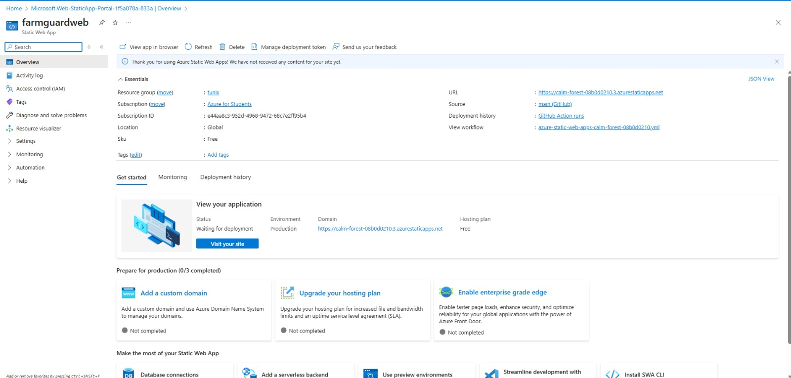
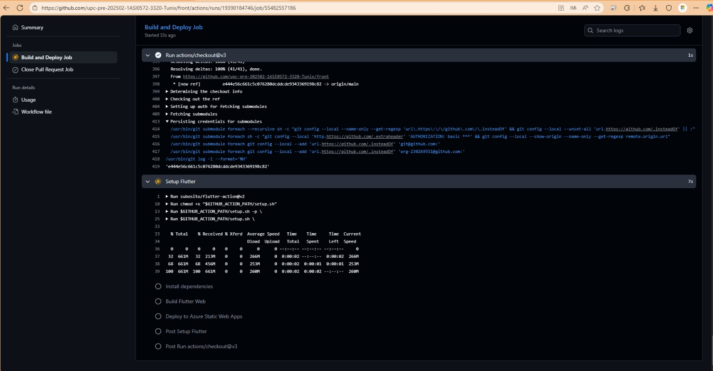

# Mobile
Evidencia de la ejecución del sistema en los entornos configurados

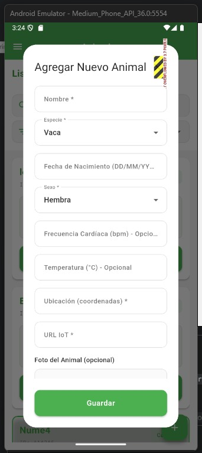
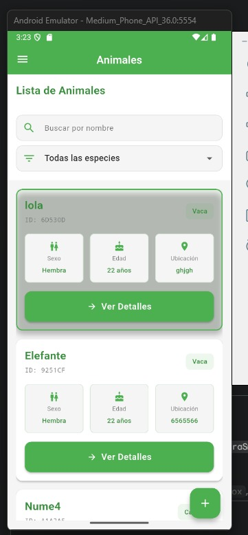

# Iot

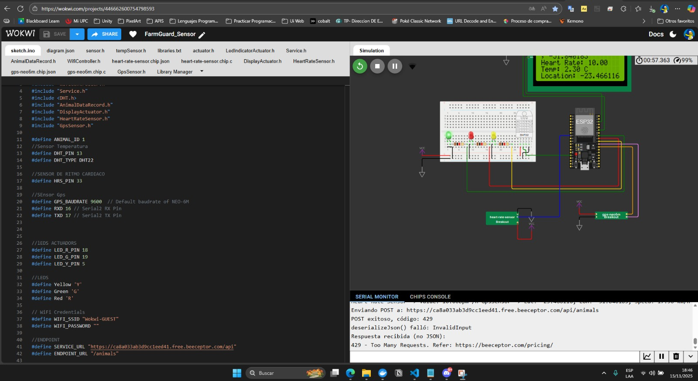

# Landing Page

Link de página desplegada: [https://upc-pre-202502-1asi0572-3320-tunix.github.io/FarmGuard-LandingPage/](https://upc-pre-202502-1asi0572-3320-tunix.github.io/FarmGuard-LandingPage/)

#### 6.2.2.7 Services Documentation Evidence


#### 6.2.2.8 Software Deployment Evidence

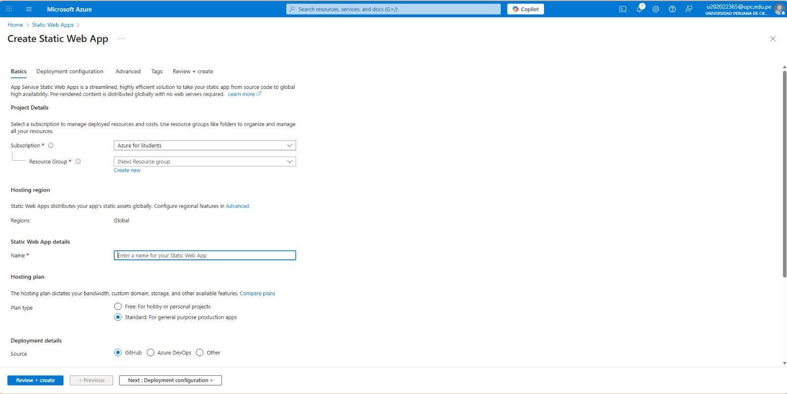
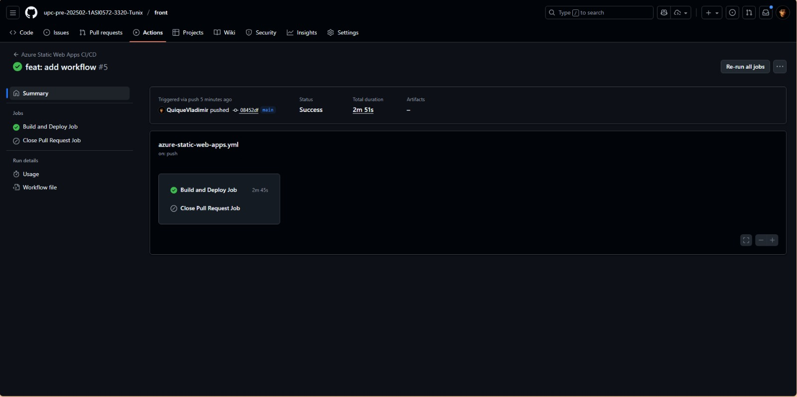

URL de la WebApp desplegada: [https://calm-forest-08b0d0210.3.azurestaticapps.net/#/medical-history](https://calm-forest-08b0d0210.3.azurestaticapps.net/#/medical-history)

URL de la Mobile desplegada: [https://calm-forest-08b0d0210.3.azurestaticapps.net/](https://calm-forest-08b0d0210.3.azurestaticapps.net/)

URL de la Swagger desplegada: [https://www.ibrayan.dev/swagger/index.html](https://www.ibrayan.dev/swagger/index.html)

#### 6.2.2.9 Team Collaboration Insights


---

### 6.2.3 Sprint 3

#### 6.2.3.1 Sprint Planning 3

| **Campo** | **Detalle** |
|-----------|-------------|
| Sprint # | Sprint 3 |
| Date | 2025/11/24 |
| Time | 5:00 PM |
| Location | Llamada grupal en la plataforma Discord |
| Prepared By | Brayan Smith Morales Quispe |
| Attendees (to planning meeting) | José Daniel Zárate Castro, Brayan Smith Morales Quispe, Oscar Nathaniel Garayar Mori, Quique Vladimir Jara Benites y Carlos Alberto Ochoa Colonio |
| Sprint 3 Goal | Consolidar la arquitectura IoT de FarmGuard a través de: <br> - La construcción y programación del **Prototipo IoT Físico (Hardware Real)** para la captura verídica de variables ambientales y fisiológicas. <br> - La implementación de la **Capa Edge**, dotando al dispositivo de inteligencia para filtrar datos y detectar anomalías localmente antes de enviarlas al backend. <br> - La **integración End-to-End** entre hardware físico, nube y clientes (Web y Móvil). |
| Sprint 3 Velocity | 24 |
| Sum of story points | 24 |


#### 6.2.3.2 Aspect Leaders and Collaborators

El siguiente LACX (Leadership-and-Collaboration Matrix) identifica a los líderes y colaboradores en los principales aspectos abordados durante el Sprint 3, incorporando ahora el componente de **Hardware IoT y Edge Computing** dentro del flujo de desarrollo, además de mantener la evolución de la Landing Page, WebApp y Backend.

| **Team Member** <br> Last Name, First Name | **GitHub Username** | **Landing Page** <br> L/C | **WebApp (Frontend)** <br> L/C | **Backend / IoT Edge** <br> L/C | **Database / ORM** <br> L/C | **Deployment & DevOps** <br> L/C | **Documentation / Report** <br> L/C |
|:------------------------------------------:|:-------------------:|:--------------------------:|:-------------------------------:|:-----------------------------:|:----------------------------:|:---------------------------------:|:----------------------------------:|
| **Zárate Castro, José Daniel** | danielzarate20      | C                         | L                              | C                            | C                           | C                                | C                                 |
| **Morales Quispe, Brayan Smith** | brayan-smithmq      | L                         | C                              | C                            | L                           | C                                | L                                 |
| **Garayar Mori, Oscar Nathaniel** | oscargarayar        | C                         | C                              | L                            | C                           | C                                | C                                 |
| **Jara Benites, Quique Vladimir** | quiquevladimir      | C                         | C                              | C                            | C                           | L                                | C                                 |
| **Ochoa Colonio, Carlos Alberto** | carlosochoac        | C                         | L                              | C                            | C                           | C                                | C                                 |

**Nota.** L = *Leader* (responsable principal del aspecto).  
C = *Collaborator* (apoya el desarrollo del aspecto).

#### 6.2.3.3 Sprint Backlog 3

El **Sprint Backlog 3** se centra en la materialización de la solución IoT, pasando de la simulación a la implementación física y lógica en el borde. Se han priorizado las historias de usuario relacionadas con el ensamblaje de hardware, la programación de algoritmos de filtrado en el microcontrolador (Edge) y la integración final con la nube.

| **User Story** |                                        | **Work-Item / Task** |  | **Description** | **Estimation (Hours)** | **Assigned To** | **Status**  |
|---------------|----------------------------------------|-----------------------|--|------------------|-------------------------|------------------|-------------|
| **Id** | **Title**                              | **Id** | **Title** | | | |             |
| US16 | Construcción del prototipo físico      | T18 | Ensamblaje de circuito y sensores | Conectar físicamente los sensores (DHT22, GPS, Ritmo Cardíaco) al microcontrolador ESP32 y asegurar la alimentación energética en el case. | 8 | Oscar / Quique | Done        |
| US17 | Procesamiento de datos en la capa Edge | T19 | Implementar algoritmos de filtrado y agregación | Programar en C++ la lógica para promediar lecturas cada minuto y evitar el envío de datos ruidosos o redundantes a la nube. | 8 | José / Oscar | Done        |
| US18 | Detección de anomalías locales         | T20 | Programar reglas de negocio en firmware | Implementar lógica en el ESP32 para detectar estados críticos (ej. fiebre > 40 °C) y forzar envíos inmediatos de alertas prioritarias. | 6 | José / Quique | In Progress |
| US19 | Sincronización Hardware–Nube           | T21 | Integración MQTT/HTTP con Backend | Configurar el ESP32 para enviar payloads JSON procesados hacia los endpoints del Backend .NET desplegado en Azure. | 8 | José / Brayan | Done        |
| US20 | Validación integral del sistema        | T22 | Pruebas de campo End-to-End | Realizar pruebas completas desde la captura del dato físico en el animal hasta su visualización en la App Móvil y la WebApp. | 6 | Carlos / Brayan | Done        |


#### 6.2.3.4 Development Evidence for Sprint Review

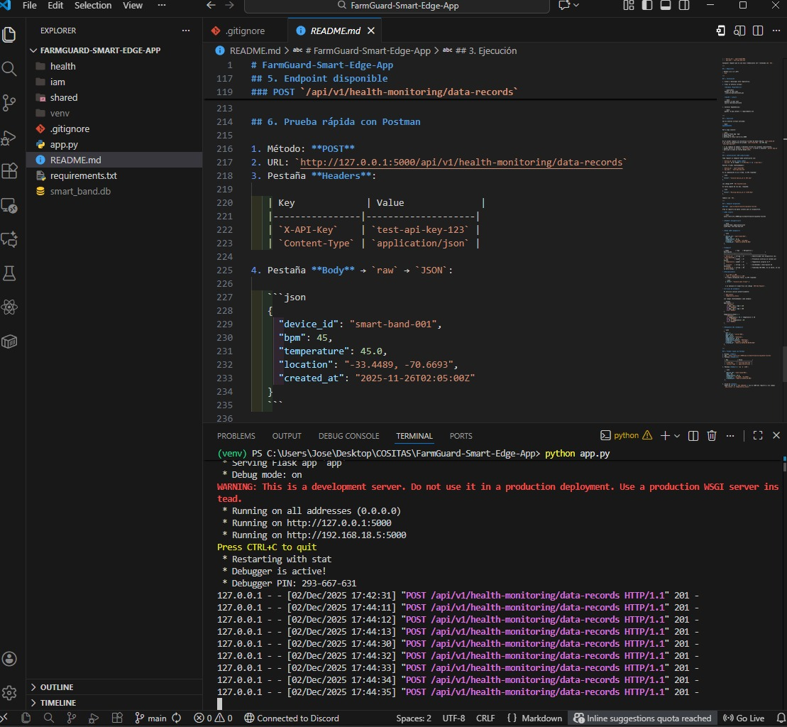

#### 6.2.3.5 Testing Suite Evidence for Sprint Review

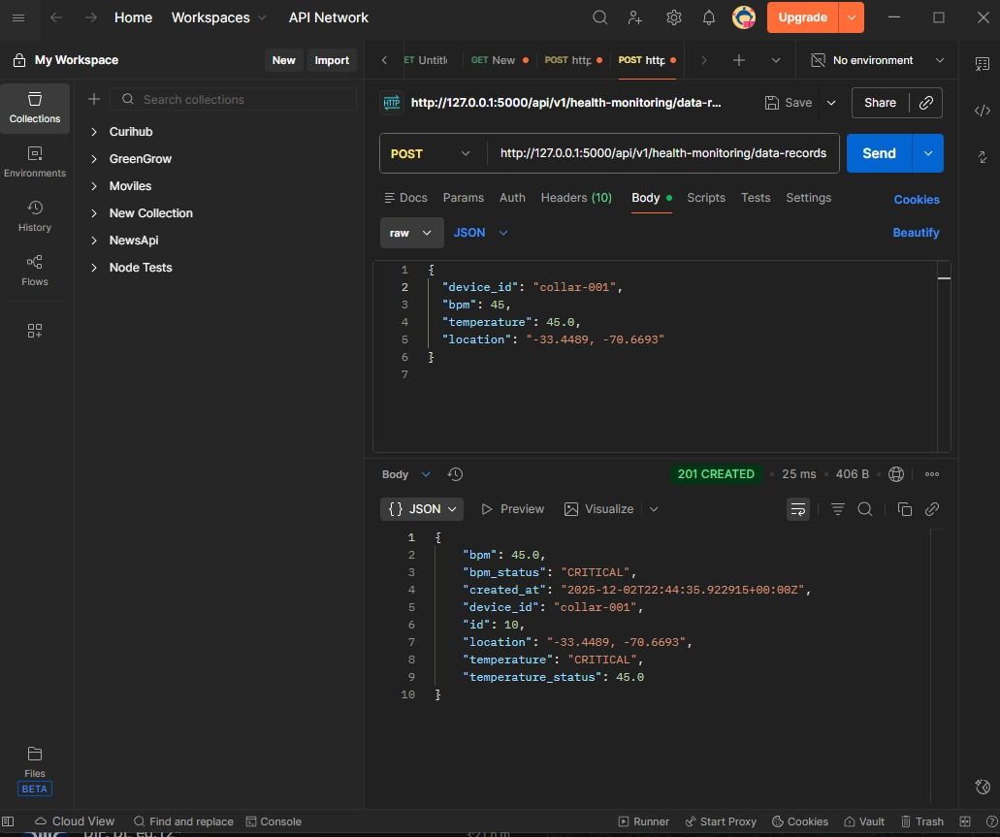

#### 6.2.3.6 Execution Evidence for Sprint Review

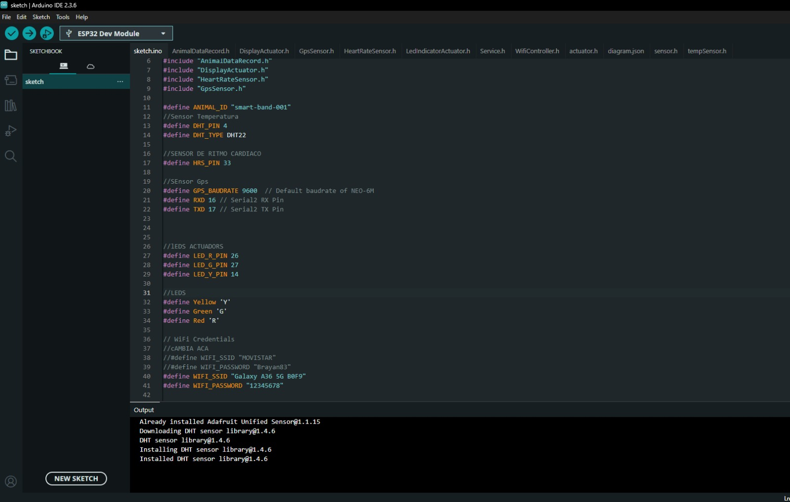

#### 6.2.3.7 Services Documentation Evidence for Sprint Review


El endpoint es /api/v1/telemetry

#### 6.2.3.8 Software Deployment Evidence for Sprint Review


#### 6.2.3.9 Team Collaboration Insights during Sprint

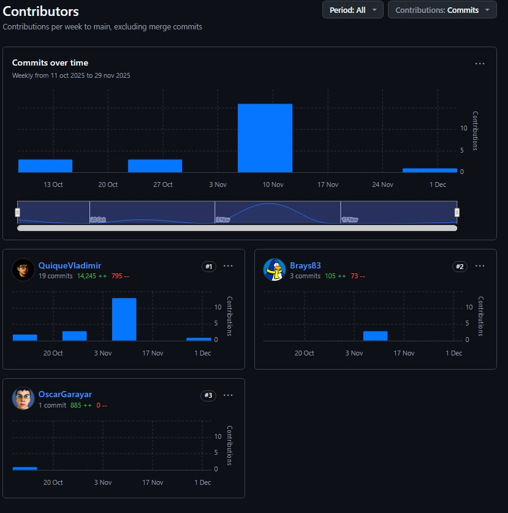

## 6.3 Validation Interviews

A continuación mostraremos las entrevistas de validación.

### 6.3.1 Diseño de entrevistas

El propósito de estas entrevistas es obtener feedback directo sobre la solución implementada (FarmGuard), evaluando su usabilidad, utilidad y cómo se ajusta a las necesidades reales de los usuarios.

Segmento Objetivo 1: Veterinarias

Objetivo: Validar la usabilidad y utilidad del módulo de Historial Médico y las Alertas en el flujo de trabajo clínico.

1. Introducción y Usabilidad de la Gestión
- Después de probar el prototipo/versión inicial de FarmGuard: ¿Cómo describiría su experiencia general al registrar un nuevo animal o al buscar uno existente?
- ¿Qué tan fácil le resultó encontrar la información de vacunas, diagnósticos o tratamientos dentro del Historial Médico?.

2. Flujo Crítico (Registro Médico)
- Al registrar un nuevo diagnóstico o tratamiento: ¿El proceso fue intuitivo? ¿Qué pasos le parecieron innecesarios o faltantes?
- Si tuviera que modificar o anular un registro (por ejemplo, una vacuna): ¿El sistema le proporcionó las herramientas y confirmaciones necesarias?

3. Reacción a la Solución y Diseño
- ¿El diseño visual (colores, botones, tipografía) le resultó profesional, claro y legible en la aplicación?
- Si tuviera que invitar a un colega a usar FarmGuard: ¿Qué tan rápido podría hacerlo y qué le diría que es lo mejor de la plataforma?

---

Segmento Objetivo 2: Ganaderos

Objetivo: Validar la utilidad de las funciones de Monitoreo IoT, Gestión de Animales y la accesibilidad de la solución en entornos de campo.

1. Monitoreo y Datos en Tiempo Real
- Cuando revisó el Monitoreo de indicadores clave: ¿La información de temperatura, peso o ritmo cardíaco se mostró en tiempo real como esperaba?.
- ¿La interfaz de la aplicación es lo suficientemente rápida y ágil para usarla en un entorno con conectividad limitada?

2. Gestión de Inventario y Alertas
- ¿La Gestión de insumos le ayudaría a controlar mejor su inventario de medicinas y alimentos, evitando tener un stock bajo?
- ¿Cómo compara la usabilidad de FarmGuard con las hojas de cálculo o registros en papel que usaba antes?

3. Adquisición y Soporte
- ¿Qué tanto se simplificó o redujo el tiempo que invierte en la gestión de sus animales usando FarmGuard?

### 6.3.2 Registro de entrevistas

A continuación se presenta el registro de las entrevistas realizadas a los veterinarios y a los ganaderos.

---

Entrevistado 1: Juan Calisaya

Segmento 2: Ganaderos

Edad: 23 años

Distrito: Villa María del Triunfo

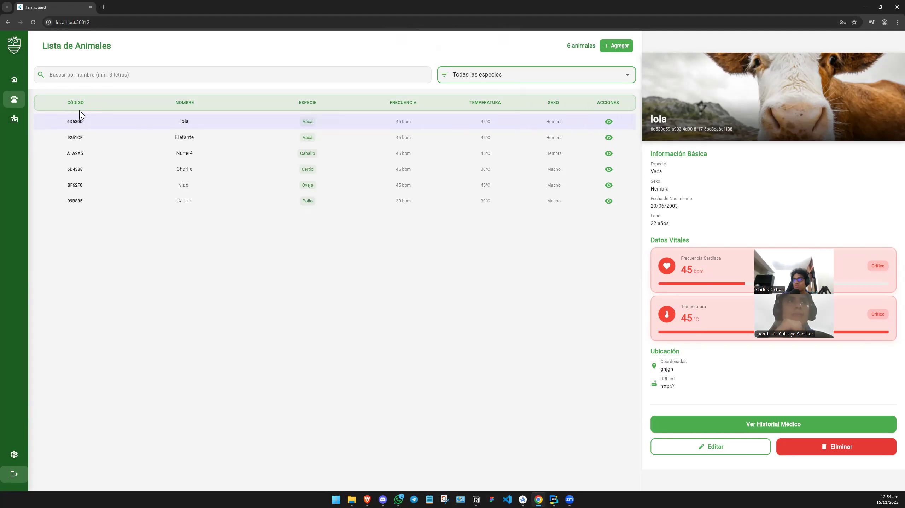

Enlace: https://youtu.be/iSETqk6i-b0

Resumen:

El entrevistado destacó que la aplicación es intuitiva, rápida y fácil de usar, incluso considerando escenarios con conectividad limitada. Valoró especialmente el monitoreo en tiempo real de temperatura, frecuencia cardíaca y ubicación de los animales mediante sensores IoT, aunque sugirió mejorar la velocidad de actualización de datos a menos de un segundo.

Sobre la gestión de historial clínico, indicó que tener tratamientos, diagnósticos y vacunas organizados digitalmente le permitiría mejor control del inventario, evitar pérdidas de información y gestionar mejor sus costos. Comparó esta solución con sus métodos previos en papel, señalando que la aplicación reduciría errores, confusión y pérdida de datos.

Finalmente, mencionó que la herramienta automatizaría gran parte del trabajo repetitivo, ahorrándole tiempo en el manejo diario de sus animales. Recalcó que le sería muy útil contar con la aplicación en su celular, algo que el equipo confirmó que ya es posible gracias a su diseño multiplataforma.

---

Entrevistado 2: Daniel Aguilar

Segmento 1: Veterinarios

Edad: 22 años

Distrito: Santiago de Surco


Enlace: https://youtu.be/bbyPPUkyL3c

Resumen:

Durante la entrevista, el veterinario Daniel Aguilar evaluó el prototipo de Farmguard desde la perspectiva clínica. Señaló que la experiencia general al registrar o buscar animales es rápida, sencilla e intuitiva, destacando que los campos son claros y el flujo de uso es eficiente. Sugirió agregar filtros adicionales como el nombre del dueño para agilizar el trabajo en clínicas veterinarias.

Con respecto al historial médico (vacunas, diagnósticos y tratamientos), afirmó que la información está bien organizada, fácil de ubicar y que la visualización por fechas mejora el seguimiento clínico. Consideró que el proceso de registrar diagnósticos y tratamientos es intuitivo, valorando especialmente la posibilidad de adjuntar fotos del animal o de lesiones. Propuso incluir una función para duplicar tratamientos, lo que facilitaría modificaciones rápidas en casos recurrentes.

En cuanto al diseño visual, señaló que es profesional, legible y agradable a la vista, aunque recomendó aumentar ligeramente el tamaño de los títulos para diferenciar mejor las secciones. Finalmente, afirmó que podría explicar la aplicación a un colega en menos de diez minutos, pues considera que Farmguard ayuda a ahorrar tiempo, reducir el uso de papel, evitar pérdidas de información y centralizar registros clínicos de manera eficiente.

---

Entrevistado 3: Gonzalo Melendez

Segmento 1: Veterinarios

Edad: 20 años

Distrito: Villa María del Triunfo

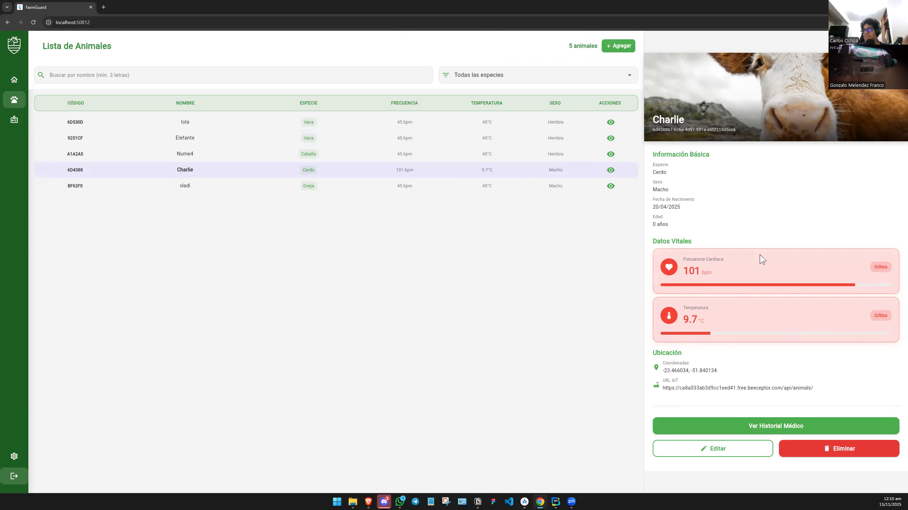

Enlace: https://youtu.be/8kWGDodHVu0

Resumen:

Gonzalo Meléndez, veterinario y parte del segmento objetivo, evaluó el prototipo de Farmguard. Describió la experiencia al registrar y buscar animales como muy automatizada, práctica y fácil de usar, destacando que el sistema guía paso a paso y ahorra tiempo en la gestión de pacientes. Sugirió ampliar la lista de especies disponibles para facilitar la clasificación clínica.

Respecto al historial médico, comentó que la información de tratamientos, vacunas y diagnósticos es muy accesible, con un botón visible que facilita acceder a toda la ficha del animal. Señaló que, en la práctica veterinaria, rara vez eliminaría un diagnóstico, salvo por error de tipeo, y recomendó agregar un detalle más profundo dentro de cada diagnóstico para consultar información ampliada.

Durante el flujo de registro de diagnósticos y tratamientos, indicó que el proceso es intuitivo y práctico, valorando las opciones de severidad y notas. Mencionó que los formatos de fecha podrían ser más claros y que clasificar mejor las vacunas sería útil, especialmente por la existencia de esquemas y secuencias diferentes.

Sobre el diseño visual, Gonzalo consideró la interfaz profesional y adecuada para una clínica veterinaria. Aunque inicialmente no comprendió el propósito del monitoreo por GPS, valoró la utilidad de recibir alertas si un animal se desplaza fuera del área de la veterinaria. Finalmente, afirmó que recomendaría la plataforma por su rapidez, practicidad y facilidad para centralizar información clínica, especialmente en comparación con los métodos tradicionales basados en papel.

---

Entrevistado 4: Miguel Ramirez

Segmento 2: Ganaderos

Edad: 22 años

Distrito: Villa María del Triunfo

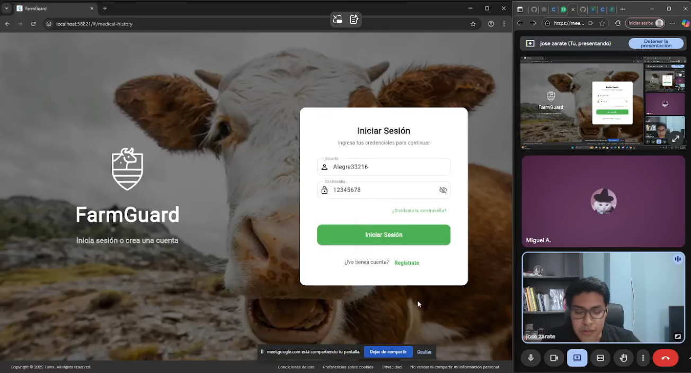

Miguel Ramirez

Enlace: https://youtu.be/oupP_r1CcYs?si=MDLP8DTZsBTSkrHI

Resumen:

Miguel Ramirez, ganadero de vacunos y porcinos y parte del segmento objetivo, probó el prototipo de Farmguard. Comentó que la experiencia de registrar y buscar animales le resultó muy automatizada, práctica y sencilla, resaltando que el sistema lo va guiando paso a paso y le permite ahorrar tiempo en la gestión de su ganado. Propuso ampliar la lista de especies disponibles para que sea más fácil clasificar clínicamente a sus animales.

En cuanto al historial sanitario, señaló que la información sobre tratamientos, vacunas y diagnósticos es muy fácil de consultar, gracias a un botón visible que da acceso rápido a toda la ficha del animal. Indicó que, en su manejo diario, casi nunca eliminaría un diagnóstico, salvo cuando se trate de un error de tipeo, y sugirió incluir un nivel de detalle más profundo dentro de cada diagnóstico para revisar información ampliada.

Durante el flujo de registro de diagnósticos y tratamientos, consideró que el proceso es intuitivo y conveniente, y valoró especialmente las opciones de severidad y las notas adicionales. Comentó que los formatos de fecha podrían ser más claros y que una mejor clasificación de las vacunas sería de gran ayuda, sobre todo porque existen distintos esquemas y secuencias de aplicación según la especie y la etapa productiva.

Respecto al diseño visual, Miguel percibió la interfaz como profesional y adecuada para una herramienta de gestión ganadera. Aunque al inicio no entendió del todo el propósito del monitoreo por GPS, luego destacó lo útil que le resultaría recibir alertas si una vaca o un cerdo sale del área establecida de la granja. Finalmente, afirmó que recomendaría la plataforma por su rapidez, practicidad y la facilidad para centralizar la información sanitaria de sus animales, especialmente frente a los métodos tradicionales basados en registros en papel.

---

Entrevistado 5: Carlos Onofre

Segmento 2: Ganaderos

Edad: 22 años

Distrito: San Juan de miraflores

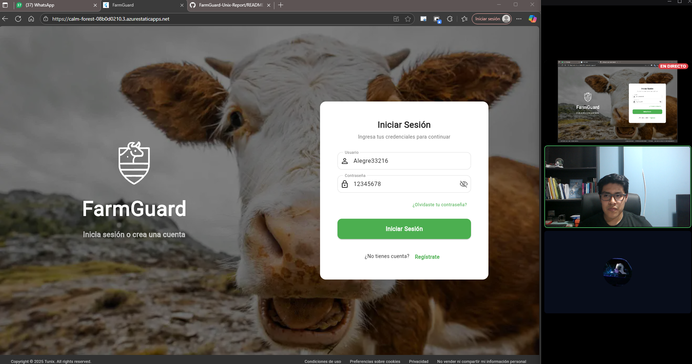

Carlos Onofre

Enlace: https://youtu.be/oupP_r1CcYs?si=MDLP8DTZsBTSkrHI

Resumen:

Carlos Onofre, productor de ganado vacuno y porcino e integrante del segmento objetivo, utilizó el prototipo de Farmguard. Señaló que el proceso de registrar y localizar animales le pareció muy automatizado, práctico y fácil de usar, subrayando que la plataforma lo orienta paso a paso y le ayuda a optimizar el tiempo dedicado a la gestión de su ganado. Además, sugirió ampliar el catálogo de especies para facilitar una mejor clasificación clínica de los animales.

Sobre el historial sanitario, comentó que acceder a la información de tratamientos, vacunas y diagnósticos le resultó muy sencillo, gracias a un botón claramente visible que le permite abrir rápidamente la ficha completa de cada animal. Indicó que, en su trabajo cotidiano, casi nunca eliminaría un diagnóstico, excepto cuando se trate de un error de escritura, y recomendó incorporar un nivel de detalle más profundo dentro de cada diagnóstico para poder revisar información extendida.

En relación con el flujo para registrar diagnósticos y tratamientos, consideró que es un proceso intuitivo y cómodo, y valoró especialmente las opciones para indicar la severidad y las notas adicionales. También mencionó que los formatos de fecha podrían mostrarse de manera más clara y que una clasificación más ordenada de las vacunas sería muy útil, sobre todo porque existen distintos esquemas y secuencias de aplicación según la especie y la etapa productiva.

En cuanto al aspecto visual, Miguel percibió la interfaz como profesional y adecuada para una solución de gestión ganadera. Aunque al principio no le quedó del todo claro el propósito del monitoreo por GPS, luego destacó lo valioso que sería recibir alertas cuando una vaca o un cerdo salga del perímetro definido de la granja. Al final, afirmó que recomendaría la plataforma por su rapidez, practicidad y por la facilidad que ofrece para centralizar la información sanitaria de sus animales, especialmente si se la compara con los métodos tradicionales basados en registros en papel.

---

Entrevistado 6: Jesus Ochoa

Segmento 1: Veterinario

Edad: 28 años

Distrito: San Juan de Lurigancho

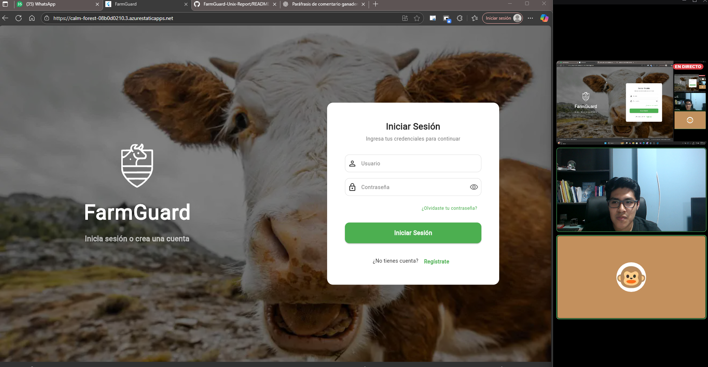

Jesus Ochoa

Enlace: https://youtu.be/oupP_r1CcYs?si=MDLP8DTZsBTSkrHI

Resumen:

Jesus Ochoa, productor de ganado vacuno y porcino e integrante del segmento objetivo, utilizó el prototipo de Farmguard. Señaló que el proceso de registrar y localizar animales le pareció muy automatizado, práctico y fácil de usar, subrayando que la plataforma lo orienta paso a paso y le ayuda a optimizar el tiempo dedicado a la gestión de su ganado. Además, sugirió ampliar el catálogo de especies para facilitar una mejor clasificación clínica de los animales.

Sobre el historial sanitario, comentó que acceder a la información de tratamientos, vacunas y diagnósticos le resultó muy sencillo, gracias a un botón claramente visible que le permite abrir rápidamente la ficha completa de cada animal. Indicó que, en su trabajo cotidiano, casi nunca eliminaría un diagnóstico, excepto cuando se trate de un error de escritura, y recomendó incorporar un nivel de detalle más profundo dentro de cada diagnóstico para poder revisar información extendida.

En relación con el flujo para registrar diagnósticos y tratamientos, consideró que es un proceso intuitivo y cómodo, y valoró especialmente las opciones para indicar la severidad y las notas adicionales. También mencionó que los formatos de fecha podrían mostrarse de manera más clara y que una clasificación más ordenada de las vacunas sería muy útil, sobre todo porque existen distintos esquemas y secuencias de aplicación según la especie y la etapa productiva.

En cuanto al aspecto visual, Miguel percibió la interfaz como profesional y adecuada para una solución de gestión ganadera. Aunque al principio no le quedó del todo claro el propósito del monitoreo por GPS, luego destacó lo valioso que sería recibir alertas cuando una vaca o un cerdo salga del perímetro definido de la granja. Al final, afirmó que recomendaría la plataforma por su rapidez, practicidad y por la facilidad que ofrece para centralizar la información sanitaria de sus animales, especialmente si se la compara con los métodos tradicionales basados en registros en papel.

### 6.3.3 Evaluaciones según heurísticas

## UX Heuristics & Principles Evaluation Usability - Inclusive Design - Information Architecture

CARRERA: Ingeniería de Software

CURSO: 1ASI0572 - Desarrollo de Soluciones IOT

SECCIÓN: 3320

PROFESORES: Marco Antonio Leon Baca

AUDITOR: Tunix

CLIENTE(S): Ganaderos y Veterinarios

---

SITE O APP A EVALUAR: FarmGuard

### TAREAS A EVALUAR:

El alcance de esta evaluación incluye la revisión de la usabilidad de las siguientes tareas:
1. Iniciar sesión en la plataforma. 
2. Visualizar la lista de animales y sus estados vitales. 
3. Seleccionar un animal para ver su detalle. 
4. Acceder al historial clínico de un animal. 
5. Consultar los tratamientos de un animal.

### ESCALA DE SEVERIDAD:

Los errores serán puntuados tomando en cuenta la siguiente escala de severidad:

| Nivel | Descripción |
|-------|-------------|
| **1** | Problema superficial: puede ser fácilmente superado por el usuario o ocurre con muy poca frecuencia. No necesita ser arreglado a no ser que exista disponibilidad de tiempo. |
| **2** | Problema menor: puede ocurrir un poco más frecuentemente o es un poco más difícil de superar para el usuario. Se le debería asignar una prioridad baja resolverlo de cara al siguiente reléase. |
| **3** | Problema mayor: ocurre frecuentemente o los usuarios no son capaces de resolverlos. Es importante que sean corregidos y se les debe asignar una prioridad alta. |
| **4** | Problema muy grave: un error de gran impacto que impide al usuario continuar con el uso de la herramienta. Es imperativo que sea corregido antes del lanzamiento. |

### TABLA RESUMEN:

| # | Problema | Escala de severidad | Heurística/Principio violada(o) |
|---|----------|----------------------|---------------------------------|
| **1** | Inconsistencia visual entre el avatar del animal (neutral) y el estado "Crítico" de sus vitales. | 3 | Usability: Consistencia y estándares |
| **2** | El ícono de "Acciones" (círculo verde) en la lista de animales no es estándar y su significado es ambiguo. | 2 | Usability: Coincidencia entre el sistema y el mundo real |
| **3** | Las acciones del panel de detalle del animal ("Ver Historial", "Editar") están al final y requieren scroll. | 2 | Information Architecture: Is it usable? / Usability: Flexibilidad y eficiencia de uso |
| **4** | La única acción en la tabla de "Tratamientos" del historial clínico es "Eliminar", una acción destructiva. | 3 | Usability: Libertad y control del usuario / Usability: Prevención de errores |

### DESCRIPCIÓN DE PROBLEMAS:

PROBLEMA #1: Inconsistencia visual entre el avatar del animal (neutral) y el estado "Crítico" de sus vitales.

Severidad: 3 Heurística violada: Usabilidad - Consistencia y estándares

Problema:  En el panel de detalle del animal, el avatar de "lola" es una imagen pixel art neutral o contenta. Sin embargo, sus "Datos Vitales" (Frecuencia Cardíaca y Temperatura) están marcados como "Crítico" en color rojo brillante. Esta es una inconsistencia visual que genera confusión: el sistema comunica "todo está bien" (avatar) y "emergencia" (vitales) al mismo tiempo.

Evidencia:

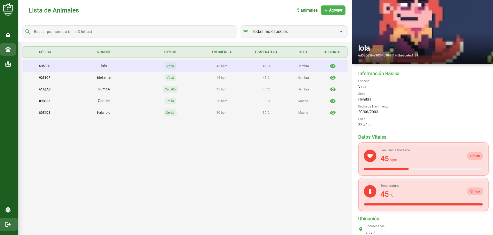

Recomendación:  Implementar un sistema de avatares dinámicos que refleje el estado del animal (ej. un avatar triste, enfermo o con un ícono de alerta si el estado es "Crítico"). Adicionalmente, agregar un botón de "Acción Recomendada" junto a los vitales críticos para guiar al usuario.

---

PROBLEMA #2: El ícono de "Acciones" (círculo verde) en la lista de animales no es estándar y su significado es ambiguo.

Severidad: 2 Heurística violada: Usabilidad - Coincidencia entre el sistema y el mundo real

Problema: En la "Lista de Animales", la columna "ACCIONES" muestra un único ícono de círculo verde para cada fila. Este ícono no es un estándar de interfaz (como un ojo, un lápiz o una papelera) y no comunica claramente su función. El usuario no sabe si significa "Ver detalle", "Estado: Activo" o "Saludable", generando duda antes de la interacción.

Evidencia:


Recomendación: Reemplazar el ícono ambiguo por íconos estándar que representen acciones claras. Si la acción es "Ver detalle" (que parece ser el caso, ya que activa el panel derecho), usar un ícono de "ojo" (eye) o un botón de "Ver". Si es solo un indicador de estado, moverlo a la columna "ESTADO" y usar un texto.

---

PROBLEMA #3: Las acciones del panel de detalle del animal ("Ver Historial", "Editar") están al final y requieren scroll.

Severidad: 2 Heurística violada: Information Architecture: Is it usable? / Usability: Flexibilidad y eficiencia de uso

Problema: Las acciones más comunes que un usuario querría realizar sobre un animal seleccionado ("Ver Historial Médico", "Editar", "Eliminar") se encuentran al final del panel de detalles. El usuario debe desplazarse (scroll) más allá de "Información Básica", "Datos Vitales" y "Ubicación" para encontrarlas. Esto es ineficiente, ya que las acciones principales no están visibles al primer vistazo.

Evidencia:

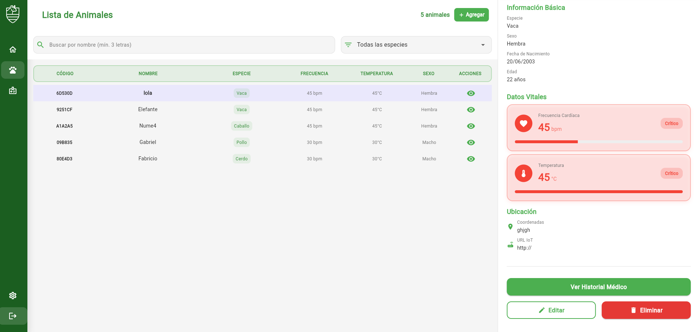

Recomendación: Mover los botones de acción principales ("Ver Historial Médico", "Editar", "Eliminar") a una ubicación más prominente, preferiblemente debajo de la información básica del animal (bajo la imagen y el nombre, en image_68b72d.png), para que sean accesibles inmediatamente al seleccionar un animal.

---

PROBLEMA #4: La única acción en la tabla de "Tratamientos" del historial clínico es "Eliminar", una acción destructiva.

Severidad: 3 Heurística violada: Usability - Libertad y control del usuario / Usability: Prevención de errores

Problema: En la pantalla "Historial Clínico", la tabla de "Tratamientos" muestra una columna de "ACCIONES" que solo contiene un ícono de papelera (Eliminar). No ofrece una opción para "Editar" o "Modificar" un tratamiento, lo cual es un caso de uso muy común en la gestión médica. Ofrecer "Eliminar" como la única acción es peligroso, ya que la eliminación accidental de un registro médico es un error grave.

Evidencia:

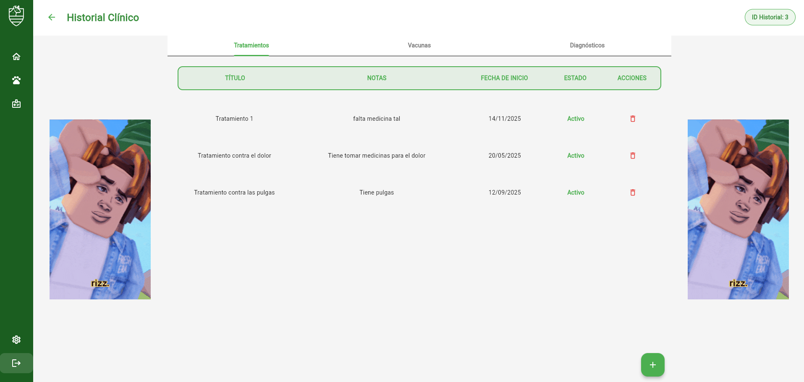

Recomendación: Añadir un ícono de "Editar" (lápiz) como acción principal para modificar los tratamientos. La acción "Eliminar" debe requerir un paso de confirmación claro ("¿Está seguro de que desea eliminar este tratamiento? Esta acción no se puede deshacer.") para prevenir errores.

## 6.4 Video About-the-Product

En esta sección presentamos un breve resumen del producto y la experiencia del usuario.

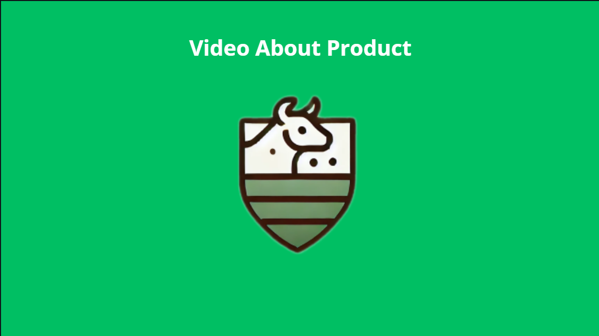

Enlace:

[https://youtu.be/aJnE8Fs01Gs](https://youtu.be/aJnE8Fs01Gs)

## Conclusiones

Tras la finalización del Sprint 2 y la realización de las entrevistas de validación (Sección 6.3), se ha logrado validar exitosamente las hipótesis y supuestos fundamentales planteados en el proceso Lean UX (Capítulo 1.2).

1. Validación del Problema: La problemática inicial, centrada en la ineficiencia, el riesgo de pérdida de información y la duplicidad de datos al usar métodos tradicionales (papel y Excel), fue contundentemente confirmada. Las entrevistas de needfinding (Capítulo 2.2) y las entrevistas de validación (Capítulo 6.3.2) coincidieron: los veterinarios y ganaderos identifican este método manual como una fuente de errores, retrasos y pérdida de información crítica. 
2. Validación de la Solución: La solución FarmGuard demostró ser la respuesta adecuada a la problemática. Durante las entrevistas de validación (Sección 6.3.2), los usuarios de ambos segmentos (ganaderos y veterinarios) describieron el prototipo funcional como "intuitivo", "rápido", "fácil de usar" y "práctico". Todos los entrevistados confirmaron que la plataforma digital es una mejora significativa sobre sus métodos actuales, destacando la accesibilidad inmediata al historial clínico  y la centralización de datos como los principales valores. 
3. Confirmación de Hipótesis: Los resultados validan las hipótesis iniciales (Sección 1.2.2.3), confirmando que existe un alto interés en la plataforma y que los usuarios están dispuestos a compartir información a cambio de una gestión centralizada y eficiente. La respuesta positiva de los entrevistados valida el Product-Market Fit preliminar. 
4. Estado del Desarrollo: La arquitectura del proyecto, con el despliegue de la Landing Page , la Web App y el Backend (.NET 8), ha demostrado ser una base sólida que permitió realizar pruebas funcionales y validaciones de usabilidad de manera temprana, tal como se evidencia en los Sprints 1 y 2 (Sección 6.2).

## Recomendaciones

1. Correcciones de Alta Prioridad (Usabilidad y Errores Graves)
- Corregir Inconsistencia de Estado (Severidad 3): Modificar la interfaz para que el avatar o la tarjeta del animal refleje visualmente el estado "Crítico" detectado en los datos vitales. La inconsistencia actual (avatar feliz con alerta roja) genera confusión.

- Prevenir Errores (Severidad 3): En el "Historial Clínico", la acción "Eliminar" no debe ser la única opción para un tratamiento. Se debe añadir la funcionalidad de "Editar" como acción principal. Además, la acción "Eliminar" debe implementar un diálogo de confirmación ("¿Está seguro?") para prevenir la pérdida accidental de registros médicos.

2. Mejoras de Eficiencia y Flujo de Usuario
- Reposicionar Acciones (Severidad 2): Mover los botones de acción principales ("Ver Historial Médico", "Editar", "Eliminar") en el panel de detalle del animal a una posición visible (ej. debajo de la información básica). Actualmente, requieren que el usuario haga scroll hasta el final, reduciendo la eficiencia.

- Añadir Filtros y Funciones de Eficiencia: Implementar las mejoras sugeridas por los validadores:

  - Añadir filtros a la lista de animales (ej. "filtrar por nombre del dueño").

  - Añadir la función de "Duplicar Tratamiento" sugerida por Daniel Aguilar, para agilizar el registro de casos recurrentes.

  - Expandir las listas de opciones (ej. "Especies") para abarcar más casos de uso.

- Mejorar Claridad de Iconos (Severidad 2): Reemplazar los íconos ambiguos (ej. el círculo verde en la columna "Acciones" de la lista de animales) por iconografía estándar (ej. un ícono de "ojo" para "Ver detalle").

3. Foco del Próximo Sprint (Sprint 3)

- Rendimiento de IoT: Atender la sugerencia de Juan Calisaya  y enfocar esfuerzos técnicos en optimizar la velocidad de actualización de los datos provenientes de los sensores IoT, apuntando a una respuesta en tiempo real (<1 segundo).

- Implementar Feedback: Priorizar la implementación de las correcciones de "Alta Prioridad" y las "Mejoras de Eficiencia" identificadas en la validación y la evaluación heurística para refinar el producto antes de la entrega final.

## Bibliografía

Banhazi, T. M., Lehr, H., Black, J. L., Crabtree, H., Schofield, P., & Tscharke, M. (2012). Precision Livestock Farming: An international review of scientific and commercial applications. Australian Journal of Multi-Disciplinary Engineering, 10(1), 77-91. https://doi.org/10.1080/14488388.2012.11464868

Evans, E. (2004). Domain-driven design: Tackling complexity in the heart of software. Addison-Wesley Professional.

Fielding, R. T. (2000). Architectural styles and the design of network-based software architectures [Tesis doctoral, University of California, Irvine]. https://www.ics.uci.edu/~fielding/pubs/dissertation/top.htm

Martin, R. C. (2018). Arquitectura limpia: Guía del artesano para la estructura y el diseño de software. Anaya Multimedia.

Naha, R. K., Garg, S., Georgakopoulos, D., Jayaraman, P. P., Gao, L., Xiang, Y., & St-Hilaire, M. (2021). A Fog/Edge/Cloud-Based IoT Framework for Scalable and Real-Time Animal Behaviour Monitoring. IEEE Internet of Things Journal, 8(12), 9801-9811. https://doi.org/10.1109/JIOT.2021.3060251

Pressman, R. S., & Maxim, B. R. (2020). Ingeniería de software: Un enfoque práctico (9ª ed.). McGraw-Hill Education.

## Anexos

### Video About The Team

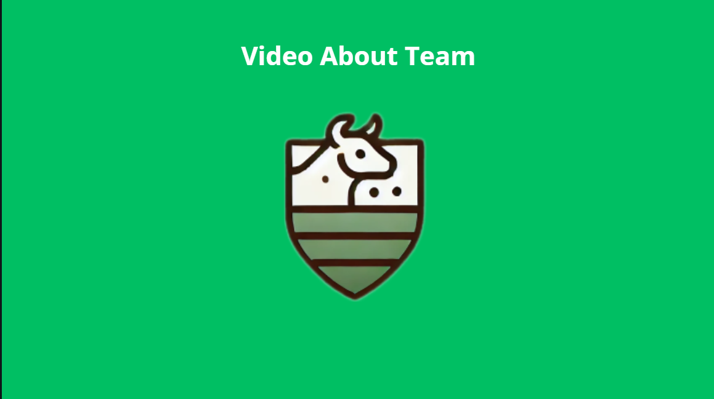

Enlace:

[https://youtu.be/Cq15jj4m8bw](https://youtu.be/Cq15jj4m8bw)

### Repositorios del Proyecto FarmGuard

- **Landing Page**  
  [https://github.com/upc-pre-202502-1ASI0572-3320-Tunix/FarmGuard-LandingPage](https://github.com/upc-pre-202502-1ASI0572-3320-Tunix/FarmGuard-LandingPage)

- **Frontend Web App**  
  [https://github.com/upc-pre-202502-1ASI0572-3320-Tunix/farmguard-frontend](https://github.com/upc-pre-202502-1ASI0572-3320-Tunix/farmguard-frontend)

- **Backend Web Services**  
  [https://github.com/upc-pre-202502-1ASI0572-3320-Tunix/FarmGuard-LandingPage](https://github.com/upc-pre-202502-1ASI0572-3320-Tunix/FarmGuard-LandingPage)

- **Mobile Application (Android - Kotlin)**  
   [https://github.com/upc-pre-202502-1ASI0572-3320-Tunix/front](https://github.com/upc-pre-202502-1ASI0572-3320-Tunix/front)
