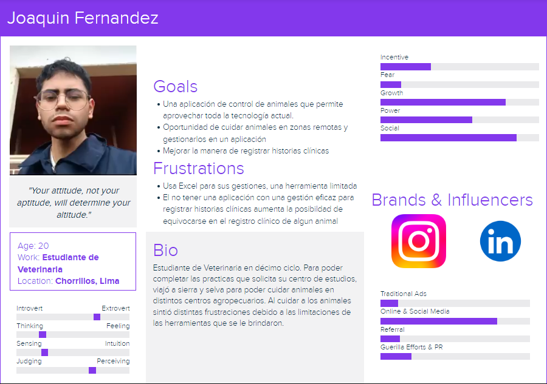
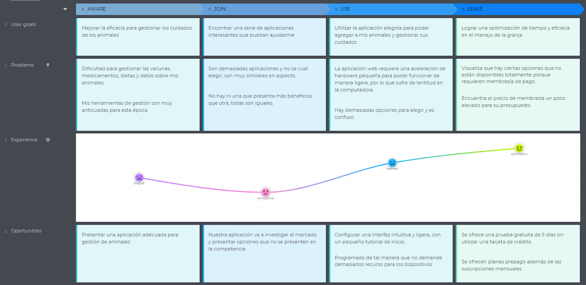
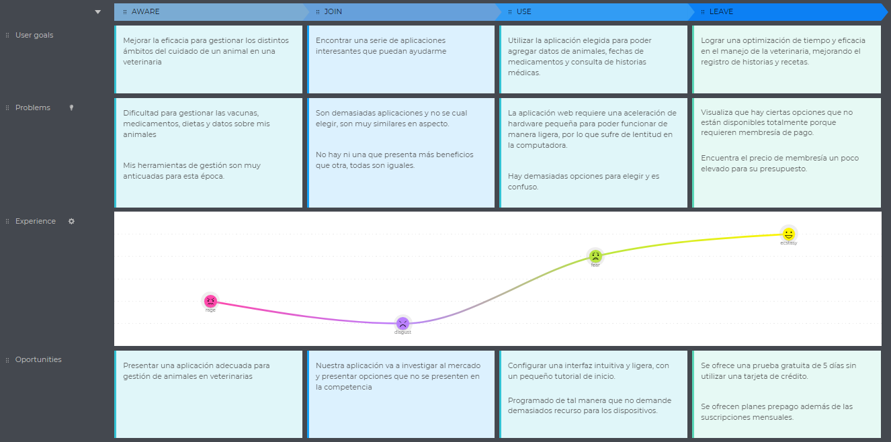
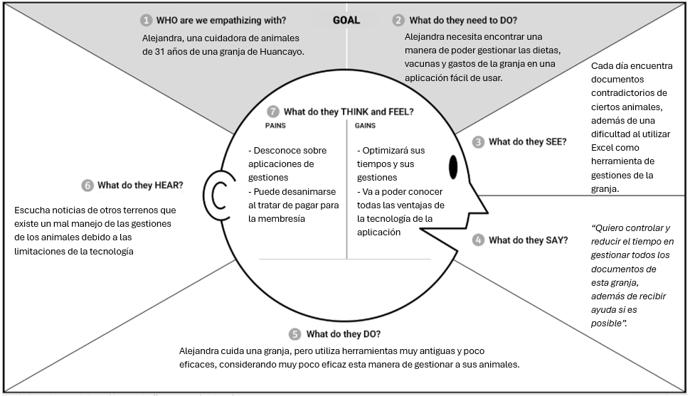
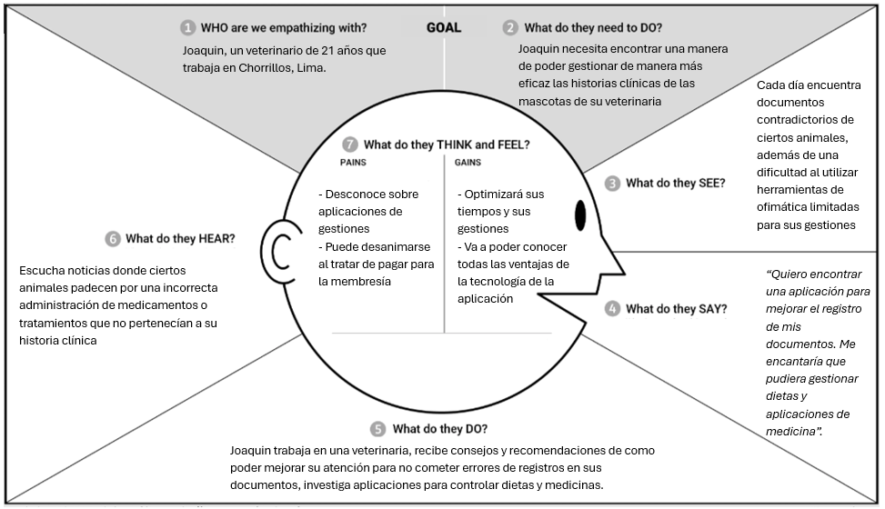
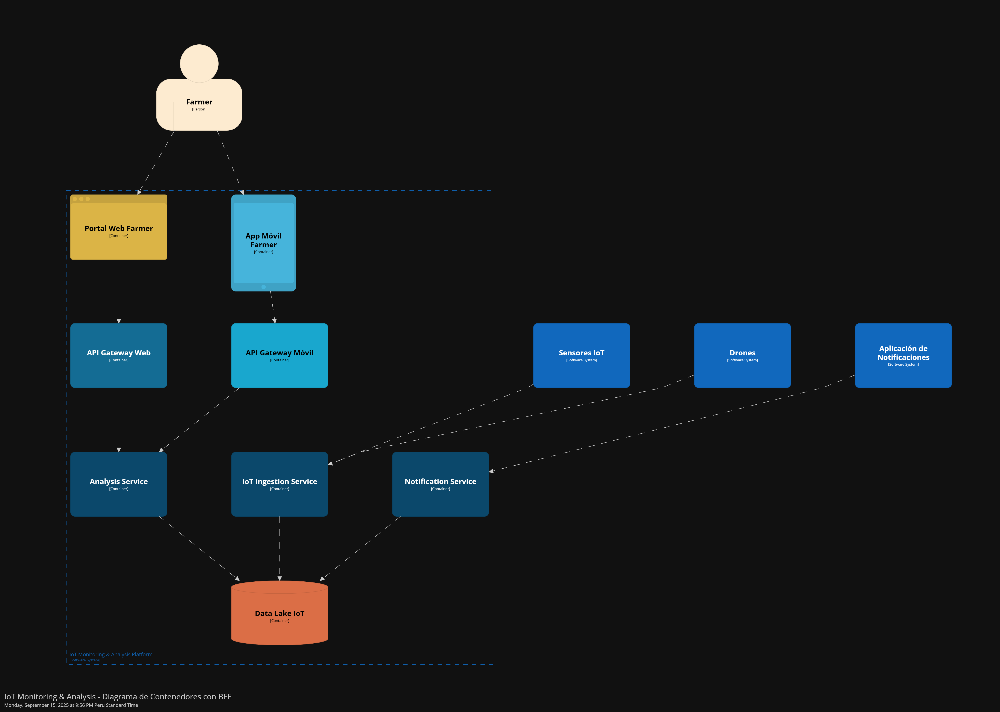
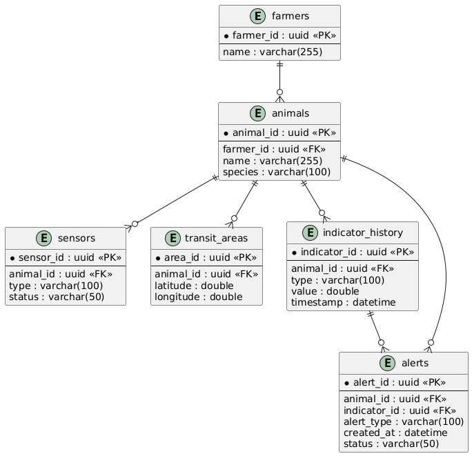

# FarmGuard-Tunix-Report 

  <h3>Universidad Peruana de Ciencias Aplicadas</h3>

<h5>Ingeniería de Software - 7mo ciclo</h5>
  <h5>Desarrollo de Soluciones IOT - 1ASI0572</h5>
  <h5>
NRC: 3320</h5>
  <h5>Docente: Marco Antonio Leon Baca</h5>
  <h5>"Informe de Trabajo Final" <h5>
  <h5>Startup: Tunix</h5>
  <h5>Producto: FarmGuard</h5>

## Team Members 

<table>
  <thead>
    <tr>
      <th>Nombre</th>
      <th>Código</th>
    </tr>
  </thead>
  <tbody>
    <tr><td>Zarate Castro Jose Daniel</td><td>u202019128</td></tr>
    <tr><td>Brayan smith morales quispe</td><td>u20211f984</td></tr>
    <tr><td>Oscar nathaniel garayar mori</td><td>u202014115</td></tr>
    <tr><td>Jara Benites Quique Vladimir</td><td>u202022365</td></tr>
    <tr><td>Carlos Alberto Ochoa Colonio</td><td>u202315945</td></tr>
  </tbody>
</table>

  <h5>Setiembre-2025</h5>

### Registro de Informe

| Versión | Fecha    | Autor(es)                             | Descripción de modificación                                                             |
|---------|----------|----------------------------------------|-----------------------------------------------------------------------------------------|
| 0.1     | 03/09/25 | Brayan Smith Morales Quispe        | Inicio del documento                                                            |
| 0.2    | 08/09/25 | Zarate Castro Jose Daniel       | Añadir bounded context de suscripcion                                                            |
| 0.3     | 19/09/25 | Jara Benites Quique Vladimir        | Añadir everstorming                                                        |
| 0.4     | 20/09/25 | Brayan Smith Morales Quispe        | Correccion de errores                                                          |

### Project Report Collaboration Insights

**URL del repositorio para el reporte del proyecto:** [Link GitHub](https://github.com/upc-pre-202502-1ASI0572-3320-Tunix/FarmGuard-Unix-Report)

**Link de los repositorios de la oraganización:** [Link GitHub](https://github.com/orgs/upc-pre-202502-1ASI0572-3320-Tunix/repositories)

**TB1**

En esta primera entrega (TB1), el objetivo principal fue ...

| Integrante                        |Tarea|
| ----------------------------------|-----|
| Zarate Castro Jose Daniel         | Bounded Context Subscription & Billing (GENERIC) y Notifications (GENERIC) | 
| Brayan Smith Morales Quispe       | Bounded Context Animal Management (CORE) |
| Oscar Nathaniel Garayar Mori      | Bounded Context IoT Monitoring & Analysis (CORE)|
| Jara Benites Quique Vladimir      | Bounded Context Identity & Access Management (SUPPORTING) y Profile (SUPPORTING)|
| Carlos Alberto Ochoa Colonio      | Entrevistas y validación de dominio|

Este gráfico muestra la cantidad de commits realizados por cada integrante durante el desarrollo del TB1 Tunix.

Estas evidencias reflejan una colaboración equilibrada y efectiva, con cada miembro aportando de manera significativa al avance y desarrollo de la solución.

# Contenido

## 📚 Tabla de Contenidos

### Capítulo I: Introducción
- [1.1 Startup Profile](#11-startup-profile)  
  - [1.1.1 Descripción de la Startup](#111-descripción-de-la-startup)  
  - [1.1.2 Perfiles de integrantes del equipo](#112-perfiles-de-integrantes-del-equipo)  
- [1.2 Solution Profile](#12-solution-profile)  
  - [1.2.1 Antecedentes y problemática](#121-antecedentes-y-problemática)  
  - [1.2.2 Lean UX Process](#122-lean-ux-process)  
    - [1.2.2.1 Lean UX Problem Statements](#1221-lean-ux-problem-statements)  
    - [1.2.2.2 Lean UX Assumptions](#1222-lean-ux-assumptions)  
    - [1.2.2.3 Lean UX Hypothesis Statements](#1223-lean-ux-hypothesis-statements)  
    - [1.2.2.4 Lean UX Canvas](#1224-lean-ux-canvas)  
- [1.3 Segmentos Objetivo](#13-segmentos-objetivo)

### Capítulo II: Requirements Elicitation & Analysis
- [2.1 Competidores](#21-competidores)  
  - [2.1.1 Análisis competitivo](#211-análisis-competitivo)  
  - [2.1.2 Estrategias y tácticas frente a competidores](#212-estrategias-y-tácticas-frente-a-competidores)  
- [2.2 Entrevistas](#22-entrevistas)  
  - [2.2.1 Diseño de entrevistas](#221-diseño-de-entrevistas)  
  - [2.2.2 Registro de entrevistas](#222-registro-de-entrevistas)  
  - [2.2.3 Análisis de entrevistas](#223-análisis-de-entrevistas)  
- [2.3 Needfinding](#23-needfinding)  
  - [2.3.1 User Personas](#231-user-personas)  
  - [2.3.2 User Task Matrix](#232-user-task-matrix)  
  - [2.3.3 User Journey Mapping](#233-user-journey-mapping)  
  - [2.3.4 Empathy Mapping](#234-empathy-mapping)  
  - [2.3.5 As-is Scenario Mapping](#235-as-is-scenario-mapping)  
- [2.4 Big Picture EventStorming](#24-big-picture-eventstorming)  
- [2.5 Ubiquitous Language](#25-ubiquitous-language)

### Capítulo III: Requirements Specification
- [3.1 To-Be Scenario Mapping](#31-to-be-scenario-mapping)  
- [3.2 User Stories](#32-user-stories)  
- [3.3 Impact Mapping](#33-impact-mapping)  
- [3.4 Product Backlog](#34-product-backlog)

#### [Capítulo IV: Solution Software Design](#solution-software-design)
  - [4.1 Strategic-Level Domain-Driven Design](#strategic-level-domain-driven-design)
    - [4.1.1 EventStorming](#eventstorming)
      - [4.1.1.1 Candidate Context Discovery](#candidate-context-discovery)
      - [4.1.1.2 Domain Message Flows Modeling](#domain-message-flows-modeling)
      - [4.1.1.3 Bounded Context Canvases](#bounded-context-canvases)
    - [4.1.2 Context Mapping](#context-mapping)
    - [4.1.3 Software Architecture](#software-architecture)
      - [4.1.3.1 System Landscape Diagram](#system-landscape-diagram)
      - [4.1.3.2 Context Level Diagrams](#context-level-diagrams)
      - [4.1.3.3 Container Level Diagrams](#container-level-diagrams)
      - [4.1.3.4 Deployment Diagrams](#deployment-diagrams)
  - [4.2 Tactical-Level Domain-Driven Design](#tactical-level-domain-driven-design)
    - [4.2.1 Bounded Context: Nombre del Contexto](#bounded-context-nombre-del-contexto)
      - [4.2.1.1 Domain Layer](#domain-layer)
      - [4.2.1.2 Interface Layer](#interface-layer)
      - [4.2.1.3 Application Layer](#application-layer)
      - [4.2.1.4 Infrastructure Layer](#infrastructure-layer)
      - [4.2.1.5 Component Level Diagrams](#component-level-diagrams)
      - [4.2.1.6 Code Level Diagrams](#code-level-diagrams)
        - [4.2.1.6.1 Domain Layer Class Diagrams](#domain-layer-class-diagrams)
        - [4.2.1.6.2 Database Design Diagram](#database-design-diagram)

### Capítulo V: Solution UI/UX Design
- [5.1 Style Guidelines](#51-style-guidelines)  
  - [5.1.1 General Style Guidelines](#511-general-style-guidelines)  
  - [5.1.2 Web, Mobile and IoT Style Guidelines](#512-web-mobile-and-iot-style-guidelines)  
- [5.2 Information Architecture](#52-information-architecture)  
  - [5.2.1 Organization Systems](#521-organization-systems)  
  - [5.2.2 Labeling Systems](#522-labeling-systems)  
  - [5.2.3 SEO Tags and Meta Tags](#523-seo-tags-and-meta-tags)  
  - [5.2.4 Searching Systems](#524-searching-systems)  
  - [5.2.5 Navigation Systems](#525-navigation-systems)  
- [5.3 Landing Page UI Design](#53-landing-page-ui-design)  
  - [5.3.1 Wireframe](#531-wireframe)  
  - [5.3.2 Mock-up](#532-mock-up)  
- [5.4 Applications UX/UI Design](#54-applications-uxui-design)  
  - [5.4.1 Wireframes](#541-wireframes)  
  - [5.4.2 Wireflow Diagrams](#542-wireflow-diagrams)  
  - [5.4.3 Mock-ups](#543-mock-ups)  
  - [5.4.4 User Flow Diagrams](#544-user-flow-diagrams)  
- [5.5 Applications Prototyping](#55-applications-prototyping)

### Capítulo VI: Product Implementation, Validation & Deployment
- [6.1 Software Configuration Management](#61-software-configuration-management)  
  - [6.1.1 Development Environment Configuration](#611-development-environment-configuration)  
  - [6.1.2 Source Code Management](#612-source-code-management)  
  - [6.1.3 Code Style Guide & Conventions](#613-code-style-guide--conventions)  
  - [6.1.4 Deployment Configuration](#614-deployment-configuration)  
- [6.2 Landing Page, Services & Applications Implementation](#62-landing-page-services--applications-implementation)  
  - [6.2.1 Sprint 1](#621-sprint-1)  
    - [6.2.1.1 Sprint Planning 1](#6211-sprint-planning-1)  
    - [6.2.1.2 Sprint Backlog 1](#6212-sprint-backlog-1)  
    - [6.2.1.3 Development Evidence](#6213-development-evidence)  
    - [6.2.1.4 Testing Suite Evidence](#6214-testing-suite-evidence)  
    - [6.2.1.5 Execution Evidence](#6215-execution-evidence)  
    - [6.2.1.6 Services Documentation Evidence](#6216-services-documentation-evidence)  
    - [6.2.1.7 Software Deployment Evidence](#6217-software-deployment-evidence)  
    - [6.2.1.8 Team Collaboration Insights](#6218-team-collaboration-insights)  
  - [6.2.2 Sprint 2](#622-sprint-2)  
    - [6.2.2.1 Sprint Planning 2](#6221-sprint-planning-2)  
    - [6.2.2.2 Sprint Backlog 2](#6222-sprint-backlog-2)  
    - [6.2.2.3 Development Evidence](#6223-development-evidence)  
    - [6.2.2.4 Testing Suite Evidence](#6224-testing-suite-evidence)  
    - [6.2.2.5 Execution Evidence](#6225-execution-evidence)  
    - [6.2.2.6 Services Documentation Evidence](#6226-services-documentation-evidence)  
    - [6.2.2.7 Software Deployment Evidence](#6227-software-deployment-evidence)  
    - [6.2.2.8 Team Collaboration Insights](#6228-team-collaboration-insights)  
  - [6.2.3 Sprint 3](#623-sprint-3)  
    - [6.2.3.1 Sprint Planning 3](#6231-sprint-planning-3)  
    - [6.2.3.2 Sprint Backlog 3](#6232-sprint-backlog-3)  
    - [6.2.3.3 Development Evidence](#6233-development-evidence)  
    - [6.2.3.4 Testing Suite Evidence](#6234-testing-suite-evidence)  
    - [6.2.3.5 Execution Evidence](#6235-execution-evidence)  
    - [6.2.3.6 Services Documentation Evidence](#6236-services-documentation-evidence)  
    - [6.2.3.7 Software Deployment Evidence](#6237-software-deployment-evidence)  
    - [6.2.3.8 Team Collaboration Insights](#6238-team-collaboration-insights)  
- [6.3 Validation Interviews](#63-validation-interviews)  
  - [6.3.1 Diseño de Entrevistas](#631-diseño-de-entrevistas)  
  - [6.3.2 Evaluaciones según heurísticas](#632-evaluaciones-según-heurísticas)  
- [6.4 Video About-the-Product](#64-video-about-the-product)  
- [6.5 Aspect Leaders and Collaborators](#65-aspect-leaders-and-collaborators)

### [Anexos](#anexos)

#### [Conclusiones y Recomendaciones](#conclusiones-y-recomendaciones)
  - [Conclusiones del Proyecto](#conclusiones-del-proyecto)
  - [Recomendaciones para trabajos futuros](#recomendaciones-para-trabajos-futuros)
  - [Video About-the-Team](#video-about-the-team)

# Student Outcome 

<table>
  <thead>
    <tr>
        <th>Criterio especifico</th>
        <th>Acciones realizadas</th>
        <th>Conclusiones</th>
    </tr>
  </thead>
  <tbody>
  <tr>
      <td><strong>Trabaja en equipo para 
      proporcionar liderazgo en 
      forma conjunta</strong></td>
      <td>
      <h6><strong>Brayan Smith Morales Quispe</strong></h6>
      TB1:
Ayude a organizar y repartir temas a  cada miembro del equipo aparte q ayude cualquier duda de mis compañeros respecto al trabajo.

      <h6>Jose Daniel Zarate Castro</h6>
      TB1:
      Apoyé a mi equipo colaborando en las tareas y dando mi ayuda cuando fue necesario para que avanzáramos juntos en los objetivos.

      <td>
      TB1: 

      </td>
  </tr>
   <tr>
      <td><strong>Crea un entorno colaborativo e 
      inclusivo, establece metas, planifica tareas 
      y cumple objetivos </strong></td>
      <td>
      <h6>Brayan Smith Morales Quispe</h6>
      TB1:
Como grupo nos establecimos metas claras hacia donde va nuestro trabajo, la planificacion considero que fue regular puesto que no todo el equipo tiene el tiempo para realizar juntas mas seguidas.

      <h6>Jose Daniel Zarate Castro</h6>
      TB1:
Colaboré con mis compañeros creando un buen ambiente de trabajo, ayudando a entender el tema, organizando las tareas y apoyando para que logremos las metas propuestas.

      </td>
      </td>
      <td>
      TB1:
 
      </td>
  </tr>

  </tbody>
</table>

# Capítulo I: Introducción  

## 1.1 Startup Profile  

### 1.1.1 Descripción de la Startup  

**Nombre de la startup:** Tunix

**Producto:** FarmGuard

**Sector:** Ganadería y Veterinaria

**Descripción:**

Somos Tunix, una startup universitaria que busca transformar la manera en que los ganaderos y veterinarios gestionan la salud y el bienestar de los animales. A través de soluciones tecnológicas innovadoras, ofrecemos herramientas que permiten un control eficiente y en tiempo real del estado de los animales, sus historiales médicos y tratamientos.

Nuestra propuesta se apoya en tecnologías emergentes como el Internet de las Cosas (IoT), que facilitan el monitoreo continuo, la automatización de procesos y la generación de alertas preventivas. Esto no solo optimiza la productividad y reduce costos, sino que también garantiza el cumplimiento de estándares de calidad y bienestar animal.

FarmGuard se posiciona como una solución integral, accesible y centrada en el usuario, diseñada para satisfacer las necesidades específicas de granjas y veterinarias, promoviendo una gestión más sostenible y responsable.

### 1.1.2 Perfiles de integrantes del equipo

<table border="1" cellspacing="0" cellpadding="8">
  <tr>
    <th colspan="2">Perfiles de integrantes del equipo</th>
  </tr>
  <tr>
    <td>
      <strong>Carlos Alberto Ochoa Colonio</strong> 
      Soy un estudiante y actualmente me encuentro en el octavo ciclo de la carrera de ingeniería de software.
    </td>
    <td align="center">
      
    </td>
  </tr>
  <tr>
    <td>
      <strong>Zarate Castro Jose Daniel</strong> 
        Estudiante de Ingeniería de Software (9no ciclo) con experiencia en análisis de datos y automatizaciónes.
    </td>
    <td>
      
    </td>
  </tr>
  <tr>
    <td>
      <strong>Oscar Nathaniel Garayar Mori</strong>
        Descripcion
    </td>
    <td>
      
    </td>
  </tr>
  <tr>
    <td>
      <strong>Jara Benites Quique Vladimir</strong>
        Estudiante de octavo ciclo de la carrera Ingenieria de Software, tengo conocimientos técnicos en Java, Js y python. Asimismo, para el desarrollo en equipo, cuento con habilidades como participación comunicativa, creatividad, resolución de problemas, adaptabilidad y toma de decisiones
    </td>
    <td>
     
    </td>
  </tr>
  <tr>
    <td>
      <strong>Brayan Smith Morales Quispe</strong> 
      Soy estudiante de ingenieria de software de la upc 8vo ciclo que le gusta el desarrollo web, desarrollo de videojuegos y aplicaciones moviles.
    </td>
    <td>
      
    </td>
  </tr>
</table>

## 1.2 Solution Profile  

### 1.2.1 Antecedentes y problemática

### Descripcion de la problematica
Nuestro software esta enfocado en el sector veterinario y ganadero, este busca facilitar el control de estado de los animales en los diferentes rubros mencionados, evitar el riesgo de perder informacion critica, duplicar informacion u omitir tratamientos, lo que puede provocar problemas de salud en los animales y generando perdidas economicas. 

#### Técnica de las 5 ‘W’s y 2 ‘H’s

#### What?

**¿Cuál es el problema?**

El problema identificado es la falta de un sistema que permita llevar un control total y en tiempo real de la salud de los animales. Esto provoca dificulta el seguimiento preciso del estado de cada animal, historial de vacunas y tratamientos médicos. Como resultado, los ganaderos y veterinarios enfrentan riesgos como la duplicación de información, administración de tratamientos incorrectos o innecesarios y la omision de tratamientos especiales, lo que compromete la salud de los animales

#### When?

**¿Cuándo sucede el problema?**

Sucede al momento que una veterinaria o granja requiere monitorear una cantidad grande o selecta de animales, sin tener que recurrir a documentos fisicos o digitales que hacen el monitoreo mas lento y menos eficaz.  

#### Where?

**¿Dónde surge el problema?**

El problema surge en granjas y veterinarias que manejan múltiples registros de animales y carecen de un sistema adecuado para gestionarlos de manera eficiente.

#### Who?

**¿Quiénes están involucrados?**

Los principales afectados son los dueños de granjas o veterinarios que manejan multiples registros de animales sobre su estado de salud en tiempo real.

#### Why?

**¿Cuál es la causa del problema?**

La causa del problema esta en la complejidad de gestionar múltiples registros y monitorear a un gran número de animales en diferentes granjas y veterinarias. Esto dificulta mantener un control preciso y actualizado del estado de salud de cada animal, lo que es esencial para garantizar su bienestar.

#### How?

**¿Como se lleva a cabo los hechos?**

Los hechos se desarrollan cuando se utilizan diferentes métodos desconectados entre si, como registros en papel, hojas de cálculo o software no integrado, para gestionar la información de los animales en granjas y veterinarias. Esta falta de integración provoca que los datos estén dispersos y no se comuniquen entre sí, lo que complica mantener un control preciso y actualizado del estado de salud de cada animal.

#### How much?

**¿Cual es la magnitud del problema?**
 

La magnitud del problema es grande, ya que afecta a la capacidad de la granjas y/o veterinarias para llevar un control sobre la salud de los animales. Que trae como consecuencia la baja salud de los animales, reduccion de productividad, incrementos de los costos, cumplimientos regulatorios de cada pais.

### 1.2.2 Lean UX Process  

#### 1.2.2.1  Lean UX Problem Statements

Nuestro entorno evidencia problemas graves al llevar un registro de salud y monitoreo, sobre los animales que son parte de nuestra vida diaria como los domesticos atendidos en veterinarias y los de granjas.

Hemos observado un factor critico que afecta al control de la salud de los animales, el cual puede perjudicar tanto a los animales domesticos atendidos en veterinarias como animales de granjas. 

**¿Cómo pueden las veterinarias y granjas llevar a cabo un monitoreo y registro de salud adecuados y eficientes de los animales?**

#### 1.2.2.2  Lean UX Assumptions

### Business Assumptions
* Los usuarios necesitan una aplicación del control de estado de una granja, que destaque por su seguridad y soporte técnico continuo.
* La principal necesidad de mis clientes es gestionar de manera eficaz y óptima los distintos procesos que se requieren para mantener una granja.
* La aplicación será redituable gracias a que existirá una membresía que mejora los tiempos de respuesta de soporte técnico y el acceso a la totalidad de las funciones de la aplicación sin ninguna restricción.
* A través de distintas estrategias de marketing obtendré distintos usuarios dispuestos a utilizar la aplicación.
* La aplicación será facil de utilizar para los usuarios ya que integrará una interfaz intuitiva y agradable a la vista.
### User Assumptions
* Los usuarios aceptarán compartir cierta cantidad de información fundamental para el correcto control de la granja dentro de la aplicación. 
* Los usuarios pagarán una membresía que mejora la experiencia en la aplicación al desbloquear todas las funciones disponibles.
* Los usuarios más fieles tendrán la oportunidad de acceder a nuevas funciones antes de ser publicadas en las versiones oficiales de la aplicación.
* Los usuarios entregrán su confianza a la aplicación para poder aprovecharla al máximo, utilizando las distintas características para la gestión segura, eficaz y óptima de sus granjas.

#### 1.2.2.3  Lean UX Hypothesis Statements

* Si le ofrecemos una plataforma de control y gestión de granjas a usuuarios del sector interesados, podemos tener un grupo inicial de usuarios para poder experimentar nuevas funciones y brindarles beneficios exclusivos para fortalezar la fidelidad entre el usuario y nuestra startup.
* Si la membresía que ofrecemos contiene beneficios interesantes y atractivos, los usuarios accedarán a pagar la mensualidad a cambio de disfrutar de las funciones exclusivas.
* Si las decisiones de marketing son correctas, apropiadas y enfocadas en el sector correcto, el aumento de registros en la aplicación será mucho mayor a la prevista.
* Si el startup garantiza que la información de los usuarios estará encriptada y segura, la fidelidad de los usuarios aumentará. Como consecuencia, la aplicacion adquirirá una reputación positiva. 

#### 1.2.2.4  Lean UX Canvas

## 1.3 Segmentos objetivo 

El primer segmento objetivo en el que la aplicación va a enfocarse es en productos agropecuarios dispuestos a gestionar sus granjas utilizando la aplicación de nuestra startup.

De la Encuesta Nacional Agropecuaria realizada en 2022 por el INEI a 32992 unidades agropecuarias, se conoce que el 59,8% es menor a 60 años, dando un margen importante de granjeros que posiblemente poseen conocimiento de las cualidades de los diversos dispositivos tecnológicos en la actualidad y tenga el interés de trasladar sus gestiones a medios digitales. De este grupo, el 6,6% de los productos agropecuarios especializados han recibido capacitación, por lo que la aplicación también puede servir como herramienta de aprendizaje para los productores interesados en aprender más tópicos fundamentales acerca de la gestión y control de crianza de animales.

El segundo segmento objetivo son las veterinarias de todo el país. La razón de esta elección es porque en el Perú existe un sistema deficiente del manejo de historias médicas, un documento totalmente determinante para la obtención y emisión de información de la salud de cualquier animal. En consecuencia, la desinformación en estos documentos fundamentales pueden perjudicar aún más la salud de animales que ya se encuentran padeciendo algun mal.

---

# Capítulo II: Requirements Elicitation & Analysis  

## 2.1 Competidores  

### 2.1.1 Análisis competitivo  

<table>
  <tr>
    <th colspan="7" valign="top"><b>Competitive Analysis Landscape</b></th>
  </tr>
  <tr>
    <td colspan="2" rowspan="2">¿Por qué llevar a cabo este análisis?</td>
    <td colspan="5">Este análisis es vital para identificar cómo tu startup puede diferenciarse en un mercado competitivo, permitiéndote ofrecer una solución más efectiva y destacada en la gestión y prevención de problemas de salud animal</td>
  </tr>
  <tr>
    <td colspan="5">.</td>
  </tr>
  <tr>
    <td colspan="3">(En la cabecera colocar por cada competidor nombre y logo)</td>
    <td colspan="1" valign="top" style="font-weight: bold;">
        FarmGuard
         
        

                
        

    <td colspan="1" valign="top" style="font-weight: bold;">
    FarmLogs
    

                
        

    </td>
    <td colspan="1" valign="top" style="font-weight: bold;">
      Herdwatch
      

                
            

      </td>
    <td colspan="1" valign="top" style="font-weight: bold;" >
      AgriWebb
      

                
            

    </td>
  </tr>
  <tr>
    <td colspan="1" rowspan="2">
Perfil
</td>
    <td colspan="2">Overview</td>
    <td colspan="1" valign="top">Tunix está enfocada en el sector veterinario y ganadero, proporcionando un software que facilita el control de la salud de los animales, evitando la pérdida de información crítica, la duplicación de datos y la omisión de tratamientos, lo que puede causar problemas de salud y pérdidas económicas.</td>
    <td colspan="1" valign="top">FarmLogs es una plataforma digital para la gestión agrícola, que permite a los agricultores monitorear cultivos, suelos y recursos, optimizando sus operaciones</td>
    <td colspan="1" valign="top">Herdwatch es una aplicación enfocada en la gestión de granjas, diseñada para rastrear la salud y productividad del ganado, cumpliendo con las regulaciones del sector</td>
    <td colspan="1" valign="top">AgriWebb proporciona un software de gestión de ganado con un fuerte enfoque en la trazabilidad, productividad y bienestar animal, utilizando datos en tiempo real para mejorar las decisiones agrícolas</td>
  </tr>
  <tr>
    <td colspan="2">Ventaja competitiva</td>
    <td colspan="1" valign="top">Nuestra solucion se destaca por su enfoque integral en la prevención y el monitoreo continuo de la salud animal, asegurando que toda la información esté centralizada y actualizada en tiempo real, lo que minimiza riesgos y optimiza la gestión</td>
    <td colspan="1" valign="top">Su enfoque en la gestión integral de recursos agrícolas lo convierte en una herramienta poderosa para operaciones más grandes que requieren un control total sobre sus cultivos y suelos</td>
    <td colspan="1" valign="top">Su mayor fortaleza es la conformidad regulatoria, permitiendo a los agricultores cumplir fácilmente con las normativas, mientras optimizan la eficiencia operativa y aseguran una trazabilidad completa del ganado</td>
    <td colspan="1" valign="top">Su ventaja competitiva radica en la trazabilidad y optimización de la producción, ayudando a los agricultores a maximizar la eficiencia y mejorar la salud y productividad del ganado</td>
  </tr>
  <tr>
    <td colspan="1" rowspan="2">
Perfil de Marketing
</td>
    <td colspan="2">Mercado objetivo</td>
    <td colspan="1" valign="top">Tunix se enfoca en veterinarias y granjas que necesitan una solución efectiva para el monitoreo y control de la salud de sus animales, así como en productores agropecuarios que buscan digitalizar sus procesos.</td>
    <td colspan="1" valign="top">FarmLogs se dirige a grandes operaciones agrícolas y agricultores que buscan optimizar la gestión de sus cultivos y recursos agrícolas</td>
    <td colspan="1" valign="top">Herdwatch se enfoca en agricultores y veterinarios que requieren un sistema eficaz para el seguimiento de la salud y la productividad del ganado</td>
    <td colspan="1" valign="top">AgriWebb se dirige a agricultores que buscan optimizar la trazabilidad, productividad y bienestar del ganado a través de una plataforma digital.</td>
  </tr>
  <tr>
    <td colspan="2">Estrategias de marketing</td>
    <td colspan="1" valign="top"> La estrategia incluye campañas educativas y de capacitación, marketing digital en redes sociales, y alianzas con asociaciones del sector veterinario y ganadero</td>
    <td colspan="1" valign="top">FarmLogs utiliza marketing digital enfocado en contenido educativo sobre eficiencia agrícola y productividad, además de realizar alianzas con grandes distribuidores de productos agrícolas</td>
    <td colspan="1" valign="top">Herdwatch utiliza campañas dirigidas a través de asociaciones agrícolas y veterinarias, destacando su conformidad con normativas y su facilidad de uso</td>
    <td colspan="1" valign="top">AgriWebb se enfoca en marketing digital dirigido, destacando casos de éxito y la optimización de la producción como sus principales atractivos</td>
  </tr>
  <tr>
    <td colspan="1" rowspan="3">
Perfil de Producto
</td>
    <td colspan="2">Productos & Servicios</td>
    <td colspan="1" valign="top">Ofrece un software integral para la gestión de la salud animal, con seguimiento de tratamientos, vacunaciones y monitoreo en tiempo real, junto con soporte técnico continuo y actualizaciones regulares.</td>
    <td colspan="1" valign="top">Ofrece una plataforma integral para el monitoreo de cultivos, gestión de suelos y recursos, incluyendo herramientas de planificación y análisis agrícola.</td>
    <td colspan="1" valign="top">Proporciona una aplicación que permite el registro y monitoreo del ganado, facilitando el cumplimiento de normativas y optimizando la productividad.</td>
    <td colspan="1" valign="top">Ofrece un software de gestión de ganado que permite a los agricultores rastrear y optimizar cada aspecto de la producción ganadera</td>
  </tr>
  <tr>
    <td colspan="2">Precios & Costos</td>
    <td colspan="1" valign="top">Modelo freemium con una versión básica gratuita y una membresía premium que desbloquea todas las funcionalidades avanzadas, disponible con planes mensuales o anuales.</td>
    <td colspan="1" valign="top">Funciona bajo un modelo de suscripción, con diferentes niveles de servicio dependiendo del tamaño de la operación agrícola y las funcionalidades requeridas.</td>
    <td colspan="1" valign="top">Ofrece un modelo de suscripción con diferentes planes basados en la cantidad de ganado y las necesidades específicas de la granja.</td>
    <td colspan="1" valign="top">Funciona bajo un modelo de suscripción, con planes que varían según la cantidad de ganado y las funcionalidades adicionales requeridas</td>
  </tr>
  <tr>
    <td colspan="2">Canales de distribución (Web y/o Móvil)</td>
    <td colspan="1" valign="top">La plataforma está disponible tanto en web como en dispositivos móviles, garantizando accesibilidad y monitoreo desde cualquier lugar.</td>
    <td colspan="1" valign="top">Disponible tanto en web como en dispositivos móviles, permitiendo a los agricultores acceder a sus datos y gestionar sus operaciones desde cualquier lugar.</td>
    <td colspan="1" valign="top">Disponible tanto en web como en aplicaciones móviles, lo que permite a los usuarios registrar datos y monitorear el ganado en tiempo real desde cualquier lugar.</td>
    <td colspan="1" valign="top">Disponible en plataformas web y móviles, asegurando que los agricultores puedan gestionar sus operaciones ganaderas en tiempo real desde cualquier dispositivo.</td>
  </tr>
  <tr>
    <td colspan="1" rowspan="5">
Análisis SWOT
</td>
    <td colspan="6">Realice esto para su startup y sus competidores. Sus fortalezas deberían apoyar sus oportunidades y contribuir a lo que ustedes definen como su posible ventaja competitiva.</td>
  </tr>
  <tr>
    <td colspan="2">Fortalezas</td>
    <td colspan="1" valign="top">Integración total de datos en tiempo real, enfoque preventivo para evitar problemas de salud animal, y accesibilidad desde múltiples dispositivos.</td>
    <td colspan="1" valign="top">Su enfoque integral en la gestión de recursos agrícolas y su capacidad para ofrecer análisis avanzados hacen de FarmLogs una herramienta poderosa para grandes agricultores</td>
    <td colspan="1" valign="top">Su capacidad para asegurar la conformidad regulatoria y su enfoque en la trazabilidad lo hace indispensable para granjas que necesitan cumplir con estrictas normativas.</td>
    <td colspan="1" valign="top">Su enfoque en la trazabilidad y la optimización de la producción permite a los usuarios maximizar la eficiencia y la rentabilidad de sus operaciones ganaderas</td>
  </tr>
  <tr>
    <td colspan="2">Debilidades</td>
    <td colspan="1" valign="top">Falta de reconocimiento inicial en el mercado y una posible curva de aprendizaje para usuarios menos familiarizados con la tecnología</td>
    <td colspan="1" valign="top">Puede no ser la mejor opción para pequeñas granjas o operaciones que se centran exclusivamente en la ganadería.</td>
    <td colspan="1" valign="top">Puede ser menos atractivo para agricultores que buscan una solución más completa que incluya otros aspectos de la gestión agrícola</td>
    <td colspan="1" valign="top">Puede ser menos útil para agricultores que buscan una solución más amplia que incluya la gestión de cultivos o recursos agrícolas además del ganado</td>
  </tr>
  <tr>
    <td colspan="2">Oportunidades</td>
    <td colspan="1" valign="top">Creciente digitalización en el sector agropecuario y posibilidad de expansión internacional en mercados con necesidades similares</td>
    <td colspan="1" valign="top">Expansión en mercados internacionales con un enfoque en la agricultura de precisión y la adopción de tecnologías avanzadas</td>
    <td colspan="1" valign="top">Expansión en mercados donde las regulaciones son estrictas, pero la adopción tecnológica es baja, lo que crea una gran necesidad de soluciones como Herdwatch.</td>
    <td colspan="1" valign="top">Adopción en mercados emergentes donde la trazabilidad del ganado se está volviendo un requisito esencial, pero las herramientas tecnológicas aún son limitadas.</td>
  </tr>
  <tr>
    <td colspan="2">Amenazas</td>
    <td colspan="1" valign="top">Competidores que ofrecen soluciones más integradas que combinan el manejo de ganado con otras funciones agrícolas</td>
    <td colspan="1" valign="top">Competencia de otras plataformas de gestión agrícola que ofrecen herramientas más específicas para el manejo de ganado o integraciones más profundas con maquinaria agrícola</td>
    <td colspan="1" valign="top">Competidores que ofrecen soluciones más integradas que combinan el manejo de ganado con otras funciones agrícolas</td>
    <td colspan="1" valign="top">Competencia de soluciones más generalizadas que ofrecen una gama más amplia de funcionalidades, incluyendo la integración de cultivos y gestión de recursos.</td>
  </tr>
</table>

### 2.1.2 Estrategias y tácticas frente a competidores  

- *Diferenciación de la plataforma:* 
#### Ofrecer funcionalidades específicas para la gestión y monitoreo detallado de la salud animal, como alertas personalizadas para tratamientos y vacunas, así como integración con dispositivos de monitoreo en tiempo real. Esto permitirá a la startup destacarse frente a competidores que pueden tener un enfoque más generalista o menos especializado en ganadería.
- *Comunidad activa:* 
#### Construir y fomentar una comunidad de usuarios mediante foros en línea, grupos en redes sociales y eventos educativos. Promover la interacción entre usuarios para compartir mejores prácticas y experiencias puede mejorar la fidelidad y el compromiso, al mismo tiempo que proporciona retroalimentación valiosa para el desarrollo continuo del producto.
- *Marketing dirigido:* 
#### Implementar campañas de marketing dirigidas a productores agropecuarios específicos y veterinarios mediante la segmentación en redes sociales, publicaciones en revistas especializadas y asistencia a eventos del sector. Aprovechar los datos demográficos y las necesidades específicas del mercado objetivo para diseñar mensajes personalizados y efectivos.
- *Monetización creativa:*
#### Ofrecer un modelo de suscripción con diferentes niveles de membresía que proporcionen acceso a funciones exclusivas, soporte prioritario y capacitación adicional. Además, explorar opciones como servicios de consultoría personalizada o módulos adicionales que puedan ser adquiridos a la carta, brindando flexibilidad y valor añadido a los clientes.

## 2.2 Entrevistas  
En esta sección se han definido todas las preguntas que se plantearan en el momento de
realizar las preguntas a los diferentes segmentos objetivos

### 2.2.1 Diseño de entrevistas  

#### 1. Contexto Inicial – Gestión y monitoreo de animales

**1.1** ¿Cómo gestionas actualmente la salud y el bienestar de tus animales?
→ ¿Usas herramientas específicas o métodos tradicionales? (Registros en papel, Excel, software especializado)

**1.2** ¿Qué tan frecuente realizas un seguimiento del estado de salud de tus animales?
→ ¿Qué información consideras más importante monitorear?

#### 2. Motivaciones y deseos

**2.1** ¿Qué mejoras te gustaría implementar en la gestión de tus animales?
→ (Por ejemplo: reducir costos, optimizar tratamientos, mejorar la productividad)

**2.2** ¿Qué tan importante es para ti contar con datos en tiempo real sobre tus animales?
→ ¿Por qué?

#### 3. Sentimientos y frustraciones

**3.1** ¿Te ha pasado que pierdes información crítica sobre tus animales?
→ ¿Cómo te afecta esto en tu trabajo diario?

**3.2** ¿Qué dificultades encuentras al gestionar múltiples registros de animales?
→ ¿Qué impacto tienen estas dificultades en la salud de los animales y en tu productividad?

#### 4. Presentación de la Solución – FarmGuard

**4.1** ¿Qué te parece la idea de tener un sistema que automatice el monitoreo y registro de la salud de tus animales?
→ ¿Te suena útil o innecesario para ti en este momento?

**4.2** ¿Preferirías que el sistema te ofrezca reportes simples y directos, o con gráficos interactivos y análisis predictivos? ¿Por qué?

**4.3** ¿Te interesa recibir alertas preventivas sobre posibles problemas de salud en tus animales? ¿Por qué?

#### 5. Cierre – Evaluación personal

**5.1** De acuerdo a lo visto y hablado anteriormente:
→ ¿Qué características de FarmGuard te llamaron más la atención?

**5.2** Imagina que usas FarmGuard todos los días por seis meses:
→ ¿Qué cambios crees que notarías en la gestión y productividad de tu granja o veterinaria?

### 2.2.2 Registro de entrevistas 

Entrevista 1:

Nombres: Olga

Apellidos: Garcia

Edad: 55

Lugar de residencia: Huancayo

entrevista 3 Link: https://drive.google.com/file/d/1eYbbus1opsrqHmcKDbPyuulvNm6NzLuB/view?usp=sharing

Evidencia de la entrevista:

Resumen de la entrevista: Olga es una criadora de cuys y gallinas en la provincia de huancayo, ella tiene problemas con el monitoreo y control de sus animales puesto que usa un sistema de registro a papel con llevando perdida de informacion importante ademas considera que al haber una tecnologia en mercado que le ayudara con su trabajo haria uso de esta misma.

### 2.2.3 Análisis de entrevistas  

## 2.3 Needfinding  

### 2.3.1 User Personas  

Se realiza un análisis de las respuestas brindadas por nuestros entrevistados, dividiéndose en los 2 segmentos definidos anteriormente por el equipo de trabajo.

*SEGMENTO 1: Cuidadores de animales en terrenos de productores agropecuarios*

.png)

*SEGMENTO 2: Veterinarias*

  

### 2.3.2 User Task Matrix  

A continuación se pueden apreciar los User Task Matrix de los segmentos objetivos.

<table align="center" border="1" width="90%" style="text-align:center;">
    <tr>
        <td></td>
        <td colspan=2>
            <b>User Persona</b>
        </td>
    </tr>
    <tr>
        <td></td>
        <td colspan=2>
            Segmento Objetivo: Cuidadores de animales en terrenos de productores agropecuarios   <b></b> 
        </td>
    </tr>
    <tr>
        <td>
            <b>Task</b>
        </td>
        <td>
            <b>Frequency</b>
        </td>
        <td>
            <b>Importance</b>
        </td>
    </tr>
    <tr>
        <td>
            Tener información sobre los animales que se disponen
        </td>
        <td>
            Always
        </td>
        <td>
            High
        </td>
    </tr>
    <tr>
        <td>
            Registrar novedades rápidas en el animal cuidado
        </td>
        <td>
            Sometimes
        </td>
        <td>
            Medium
        </td>
    </tr>
    <tr>
        <td>
            Registrar recetas de medicamentos
        </td>
        <td>
            Sometimes
        </td>
        <td>
            High
        </td>
    </tr>
    <tr>
        <td>
            Gestión de dieta de animales
        </td>
        <td>
            Usually
        </td>
        <td>
            High
        </td>
    </tr>
    <tr>
        <td>
            Consultar las guías/tutoriales de la aplicación
        </td>
        <td>
            Rarely
        </td>
        <td>
            Low
        </td>
    </tr>
    <tr>
        <td>
            Registro de costos operativos en la granja o terreno
        </td>
        <td>
            Usually
        </td>
        <td>
            High
        </td>
    </tr>
  </thead>
</table>

  

<table align="center" border="1" width="90%" style="text-align:center;">
    <tr>
        <td></td>
        <td colspan=2>
            <b>User Persona</b>
        </td>
    </tr>
    <tr>
        <td></td>
        <td colspan=2>
            Segmento Objetivo: Veterinarias  <b></b>  
        </td>
    </tr>
    <tr>
        <td>
            <b>Task</b>
        </td>
        <td>
            <b>Frequency</b>
        </td>
        <td>
            <b>Importance</b>
        </td>
    </tr>
    <tr>
        <td>
            Registro de la historia clínica del animal
        </td>
        <td>
            Always
        </td>
        <td>
            High
        </td>
    </tr>
    <tr>
        <td>
            Gestión de vacunación del animal
        </td>
        <td>
            Always
        </td>
        <td>
            High
        </td>
    </tr>
    <tr>
        <td>
            Programación de citas médicas y revisiones
        </td>
        <td>
            Sometimes
        </td>
        <td>
            High
        </td>
    </tr>
  </thead>
</table>

  

### 2.3.3 User Journey Mapping  

A continuación se pueden apreciar los User Journey Mapping de los segmentos objetivos.

*Cuidadores de animales en terrenos de productores agropecuarios*

  

*Veterinarias*

  

### 2.3.4 Empathy Mapping  

A continuación se pueden apreciar los Empathy Mapping de los segmentos objetivos.

*Cuidadores de animales en terrenos de productores agropecuarios*

*Veterinarias*

## 2.4 Big Picture EventStorming  

## 2.5 Ubiquitous Language  

Este será el lenguaje que se utilizará para distintos elementos de la aplicación que encapsulan distintas funciones o permiten un mejor reconocimiento del significado.

***User:*** Professional animal caretaker looking for an animal management and control app

***User:*** Veterinarian with medical history record issues

***Member:*** User part of the premium membership that has different benefits

***Membership:*** Subscription that allows you to unlock benefits that will improve the user experience of the application

***Medical Record:*** Document that records all of an animal's medical history

***Management:*** Total animal control, with each of the elements that make up the application

Implementation example: When a **user** acquires a **membership**, he unlocks different benefits for being an exclusive **member** of the application.

---

# Capítulo III: Requirements Specification  

## 3.1 User Stories  

En la sección de historias de usuarios, detallaremos las diversas necesidades y requerimientos de nuestros usuarios y veterinarios. Cada historia de usuario representará un escenario o una función que la plataforma debe proporcionar para cumplir con nuestro objetivo principal: ofrecer una solución completa para la gestión de la salud animal.

Proporcionar a los usuarios herramientas efectivas para el monitoreo, registro y análisis de la salud de los animales en granjas y clínicas veterinarias es el objetivo principal. Esto permitirá a los dueños de granjas y veterinarios tomar decisiones informadas y reducir los riesgos asociados con la salud animal. Al detallar estas historias de usuario, podremos comprender mejor cómo la plataforma satisfará las necesidades de ambos grupos y ofrecer una solución completa y eficiente para la administración de la salud de los animales.

<!-- ===================== TABLA DE ÉPICAS ===================== -->
<table>
  <thead>
    <tr>
      <th>Epic ID</th>
      <th>Nombre del Epic</th>
      <th>Descripción</th>
    </tr>
  </thead>
  <tbody>
    <tr>
      <td>EP-01</td>
      <td>Gestión y Monitoreo de Animales (IoT)</td>
      <td>Digitalización integral de la granja: animales, indicadores, historial, vacunas, sensores, insumos, geocercas y mapa.</td>
    </tr>
    <tr>
      <td>EP-02</td>
      <td>Notificaciones y Alertas</td>
      <td>Mensajería proactiva ante cambios y eventos críticos de salud.</td>
    </tr>
    <tr>
      <td>EP-03</td>
      <td>Identidad y Acceso</td>
      <td>Registro, autenticación y control de acceso por roles.</td>
    </tr>
    <tr>
      <td>EP-04</td>
      <td>Gestión de Perfiles de Usuario</td>
      <td>Creación y mantenimiento de la información del usuario.</td>
    </tr>
    <tr>
      <td>EP-05</td>
      <td>Landing Page</td>
      <td>Sitio público con propuesta de valor, planes, equipo y contacto.</td>
    </tr>
    <tr>
      <td>EP-06</td>
      <td>Gestión de Suscripciones y Pagos</td>
      <td>Alta, activación y cancelación de suscripciones (web y móvil).</td>
    </tr>
  </tbody>
</table>

 

<!-- ===================== TABLA DE USER STORIES (GHERKIN) ===================== -->
<table>
  <thead>
    <tr>
      <th>#</th>
      <th>User Story ID</th>
      <th>Título</th>
      <th>Descripción (User Story)</th>
      <th>Criterios de aceptación (Gherkin)</th>
      <th>Epic</th>
    </tr>
  </thead>
  <tbody>
    <!-- EP-01 -->
    <tr>
      <td>1</td>
      <td>US01</td>
      <td>Gestión digital de los animales</td>
      <td>Como productor quiero registrar y actualizar animales para consultar su información desde cualquier dispositivo.</td>
      <td>
        <ul>
          <li><strong>Scenario 1</strong> 
            Given un usuario autenticado y el formulario con campos obligatorios completos 
            When guarda el nuevo animal 
            Then el sistema crea el registro y lo muestra en la lista
          </li>
          <li><strong>Scenario 2</strong> 
            Given un animal existente 
            When el usuario edita datos válidos y guarda 
            Then el sistema actualiza el registro y confirma el cambio
          </li>
        </ul>
      </td>
      <td>EP-01</td>
    </tr>
    <tr>
      <td>2</td>
      <td>US02</td>
      <td>Monitoreo de indicadores clave</td>
      <td>Como productor quiero ver temperatura, peso y otros indicadores en tiempo real para decidir mejor.</td>
      <td>
        <ul>
          <li><strong>Scenario 1</strong> 
            Given sensores conectados y operativos 
            When el usuario abre el panel de monitoreo 
            Then se muestran indicadores actualizados en tiempo real
          </li>
          <li><strong>Scenario 2</strong> 
            Given un sensor sin envío de datos 
            When el panel intenta cargar su lectura 
            Then se muestra el mensaje "Sensor sin datos"
          </li>
        </ul>
      </td>
      <td>EP-01</td>
    </tr>
    <tr>
      <td>3</td>
      <td>US03</td>
      <td>Integración con equipos y sensores</td>
      <td>Como productor quiero vincular sensores/dispositivos para automatizar el monitoreo.</td>
      <td>
        <ul>
          <li><strong>Scenario 1</strong> 
            Given un dispositivo válido y credenciales de vinculación 
            When se completa el proceso de enlace 
            Then el sistema comienza a recibir lecturas del dispositivo
          </li>
          <li><strong>Scenario 2</strong> 
            Given reglas automáticas configuradas 
            When llega un evento de dispositivo (p.ej., vacunación registrada) 
            Then el sistema crea el registro correspondiente sin intervención manual
          </li>
        </ul>
      </td>
      <td>EP-01</td>
    </tr>
    <tr>
      <td>4</td>
      <td>US04</td>
      <td>Gestión de vacunas del animal</td>
      <td>Como productor quiero registrar y consultar vacunas para controlar el calendario sanitario.</td>
      <td>
        <ul>
          <li><strong>Scenario 1</strong> 
            Given un animal válido y los datos de vacuna (tipo, fecha) 
            When el usuario registra la vacuna 
            Then la vacuna queda guardada en el historial del animal
          </li>
          <li><strong>Scenario 2</strong> 
            Given una vacuna con fecha de revacunación configurada a 7 días 
            When se cumple el umbral de aviso 
            Then el sistema envía un recordatorio al usuario
          </li>
        </ul>
      </td>
      <td>EP-01</td>
    </tr>
    <tr>
      <td>5</td>
      <td>US05</td>
      <td>Visualización del estado del animal</td>
      <td>Como productor quiero ver un resumen del estado actual de cada animal.</td>
      <td>
        <ul>
          <li><strong>Scenario 1</strong> 
            Given un animal con lecturas recientes 
            When el usuario abre la ficha del animal 
            Then se muestra estado, última lectura y alertas activas
          </li>
          <li><strong>Scenario 2</strong> 
            Given datos con antigüedad mayor a X horas 
            When se consulta la ficha 
            Then se indica "Datos desactualizados"
          </li>
        </ul>
      </td>
      <td>EP-01</td>
    </tr>
    <tr>
      <td>6</td>
      <td>US06</td>
      <td>Historial médico del animal</td>
      <td>Como productor quiero consultar el historial médico para analizar tratamientos y eventos.</td>
      <td>
        <ul>
          <li><strong>Scenario 1</strong> 
            Given un animal con registros médicos 
            When el usuario abre el historial 
            Then se listan eventos con fecha, tipo y responsable
          </li>
          <li><strong>Scenario 2</strong> 
            Given un filtro por rango de fechas 
            When el usuario aplica el filtro 
            Then se muestran solo los registros del rango seleccionado
          </li>
        </ul>
      </td>
      <td>EP-01</td>
    </tr>
    <tr>
      <td>7</td>
      <td>US07</td>
      <td>Gestión de insumos</td>
      <td>Como productor quiero registrar alimentos y medicinas para controlar inventario y consumo.</td>
      <td>
        <ul>
          <li><strong>Scenario 1</strong> 
            Given un nuevo insumo con datos completos 
            When se guarda el registro 
            Then el stock aumenta y se registra el movimiento
          </li>
          <li><strong>Scenario 2</strong> 
            Given un umbral de stock crítico 
            When el stock iguala o cae por debajo del umbral 
            Then el sistema muestra la alerta "Stock bajo"
          </li>
        </ul>
      </td>
      <td>EP-01</td>
    </tr>
    <tr>
      <td>8</td>
      <td>US08</td>
      <td>Delimitar área (geocerca)</td>
      <td>Como productor quiero definir áreas de movimiento y recibir alertas si salen de la zona.</td>
      <td>
        <ul>
          <li><strong>Scenario 1</strong> 
            Given un polígono de geocerca definido y guardado 
            When se activa la supervisión 
            Then el sistema monitorea entradas y salidas del área
          </li>
          <li><strong>Scenario 2</strong> 
            Given un animal dentro del área 
            When el animal cruza el límite 
            Then el sistema envía una alerta inmediata al usuario
          </li>
        </ul>
      </td>
      <td>EP-01</td>
    </tr>
    <tr>
      <td>9</td>
      <td>US09</td>
      <td>Mapa de animales</td>
      <td>Como productor quiero visualizar en un mapa la ubicación actual de mis animales.</td>
      <td>
        <ul>
          <li><strong>Scenario 1</strong> 
            Given dispositivos con GPS activos 
            When el usuario abre el mapa 
            Then se muestran marcadores en tiempo real por animal
          </li>
          <li><strong>Scenario 2</strong> 
            Given un animal sin señal de ubicación 
            When el mapa intenta posicionarlo 
            Then se muestra el estado "Sin localización"
          </li>
        </ul>
      </td>
      <td>EP-01</td>
    </tr>
    <!-- EP-02 -->
    <tr>
      <td>10</td>
      <td>US10</td>
      <td>Notificaciones por cambios</td>
      <td>Como productor quiero recibir notificaciones cuando cambien datos relevantes de un animal.</td>
      <td>
        <ul>
          <li><strong>Scenario 1</strong> 
            Given un usuario suscrito a un animal 
            When se actualiza su estado o información clave 
            Then el sistema envía una notificación al usuario
          </li>
          <li><strong>Scenario 2</strong> 
            Given notificaciones desactivadas por el usuario 
            When ocurre un cambio 
            Then el sistema no envía ninguna notificación
          </li>
        </ul>
      </td>
      <td>EP-02</td>
    </tr>
    <tr>
      <td>11</td>
      <td>US11</td>
      <td>Alertas de emergencia</td>
      <td>Como productor quiero alertas inmediatas ante anomalías de salud para actuar rápido.</td>
      <td>
        <ul>
          <li><strong>Scenario 1</strong> 
            Given umbrales de salud configurados 
            When una lectura excede el umbral crítico 
            Then el sistema envía una alerta crítica (push/email)
          </li>
          <li><strong>Scenario 2</strong> 
            Given una alerta recibida 
            When el usuario la abre 
            Then se muestran pasos recomendados y contactos de soporte
          </li>
        </ul>
      </td>
      <td>EP-02</td>
    </tr>
    <!-- EP-03 -->
    <tr>
      <td>12</td>
      <td>US12</td>
      <td>Creación de cuenta</td>
      <td>Como usuario quiero registrarme para acceder a la plataforma.</td>
      <td>
        <ul>
          <li><strong>Scenario 1</strong> 
            Given un correo permitido y datos válidos 
            When el usuario completa el registro 
            Then el sistema crea la cuenta y envía verificación
          </li>
          <li><strong>Scenario 2</strong> 
            Given un correo no permitido 
            When intenta registrarlo 
            Then el sistema muestra "Correo no válido"
          </li>
        </ul>
      </td>
      <td>EP-03</td>
    </tr>
    <tr>
      <td>13</td>
      <td>US13</td>
      <td>Autenticación/IAM por roles</td>
      <td>Como usuario quiero iniciar sesión y tener permisos según mi rol.</td>
      <td>
        <ul>
          <li><strong>Scenario 1</strong> 
            Given credenciales válidas 
            When el usuario inicia sesión 
            Then accede al sistema con el rol correcto asignado
          </li>
          <li><strong>Scenario 2</strong> 
            Given un rol sin permiso para una acción 
            When intenta ejecutarla 
            Then el sistema responde "Acceso denegado"
          </li>
        </ul>
      </td>
      <td>EP-03</td>
    </tr>
    <!-- EP-04 -->
    <tr>
      <td>14</td>
      <td>US14</td>
      <td>Completar perfil de usuario</td>
      <td>Como usuario quiero completar mi perfil con datos personales/profesionales.</td>
      <td>
        <ul>
          <li><strong>Scenario 1</strong> 
            Given todos los campos obligatorios completos 
            When el usuario guarda el perfil 
            Then el sistema actualiza y confirma la operación
          </li>
          <li><strong>Scenario 2</strong> 
            Given campos obligatorios faltantes 
            When intenta guardar 
            Then el sistema muestra "Faltan datos"
          </li>
        </ul>
      </td>
      <td>EP-04</td>
    </tr>
    <tr>
      <td>15</td>
      <td>US15</td>
      <td>Visualizar y editar mi perfil</td>
      <td>Como usuario quiero ver y editar mi perfil para mantener mis datos actualizados.</td>
      <td>
        <ul>
          <li><strong>Scenario 1</strong> 
            Given un usuario autenticado 
            When abre la pantalla de perfil 
            Then ve sus datos vigentes
          </li>
          <li><strong>Scenario 2</strong> 
            Given cambios válidos en el perfil 
            When guarda los cambios 
            Then el sistema confirma la actualización
          </li>
        </ul>
      </td>
      <td>EP-04</td>
    </tr>
    <!-- EP-05 -->
    <tr>
      <td>16</td>
      <td>US16</td>
      <td>Página de inicio (Landing)</td>
      <td>Como visitante quiero ver la propuesta de valor de la app.</td>
      <td>
        <ul>
          <li><strong>Scenario 1</strong> 
            Given un visitante en la landing 
            When la página carga 
            Then se muestran héroe, CTA y beneficios clave
          </li>
          <li><strong>Scenario 2</strong> 
            Given un recurso de portada que falla 
            When ocurre el error 
            Then se muestran contenidos alternativos sin romper la página
          </li>
        </ul>
      </td>
      <td>EP-05</td>
    </tr>
    <tr>
      <td>17</td>
      <td>US17</td>
      <td>Sección “Beneficios”</td>
      <td>Como visitante quiero explorar beneficios antes de registrarme.</td>
      <td>
        <ul>
          <li><strong>Scenario 1</strong> 
            Given un visitante en desktop 
            When hace clic en "Beneficios" 
            Then la página hace scroll y se muestran tarjetas con descripciones
          </li>
          <li><strong>Scenario 2</strong> 
            Given un visitante en móvil 
            When abre el menú y selecciona "Beneficios" 
            Then navega a la sección sin errores
          </li>
        </ul>
      </td>
      <td>EP-05</td>
    </tr>
    <tr>
      <td>18</td>
      <td>US18</td>
      <td>Planes disponibles</td>
      <td>Como visitante quiero ver planes y precios para evaluar la suscripción.</td>
      <td>
        <ul>
          <li><strong>Scenario 1</strong> 
            Given la sección de planes 
            When se carga 
            Then se muestran nombre, precio y descripción por plan
          </li>
          <li><strong>Scenario 2</strong> 
            Given el botón "Suscribirme" 
            When el visitante hace clic 
            Then el sistema redirige al flujo de alta correspondiente
          </li>
        </ul>
      </td>
      <td>EP-05</td>
    </tr>
    <tr>
      <td>19</td>
      <td>US19</td>
      <td>Sección “Equipo”</td>
      <td>Como visitante quiero conocer al equipo para generar confianza.</td>
      <td>
        <ul>
          <li><strong>Scenario 1</strong> 
            Given un visitante en desktop 
            When llega a la sección "Equipo" 
            Then se muestran fotos, nombres y roles
          </li>
          <li><strong>Scenario 2</strong> 
            Given un visitante en móvil 
            When hace scroll 
            Then las tarjetas se ajustan al ancho del dispositivo
          </li>
        </ul>
      </td>
      <td>EP-05</td>
    </tr>
    <tr>
      <td>20</td>
      <td>US20</td>
      <td>Sobre la App y Videos</td>
      <td>Como visitante quiero ver explicación y videos para entender el producto.</td>
      <td>
        <ul>
          <li><strong>Scenario 1</strong> 
            Given la sección "Sobre la App" 
            When el visitante llega a la sección 
            Then se muestra el texto descriptivo
          </li>
          <li><strong>Scenario 2</strong> 
            Given una miniatura de video 
            When el visitante hace clic 
            Then el video se reproduce en un modal embebido
          </li>
        </ul>
      </td>
      <td>EP-05</td>
    </tr>
    <tr>
      <td>21</td>
      <td>US21</td>
      <td>Sección FAQ</td>
      <td>Como visitante quiero resolver dudas frecuentes sin contactar soporte.</td>
      <td>
        <ul>
          <li><strong>Scenario 1</strong> 
            Given un acordeón de preguntas 
            When el visitante expande una pregunta 
            Then se muestra su respuesta sin colapsar las demás
          </li>
          <li><strong>Scenario 2</strong> 
            Given un dispositivo móvil 
            When el visitante toca una pregunta 
            Then la respuesta se despliega con animación suave
          </li>
        </ul>
      </td>
      <td>EP-05</td>
    </tr>
    <tr>
      <td>22</td>
      <td>US22</td>
      <td>Formulario de contacto</td>
      <td>Como visitante quiero enviar un mensaje desde la landing y recibir confirmación.</td>
      <td>
        <ul>
          <li><strong>Scenario 1</strong> 
            Given nombre, correo y mensaje completos 
            When el visitante envía el formulario 
            Then se muestra "Gracias, responderemos pronto"
          </li>
          <li><strong>Scenario 2</strong> 
            Given campos obligatorios vacíos 
            When intenta enviar 
            Then se resaltan los campos y se muestra el error correspondiente
          </li>
        </ul>
      </td>
      <td>EP-05</td>
    </tr>
    <!-- EP-06 -->
    <tr>
      <td>23</td>
      <td>US23</td>
      <td>Alta de suscripción en web</td>
      <td>Como usuario quiero registrar y activar mi suscripción desde la web.</td>
      <td>
        <ul>
          <li><strong>Scenario 1</strong> 
            Given un plan seleccionado y pago aprobado 
            When el usuario confirma el alta 
            Then el sistema crea la suscripción con estado "activa"
          </li>
          <li><strong>Scenario 2</strong> 
            Given un pago rechazado 
            When el usuario intenta activar 
            Then el sistema muestra el error y mantiene el estado "pendiente"
          </li>
        </ul>
      </td>
      <td>EP-06</td>
    </tr>
    <tr>
      <td>24</td>
      <td>US24</td>
      <td>Alta de suscripción en móvil</td>
      <td>Como usuario quiero registrar y activar mi suscripción desde la app móvil.</td>
      <td>
        <ul>
          <li><strong>Scenario 1</strong> 
            Given un plan disponible en la app y pago aprobado 
            When el usuario confirma el alta 
            Then la suscripción se crea y se envía confirmación push
          </li>
          <li><strong>Scenario 2</strong> 
            Given una desconexión temporal 
            When se procesa el alta 
            Then el sistema reintenta o permite reintento manual manteniendo consistencia
          </li>
        </ul>
      </td>
      <td>EP-06</td>
    </tr>
    <tr>
      <td>25</td>
      <td>US25</td>
      <td>Cancelación de suscripción en web</td>
      <td>Como usuario quiero cancelar mi suscripción desde la web y conocer la fecha fin.</td>
      <td>
        <ul>
          <li><strong>Scenario 1</strong> 
            Given una suscripción activa 
            When el usuario confirma la cancelación 
            Then el estado cambia a "cancelada" y se muestra la fecha de término
          </li>
          <li><strong>Scenario 2</strong> 
            Given una suscripción ya cancelada 
            When el usuario intenta cancelar de nuevo 
            Then el sistema informa que no hay suscripción activa
          </li>
        </ul>
      </td>
      <td>EP-06</td>
    </tr>
    <tr>
      <td>26</td>
      <td>US26</td>
      <td>Cancelación de suscripción en móvil</td>
      <td>Como usuario quiero cancelar mi suscripción desde la app móvil con confirmación clara.</td>
      <td>
        <ul>
          <li><strong>Scenario 1</strong> 
            Given una suscripción activa en la app 
            When el usuario confirma la cancelación 
            Then el estado pasa a "cancelada" y se envía confirmación
          </li>
          <li><strong>Scenario 2</strong> 
            Given un error de red durante la cancelación 
            When ocurre el error 
            Then el sistema permite reintentar y no duplica operaciones
          </li>
        </ul>
      </td>
      <td>EP-06</td>
    </tr>
  </tbody>
</table>

## 3.2 Impact Mapping  

La sección de Impact Mapping analizará las consecuencias más amplias y los objetivos estratégicos que buscamos lograr con la implementación de esta aplicación. En lugar de concentrarnos en detalles técnicos o funcionalidades específicas, el Impact Mapping nos ayudará a comprender cómo funciona.

Nuestro proyecto ayudará a lograr objetivos más grandes y cómo tendrá un impacto positivo en varios grupos de interés. Este Impact Mapping nos ayudará a identificar cómo las características de la aplicación se relacionan con los resultados deseados, lo que nos permitirá tomar decisiones informadas sobre qué aspectos priorizar y cómo medir el éxito a largo plazo.

## 3.3 Product Backlog  

<table border="1" cellspacing="0" cellpadding="6">
  <thead>
    <tr>
      <th>#Orden</th>
      <th>User Story ID</th>
      <th>Título</th>
      <th>Epic</th>
      <th>Prioridad</th>
      <th>Story Points</th>
    </tr>
  </thead>
  <tbody>
    <!-- EP-01 -->
    <tr>
      <td>1</td>
      <td>US01</td>
      <td>Gestión digital de los animales</td>
      <td>EP-01</td>
      <td>Alta</td>
      <td>5</td>
    </tr>
    <tr>
      <td>2</td>
      <td>US02</td>
      <td>Monitoreo de indicadores clave</td>
      <td>EP-01</td>
      <td>Alta</td>
      <td>5</td>
    </tr>
    <tr>
      <td>3</td>
      <td>US03</td>
      <td>Integración con equipos y sensores</td>
      <td>EP-01</td>
      <td>Alta</td>
      <td>8</td>
    </tr>
    <tr>
      <td>4</td>
      <td>US04</td>
      <td>Gestión de vacunas del ganado</td>
      <td>EP-01</td>
      <td>Alta</td>
      <td>3</td>
    </tr>
    <tr>
      <td>5</td>
      <td>US05</td>
      <td>Visualización del estado del animal</td>
      <td>EP-01</td>
      <td>Media</td>
      <td>3</td>
    </tr>
    <tr>
      <td>6</td>
      <td>US06</td>
      <td>Historial médico del animal</td>
      <td>EP-01</td>
      <td>Media</td>
      <td>5</td>
    </tr>
    <tr>
      <td>7</td>
      <td>US07</td>
      <td>Gestión de insumos</td>
      <td>EP-01</td>
      <td>Alta</td>
      <td>5</td>
    </tr>
    <tr>
      <td>8</td>
      <td>US08</td>
      <td>Delimitar área (geocerca)</td>
      <td>EP-01</td>
      <td>Media</td>
      <td>5</td>
    </tr>
    <tr>
      <td>9</td>
      <td>US09</td>
      <td>Mapa de animales</td>
      <td>EP-01</td>
      <td>Media</td>
      <td>5</td>
    </tr>
    <!-- EP-02 -->
    <tr>
      <td>10</td>
      <td>US10</td>
      <td>Notificaciones por cambios</td>
      <td>EP-02</td>
      <td>Alta</td>
      <td>3</td>
    </tr>
    <tr>
      <td>11</td>
      <td>US11</td>
      <td>Alertas de emergencia</td>
      <td>EP-02</td>
      <td>Alta</td>
      <td>5</td>
    </tr>
    <!-- EP-03 -->
    <tr>
      <td>12</td>
      <td>US12</td>
      <td>Creación de cuenta</td>
      <td>EP-03</td>
      <td>Alta</td>
      <td>3</td>
    </tr>
    <tr>
      <td>13</td>
      <td>US13</td>
      <td>Autenticación/IAM por roles</td>
      <td>EP-03</td>
      <td>Alta</td>
      <td>5</td>
    </tr>
    <!-- EP-04 -->
    <tr>
      <td>14</td>
      <td>US14</td>
      <td>Completar perfil de usuario</td>
      <td>EP-04</td>
      <td>Media</td>
      <td>3</td>
    </tr>
    <tr>
      <td>15</td>
      <td>US15</td>
      <td>Visualizar y editar mi perfil</td>
      <td>EP-04</td>
      <td>Media</td>
      <td>2</td>
    </tr>
    <!-- EP-05 -->
    <tr>
      <td>16</td>
      <td>US16</td>
      <td>Página de inicio (Landing)</td>
      <td>EP-05</td>
      <td>Media</td>
      <td>2</td>
    </tr>
    <tr>
      <td>17</td>
      <td>US17</td>
      <td>Sección “Beneficios”</td>
      <td>EP-05</td>
      <td>Baja</td>
      <td>2</td>
    </tr>
    <tr>
      <td>18</td>
      <td>US18</td>
      <td>Planes disponibles</td>
      <td>EP-05</td>
      <td>Media</td>
      <td>3</td>
    </tr>
    <tr>
      <td>19</td>
      <td>US19</td>
      <td>Sección “Equipo”</td>
      <td>EP-05</td>
      <td>Baja</td>
      <td>2</td>
    </tr>
    <tr>
      <td>20</td>
      <td>US20</td>
      <td>Sobre la App y Videos</td>
      <td>EP-05</td>
      <td>Baja</td>
      <td>3</td>
    </tr>
    <tr>
      <td>21</td>
      <td>US21</td>
      <td>Sección FAQ</td>
      <td>EP-05</td>
      <td>Baja</td>
      <td>2</td>
    </tr>
    <tr>
      <td>22</td>
      <td>US22</td>
      <td>Formulario de contacto</td>
      <td>EP-05</td>
      <td>Media</td>
      <td>2</td>
    </tr>
    <!-- EP-06 -->
    <tr>
      <td>23</td>
      <td>US23</td>
      <td>Alta de suscripción en web</td>
      <td>EP-06</td>
      <td>Alta</td>
      <td>5</td>
    </tr>
    <tr>
      <td>24</td>
      <td>US24</td>
      <td>Alta de suscripción en móvil</td>
      <td>EP-06</td>
      <td>Alta</td>
      <td>5</td>
    </tr>
    <tr>
      <td>25</td>
      <td>US25</td>
      <td>Cancelación de suscripción en web</td>
      <td>EP-06</td>
      <td>Media</td>
      <td>3</td>
    </tr>
    <tr>
      <td>26</td>
      <td>US26</td>
      <td>Cancelación de suscripción en móvil</td>
      <td>EP-06</td>
      <td>Media</td>
      <td>3</td>
    </tr>
  </tbody>
</table>

# Capítulo IV: Solution Software Design  

## 4.1 Strategic-Level Domain-Driven Design  

### 4.1.1 Design-Level EventStorming  

#### 4.1.1.1 Candidate Context Discovery

Para el event storming el equipo completo se reunio por alrededor de 2 horas para poder definir cada una de las funcionalidades que tendra el sistema, los pasos fueron los siguientes:
1. Unstructured Exploration
   
2. Timelines
   
   
3. Paint points
   
   
   
4. Pivotal Points
   
   
5. Commands
   
   
   
6. Policies
   
   
   
7. Read Models
   
   
   
8. External Systems
   
   
   
9. Aggregates
   
   
   
10. Bounded Contexts
     

#### 4.1.1.2 Domain Message Flows Modeling  

**Domain: Identity and Access Management (IAM)**
Se describe el flujo de autenticación que permite al usuario acceder a la funcionalidad principal de la aplicación.
El proceso inicia cuando el usuario abre la aplicación e ingresa sus credenciales en la pantalla de inicio de sesión mediante el command Iniciar sesión.
El sistema de autenticación valida los datos proporcionados y, si son correctos, emite el event Acceso concedido, permitiendo el ingreso a la aplicación.
Una vez autenticado, el usuario puede continuar navegando y acceder a las funcionalidades habilitadas según su perfil.
En caso de que las credenciales sean inválidas, el sistema emite el event Acceso denegado, devolviendo un mensaje de error y evitando la apertura de sesión.

 

#### 4.1.1.3 Bounded Context Canvases  

### 4.1.2 Context Mapping  

**IAM - Profile (Customer/Supplier)**
El contexto de Profile depende de la autenticación y gestión de identidades que provee IAM. En este patrón, IAM actúa como supplier de credenciales y datos básicos de usuario, mientras que Profile es el customer que consume esta información para construir y mantener los perfiles.

 

**Subscription - IAM (con Anti-Corruption Layer – ACL)**
El contexto de Subscription necesita información de usuarios autenticados por IAM. Para evitar depender directamente del modelo de IAM, se define un Anti-Corruption Layer que traduce y adapta los datos, garantizando independencia evolutiva entre ambos contextos.

**Animal Management - IoT Monitoring (Shared Kernel – SK)**
Ambos contextos comparten un núcleo común de conceptos (por ejemplo, identificadores de animales y la vinculación con sensores). El uso de un Shared Kernel asegura consistencia en estos elementos críticos, aunque implica coordinación entre los equipos de ambos contextos para gestionar cambios.

**Notifications (Open Host Service – OHS)**
Notifications funciona como un servicio compartido que expone una interfaz estándar (Open Host Service) para que otros contextos (Subscription, Animal Management, IoT Monitoring, IAM) puedan publicar mensajes y alertas sin necesidad de acoplarse a su implementación interna. Esto centraliza la gestión de envíos y asegura consistencia en la comunicación hacia el usuario final.

### 4.1.3 Software Architecture  

#### 4.1.3.1 Software Architecture System Landscape Diagram
.png)  

#### 4.1.3.2 Software Architecture Context Level Diagrams 

.png)  

#### 4.1.3.3 Software Architecture Container Level Diagrams 
.png)   

#### 4.1.3.4 Software Architecture Deployment Diagrams  

%20(1).png)  

## 4.2 Tactical-Level Domain-Driven Design  

### 4.2.1 Bounded Context: <Bounded Animal Management>

## Diccionario de Clases
 
 ### Clase: `Section`
 
 Representa un al conjunto de animales que tiene un veterinario o ganadero.
 
 | Nombre      | Section                                                                                                          |
 | ----------- | ------------------------------------------------------------------------------------------------------------------- |
 | Relaciones  | Animal,Veterinarian, Vaccine,Disease, Medication                                                                                                              |
 | Descripción |  Agrupa animales y administra su ciclo de vida (creación, actualización, eliminación), reasignación e invitaciones de acceso.  |
 
 ##### Atributos
 
 | Nombre         | Tipo de Dato | Visibilidad |
 | -------------- | ------------ | ----------- |
 | Id             | int          | private     |
 | Animals[]      | Array        | private     |
 | ProfileId      | int          | private     |
 | CreatedAt      | datetime     | private     |
 | UpdatedAt      | datetime     | private     |
 | IsActive       | bool         | private     |

 
 ##### Métodos
 
  - `Create(): Section`
  - `Update(profileId?:int): void`
  - `Delete(): void`
  - `AddAnimal(animal:Animal): void`
  - `RemoveAnimal(animalId:int): void`
  - `ReassignAnimal(animalId:int, targetSectionId:int): void`
  - `InviteVeterinarian(vetId:int): Invitation`
  - `AcceptInvitation(invitationId:int): AccessGrant`
  - `GrantAccess(vetId:int): AccessGrant`
  - `RevokeAccess(vetId:int): void`
  - `ListAnimals(): Animal[]`
 
 ---

 ### Clase: `Animal`

Entidad principal: un animal dentro de una `Section`.

| Nombre      | Animal |
| ----------- | ------ |
| Relaciones  | Section, MedicalHistory, FoodDiary |
| Descripción | Identidad básica del animal y vínculo con historiales médico y de alimentación. |

##### Atributos

| Nombre        | Tipo de Dato         | Visibilidad |
| ------------- | -------------------- | ----------- |
| Id            | int                  | private     |
| TagCode       | string               | private     |
| Name          | string               | private     |
| BirthDate     | date                 | private     |
| Sex           | string               | private     |
| Species       | string               | private     |
| ImageUrl      | string               | private     |
| UrlIot        | string               | private     |
| SectionId     | int                  | private     |
| MedicalHistory| MedicalHistory       | private     |
| FoodDiary     | FoodDiary            | private     |
| Status        | string               | private     |
| CreatedAt     | datetime             | private     |
| UpdatedAt     | datetime             | private     |

##### Métodos

- `AssignToSection(sectionId:int): void`
- `UpdateProfile(fields:object): void`
- `GetMedicalHistory(): MedicalHistory`
- `GetFoodDiary(): FoodDiary`

---

### Clase: `MedicalHistory`

Historial médico longitudinal del animal (gestionado por veterinario).

| Nombre      | MedicalHistory |
| ----------- | ---------------|
| Relaciones  | Animal, Veterinarian, Treatment, VaccinationRecord, DiseaseDiagnosis, Medication |
| Descripción | Registro de diagnósticos, vacunas y tratamientos; conserva modificaciones y anulaciones. |

##### Atributos

| Nombre           | Tipo de Dato               | Visibilidad |
| ---------------- | -------------------------- | ----------- |
| Id               | int                         | private     |
| AnimalId         | int                         | private     |
| Vaccinations[]   | Vaccine[]                   | private     |
| Treatments[]     | Treatment[]                 | private     |
| Diagnoses[]      | DiseaseDiagnosis[]          | private     |
| LastUpdatedBy    | int (VeterinarianId)        | private     |
| LastUpdatedAt    | datetime                    | private     |

##### Métodos

- `AddVaccination(record:Vaccine): void`
- `ModifyVaccination(recordId:int, changes:object): void`
- `AnnulVaccination(recordId:int, reason:string): void`
- `RemoveVaccination(recordId:int, reason:string): void`
- `AddTreatment(t:Treatment): void`
- `ModifyTreatment(treatmentId:int, changes:object): void`
- `CloseTreatment(treatmentId:int): void`
- `RemoveTreatment(treatmentId:int, reason:string): void`
- `AddDiagnosis(d:DiseaseDiagnosis): void`
- `ModifyDiagnosis(diagnosisId:int, changes:object): void`
- `RemoveDiagnosis(diagnosisId:int, reason:string): void`

---

<!--Clases bases-->

### Clase: `Treatment`

Tratamiento veterinario registrado/cerrado/modificado.

| Nombre      | Treatment |
| ----------- | --------- |
| Relaciones  | MedicalHistory, Medication |
| Descripción | Indica protocolo terapéutico, dosis y estado. |

##### Atributos

| Nombre        | Tipo de Dato | Visibilidad |
| ------------- | ------------ | ----------- |
| Id            | int          | private     |
| MedicalHistoryId | int       | private     |
| Title         | string       | private     |
| Notes         | string       | private     |
| StartDate     | date         | private     |
| EndDate       | date?        | private     |
| Medications[] | Medication[] | private     |
| Status        | string (open|closed) | private |

##### Métodos

- `Close(): void`
- `Modify(changes:object): void`
- `Remove(reason:string): void`
---

### Clase: `DiseaseDiagnosis`

Diagnóstico de enfermedad.

| Nombre      | DiseaseDiagnosis |
| ----------- | ---------------- |
| Relaciones  | MedicalHistory, Disease |
| Descripción | Registro de diagnóstico con severidad y estado. |

##### Atributos

| Nombre       | Tipo de Dato | Visibilidad |
| ------------ | ------------ | ----------- |
| Id           | int          | private     |
| DiseaseId    | int          | private     |
| Severity     | string       | private     |
| Notes        | string       | private     |
| DiagnosedAt  | datetime     | private     |
| PerformedBy  | int (VeterinarianId) | private |
| Status       | string (active|modified|removed) | private |

##### Métodos
- `Modify(changes:object): void`
- `Remove(reason:string): void`

---

### Clase: `Vaccine` (catálogo)

| Nombre      | Vaccine |
| ----------- | ------- |
| Relaciones  | VaccinationRecord |
| Descripción | Catálogo de vacunas. |

##### Atributos

| Nombre       | Tipo de Dato | Visibilidad |
| ------------ | ------------ | ----------- |
| Id           | int          | private     |
| Name         | string       | private     |
| Manufacturer | string       | private     |
| Schema       | string       | private     |

---

### Clase: `Medication` (catálogo)

| Nombre      | Medication |
| ----------- | ---------- |
| Relaciones  | Treatment |
| Descripción | Catálogo de medicamentos y principios activos. |

##### Atributos

| Nombre            | Tipo de Dato | Visibilidad |
| ----------------- | ------------ | ----------- |
| Id                | int          | private     |
| Name              | string       | private     |
| ActiveIngredient  | string       | private     |
| DoseDefault       | string       | private     |
| RouteDefault      | string       | private     |

---

#### 4.2.1.1 Domain Layer 
Dentro del dominio de Animal Management (gestión de animales y salud), se concentran las entidades y servicios que permiten identificar a cada animal, administrarlo dentro de una Section (rebaño/lote), y mantener su Historial Médico y Bitácora de Alimentación, controlando además el acceso de veterinarios y generando notificaciones de cambios relevantes.

Este dominio es crítico para garantizar la integridad clínica y trazabilidad: registrar diagnósticos, vacunas y tratamientos (con modificaciones, cierres o anulaciones con motivo); asegurar que los usuarios autorizados (veterinarios) puedan actuar; y que cada animal disponga de su información actualizada (incluida su imagen).

  ### Aggregate Root

  - Animal → contiene referencias a su MedicalHistory (3 arrays) y FoodDiary.
  - Section → agrupa Animal(es) y gestiona accesos (invitaciones/permisos a veterinarios).

  ### Entities

  - Animal (Id, TagCode, Name, BirthDate, Sex, Species, Breed, ImageUrl, SectionId, Status).

  - MedicalHistory (AnimalId, Vaccinations[], Treatments[], Diagnoses[], LastUpdatedBy, LastUpdatedAt).

    - VaccinationRecord (VaccineId, Dose, Lot, Site, AppliedAt, PerformedBy, Status, Notes).

    - Treatment (Title, Notes, StartDate, EndDate?, Medications[], PerformedBy, Status).

    - DiseaseDiagnosis (DiseaseId, Severity, Notes, DiagnosedAt, PerformedBy, Status).

  - FoodDiary / FoodEntry (alimento, cantidad/unidad, GivenAt, notas).

  - Veterinarian, Invitation, AccessGrant (acceso controlado por sección).

  #### Value Object:

  - TagCode, ImageUrl, Dose, Severity, Status

#### 4.2.1.2 Interface Layer  

  ## Controladores del Sistema

  ### Gestión de Animales
  - `AnimalsController`

  ### Secciones
  - `SectionsController`

  ### Historial Médico
  - `MedicalHistoryController`

  ### Vacunaciones
  - `VaccinationsController`

  ### Tratamientos
  - `TreatmentsController`

  ### Diagnósticos
  - `DiagnosesController`

  ### Alimentación
  - `FeedingController`

  ### Acceso de Veterinarios
  - `AccessController` _(invitaciones/permisos de veterinarios)_

  ##  Comandos de Escritura

  ###  Gestión de Animales
  - `RegisterAnimalCommand`
  - `UpdateAnimalCommand`
  - `ReassignAnimalCommand`

  ###  Imagen del Animal
  - `UploadAnimalImageCommand`

  ###  Vacunación
  - `ApplyVaccineCommand`
  - `ModifyVaccinationCommand`
  - `AnnulVaccinationCommand`
  - `RemoveVaccinationCommand`

  ###  Tratamientos
  - `RegisterTreatmentCommand`
  - `ModifyTreatmentCommand`
  - `CloseTreatmentCommand`
  - `RemoveTreatmentCommand`

  ###  Diagnóstico de Enfermedades
  - `DiagnoseDiseaseCommand`
  - `ModifyDiagnosisCommand`
  - `RemoveDiagnosisCommand`

  ###  Registro de Alimentación
  - `RegisterFeedingEntryCommand`
  - `ModifyFeedingEntryCommand`
  - `DeleteFeedingEntryCommand`

  ###  Acceso de Veterinarios
  - `InviteVeterinarianCommand`
  - `GrantAccessCommand`
  - `RevokeAccessCommand`

  ## Queries (Lectura)

  ### Animales
  - `GetAnimalByIdQuery`
  - `ListAnimalsBySectionQuery`
  - `SearchAnimalsQuery`

  ### Historial Médico
  - `GetMedicalHistoryQuery` _(retorna 3 arrays)_
  - `GetVaccinationsQuery`
  - `GetTreatmentsQuery`
  - `GetDiagnosesQuery`

  ### Alimentación
  - `GetFoodEntriesQuery`

  ### Secciones
  - `GetSectionByIdQuery`
  - `ListSectionsByOwnerQuery`

  ### Catálogos
  - `GetCatalogVaccineQuery`
  - `GetCatalogMedicationQuery`
  - `GetCatalogDiseaseQuery`

#### 4.2.1.3 Application Layer  

  ## Servicios del Sistema

  ### CommandServices
  Servicios encargados de ejecutar acciones que modifican el estado del sistema.

  - `AnimalCommandService.cs`  
    _Registro, actualización y reasignación de animales_

  - `MedicalCommandService.cs`  
    _Gestión de vacunas, tratamientos y diagnósticos_

  - `FoodCommandService.cs`  
    _Registro y modificación del diario de alimentación_

  - `SectionAccessCommandService.cs`  
    _Invitaciones y permisos para veterinarios_

  ---

  ### QueryServices
  Servicios dedicados a la lectura y consulta de datos.

  - `AnimalQueryService.cs`  
    _Consulta de animales por ID, sección o búsqueda_

  - `MedicalHistoryQueryService.cs`  
    _Retorna arrays de `Vaccinations[]`, `Treatments[]`, `Diagnoses[]`_

  - `FoodQueryService.cs`  
    _Consulta de entradas alimenticias_

  - `SectionQueryService.cs`  
    _Consulta de secciones por ID o propietario_

  ---

  ### OutboundServices
  Servicios que interactúan con sistemas externos o recursos fuera del dominio principal.

  - `ExternalNotificationService.cs`  
    _Manejo de eventos y envío de notificaciones externas_

  - `ImageStorageService.cs`  
    _Subida y eliminación de imágenes de animales_

#### 4.2.1.4 Infrastructure Layer  

  ## Repositorios

  ### Animales
  - `AnimalRepository` _(implements `IAnimalRepository`)_

  ### Secciones
  - `SectionRepository` _(implements `ISectionRepository`)_

  ### Historial Médico
  - `MedicalHistoryRepository` _(implements `IMedicalHistoryRepository`)_

  ### Catálogos
  - `CatalogRepository` _(maneja catálogos de Vacunas, Medicamentos y Enfermedades)_

  ###  Acceso de Veterinarios
  - `VeterinarianAccessRepository` _(gestiona Invitaciones y Concesión de Accesos)_

#### 4.2.1.5 Bounded Context Software Architecture Component Level Diagrams  
A continuacion se mostrara el diagrama de componentes de nuestro sistema.

   

#### 4.2.1.6 Bounded Context Software Architecture Code Level Diagrams  
##### 4.2.1.6.1 Bounded Context Domain Layer Class Diagrams

A continuacion se mostrara el diagrama de clases de nuestro sistema.

  

##### 4.2.1.6.2 Bounded Context Database Design Diagram  

A continuacion se mostrara el diagrama de base de datos de nuestro sistema.

 

### 4.2.2 Bounded Context: IoT Monitoring & Analysis

#### 4.2.2.1 Domain Layer

- **Value Objects**
  - `SensorStatus` → Valor que define el estado de un sensor: Activo, Inactivo, Vinculado o Desvinculado.  
  - `GeoCoordinates` → Valor que encapsula la latitud y longitud de las áreas de tránsito.  
  - `IndicatorValue` → Valor numérico o categórico que representa la medición obtenida por un sensor (ejemplo: 70 bpm, 38 °C).

- **Commands**
  - `LinkSensorCommand` → Orden para asociar un sensor IoT a un animal específico.  
  - `UnlinkSensorCommand` → Orden para eliminar la asociación de un sensor previamente vinculado.  
  - `DefineTransitAreaCommand` → Orden para registrar un área geográfica en el sistema.  
  - `ActivateSensorCommand` → Orden para habilitar un sensor IoT y comenzar el monitoreo.  
  - `ProcessSensorDataCommand` → Orden que procesa los datos capturados por los sensores en tiempo real.

- **Queries**
  - `GetAnimalIndicatorsQuery` → Consulta que obtiene los valores actuales de los indicadores de un animal.  
  - `GetActiveSensorsQuery` → Consulta que lista los sensores activos y vinculados en el sistema.  
  - `GetAnalysisHistoryQuery` → Consulta que recupera el historial de análisis e indicadores críticos detectados.

- **Domain Services**
  - `AnalysisPolicyService` → Servicio que define y aplica las reglas para determinar cuándo un indicador pasa de estado normal a crítico.  
  - `NotificationService` → Servicio que genera y envía las alertas al ganadero cuando se detecta un evento crítico.  
  - `SensorSynchronizationService` → Servicio que asegura la correcta sincronización de datos entre los sensores IoT y el sistema central.

#### 4.2.2.2 Interface Layer  

En esta capa se definen los **controladores de backend** que exponen la lógica de aplicación mediante endpoints REST.  

- **SensorController**
  - `POST /sensors/link` → Vincular un sensor IoT a un animal.
  - `DELETE /sensors/unlink/{sensorId}` → Desvincular un sensor.
  - `PUT /sensors/sync/{sensorId}` → Sincronizar datos de un sensor.
  - `GET /sensors/{sensorId}` → Obtener detalles de un sensor específico.
  - `GET /sensors` → Listar sensores activos.

- **AnimalController**
  - `POST /animals` → Registrar un animal en el sistema.
  - `GET /animals/{animalId}` → Consultar información de un animal.
  - `GET /animals` → Listar todos los animales registrados.
  - `GET /animals/{animalId}/indicators` → Obtener indicadores del animal en tiempo real.

- **AreaDeTransitoController**
  - `POST /areas` → Definir un área de tránsito para los animales.
  - `GET /areas/{areaId}` → Consultar detalles de un área.
  - `PUT /areas/{areaId}` → Actualizar coordenadas de un área.
  - `DELETE /areas/{areaId}` → Eliminar un área de tránsito.

- **AnalisisController**
  - `POST /analysis/process` → Ejecutar el análisis de datos provenientes de sensores.
  - `GET /analysis/indicators` → Obtener indicadores clave verificados.
  - `GET /analysis/history` → Consultar el historial de análisis realizados.

- **NotificacionController**
  - `POST /notifications/critical` → Enviar notificación por indicador crítico.
  - `GET /notifications` → Listar notificaciones enviadas.

#### 4.2.2.3 Application Layer
Esta capa coordina las operaciones del dominio, gestionando la orquestación de **commands** y **queries**.  
Implementa los servicios definidos en el **Domain Layer**.

**Command Service Implementations**
1. `SensorCommandServiceImpl` → Implementación de `LinkSensorCommand`, `UnlinkSensorCommand`, `ActivateSensorCommand` y `ProcessSensorDataCommand`.  
2. `TransitAreaCommandServiceImpl` → Implementación de `DefineTransitAreaCommand`.  

**Query Service Implementations**
1. `AnimalQueryServiceImpl` → Implementación de `GetAnimalIndicatorsQuery`.  
2. `SensorQueryServiceImpl` → Implementación de `GetActiveSensorsQuery`.  
3. `AnalysisQueryServiceImpl` → Implementación de `GetAnalysisHistoryQuery`.  

#### 4.2.2.4 Infrastructure Layer
Esta capa proporciona la implementación técnica para la persistencia de datos y acceso a recursos externos.

**Repositories**
1. `SensorRepository` → Guarda, actualiza y recupera entidades `Sensor` desde la base de datos.  
2. `AnimalRepository` → Permite la persistencia y recuperación de entidades `Animal`.  
3. `TransitAreaRepository` → Almacena y gestiona áreas de tránsito (`TransitArea`) definidas en el sistema.  
4. `IndicatorRepository` → Registra y consulta los valores de indicadores (`IndicatorValue`).  
5. `HistoryRepository` → Administra la lista persistente del historial de indicadores (`IndicatorHistory`).  

#### 4.2.2.5 Bounded Context Software Architecture Component Level Diagrams  

  

#### 4.2.2.6 Bounded Context Software Architecture Code Level Diagrams  

##### 4.2.2.6.1 Bounded Context Domain Layer Class Diagrams  

  
---

##### 4.2.2.6.2 Bounded Context Database Design Diagram  

A continuacion se mostrara el diagrama de base de datos de nuestro sistema.

   
 

## 4.2.3 Bounded Context: <Bounded Payment Management>

### Diccionario de Clases

---

### Clase: `Payment`
Entidad principal (Aggregate Root): representa un pago dentro del sistema.  

| Nombre      | Payment |
| ----------- | ------- |
| Relaciones  | Customer, PaymentMethod, Transaction |
| Descripción | Gestiona los pagos realizados por clientes, incluyendo estado, método y referencia externa. |

#### Atributos

| Nombre           | Tipo de Dato       | Visibilidad |
| ---------------- | ------------------ | ----------- |
| Id               | int                | private     |
| CustomerId       | int                | private     |
| Amount           | Amount             | private     |
| Currency         | Currency           | private     |
| Status           | PaymentStatus      | private     |
| ExternalReference| ExternalReference  | private     |
| CreatedAt        | datetime           | private     |
| UpdatedAt        | datetime           | private     |

#### Métodos

- `static Create(customerId:int, amount:Amount, currency:Currency, reference:ExternalReference): Payment`
- `ChangeAmount(newAmount: Amount): void`
- `ChangePaymentMethod(newMethod: PaymentMethod): void`
- `MarkAsCancelled(): void`
- `MarkAsProcessed(transaction: Transaction): void`
- `MarkAsRefunded(transaction: Transaction): void`

  
---

### Clase: `Transaction`
Entidad dependiente del agregado `Payment`. Representa el resultado de la operación en el sistema externo.  

| Nombre      | Transaction |
| ----------- | ----------- |
| Relaciones  | Payment     |
| Descripción | Contiene información del resultado de la transacción en el sistema externo. |

#### Atributos

| Nombre        | Tipo de Dato       | Visibilidad |
| ------------- | ------------------ | ----------- |
| Id            | int                | private     |
| PaymentId     | int                | private     |
| Status        | TransactionStatus  | private     |
| ResponseCode  | string             | private     |
| Message       | string             | private     |
| ExternalId    | string             | private     |
| CreatedAt     | datetime           | private     |

#### Métodos

- `RecordResponse(response:object): void`
- `MarkSuccess(): void`
- `MarkFailed(): void`

---

### 4.2.3.1 Domain Layer
- **Aggregate Root**: `Payment` → contiene una colección/referencia a `Transaction`.  
- **Entities**: `Payment`, `Transaction` (dentro del agregado `Payment`).  
- **Value Objects**: `Amount`, `Currency`, `PaymentStatus`, `TransactionStatus`, `ExternalReference`.  
- **Domain Events**:  
  - `PaymentCreatedEvent`  
  - `PaymentProcessedEvent`  
  - `PaymentCancelledEvent`  
  - `PaymentRefundedEvent`  

---

### 4.2.3.2 Interface Layer

#### Controladores del Sistema
- `PaymentsController`

#### Comandos de Escritura
- `CreatePaymentCommand`
- `ProcessPaymentCommand`
- `CancelPaymentCommand`
- `RefundPaymentCommand`

#### Queries (Lectura)
- `GetPaymentByIdQuery`
- `ListPaymentsByCustomerQuery`
- `GetPaymentStatusQuery`

> **Nota**: Todos los comandos y queries trabajan con **DTOs** (`PaymentDto`, `TransactionDto`, etc.) en lugar de exponer entidades de dominio directamente.

---

### 4.2.3.3 Application Layer

#### CommandServices
- `PaymentCommandService`  
  _Gestiona creación de pagos, procesamiento de transacciones, cancelaciones y reembolsos. Publica eventos de dominio._

#### QueryServices
- `PaymentQueryService`  
  _Consulta pagos y estados de transacciones a través de repositorios y devuelve DTOs._

#### OutboundServices
- `IPaymentGateway` (puerto)  
- `ExternalPaymentGatewayService` _(adaptador que implementa `IPaymentGateway`)_  
  _Encapsula la comunicación con el proveedor externo de pagos._  

#### EventHandlers
- `PaymentEventHandler`  
  _Orquesta integración con el gateway externo en respuesta a eventos de dominio._

---

### 4.2.3.4 Infrastructure Layer

#### Repositorios
- `PaymentRepository` _(implements `IPaymentRepository`)_  
  _Gestiona el agregado `Payment` junto con sus transacciones asociadas._  

> Si se requieren consultas específicas de transacciones (ej. conciliación), se podrá crear un `TransactionReadRepository` especializado solo para reporting.

#### 4.2.3.5 Bounded Context Software Architecture Component Level Diagrams  

A continuacion se mostrara el diagrama de componentes de nuestro sistema.

   
 

#### 4.2.3.6 Bounded Context Software Architecture Code Level Diagrams  
##### 4.2.3.6.1 Bounded Context Domain Layer Class Diagrams

A continuacion se mostrara el diagrama de clases de nuestro sistema.

   
 

##### 4.2.3.6.2 Bounded Context Database Design Diagram  

A continuacion se mostrara el diagrama de base de datos de nuestro sistema.

   
 

# Capítulo V: Solution UI/UX Design  

## 5.1 Style Guidelines  

### 5.1.1 General Style Guidelines  

### 5.1.2 Web, Mobile and IoT Style Guidelines  

## 5.2 Information Architecture  

### 5.2.1 Organization Systems  

### 5.2.2 Labeling Systems  

### 5.2.3 SEO Tags and Meta Tags  

### 5.2.4 Searching Systems  

### 5.2.5 Navigation Systems  

## 5.3 Landing Page UI Design  

### 5.3.1 Landing Page Wireframe  

### 5.3.2 Landing Page Mock-up  

## 5.4 Applications UX/UI Design  

### 5.4.1 Applications Wireframes  

### 5.4.2 Applications Wireflow Diagrams  

### 5.4.3 Applications Mock-ups  

### 5.4.4 Applications User Flow Diagrams  

## 5.5 Applications Prototyping  

---

# Capítulo VI: Product Implementation, Validation & Deployment  

## 6.1 Software Configuration Management  

### 6.1.1 Software Development Environment Configuration  

### 6.1.2 Source Code Management  

### 6.1.3 Source Code Style Guide & Conventions  

### 6.1.4 Software Deployment Configuration  

## 6.2 Landing Page, Services & Applications Implementation  

### 6.2.1 Sprint 1  

#### 6.2.1.1 Aspect Leaders and Collaborators  

#### 6.2.1.2 Sprint Backlog 1  

#### 6.2.1.3 Development Evidence for Sprint Review  

#### 6.2.1.4 Testing Suite Evidence for Sprint Review  

#### 6.2.1.5 Execution Evidence for Sprint Review  

#### 6.2.1.6 Services Documentation Evidence for Sprint Review  

#### 6.2.1.7 Software Deployment Evidence for Sprint Review  

#### 6.2.1.8 Team Collaboration Insights during Sprint  

#### 6.2.1.9 Validation Interviews  

## 6.3 Validation Interviews

A continuacion se muetras las Validation Interviews son ...

### 6.3.1. Diseño de Entrevistas

###  Segmento 1

###  Segmento 2

### 6.3.2. Registro de Entrevistas

A continuación se presentan los registros de las entrevistas realizadas a...

**Segmento1:**

Entrevista 1: 

Edad: 

Departamento: 

Enlace: https://acortar.link/oE3tjw

Resumen:

**Segmento 2:**

Entrevista 1:  

Edad:  años

Enlace: https://acortar.link/OAlrEE

Resumen:

### 6.3.3. Evaluaciones segun heuristicas

  <strong>UX Heuristics & Principles Evaluation</strong> 
  <em>Usability – Inclusive Design – Information Architecture</em>

**CARRERA**: Ingeniería de Software  
**CURSO**: Desarrollo de Soluciones IoT  
**SECCIÓN**: 
**PROFESORES**:   
**AUDITOR**:  
**CLIENTE(S)**: 

---

**SITE o APP A EVALUAR**:  – Plataforma de gestión agrícola 

## TAREAS A EVALUAR:

El alcance de esta evaluación incluye la revisión de la usabilidad de las siguientes tareas en el sistema :

1. Registro de un agricultor en la plataforma (Web y Mobile)

No están incluidas en esta versión de la evaluación las siguientes tareas:

1. Integración con módulos externos de analisis climática

## ESCALA DE SEVERIDAD:

Los errores serán puntuados tomando en cuenta la siguiente escala de severidad:

| Nivel | Descripción |
|-------|-------------|
| **1** | Problema superficial: puede ser fácilmente superado por el usuario o ocurre con muy poca frecuencia. No necesita ser arreglado a menos que haya tiempo disponible. |
| **2** | Problema menor: ocurre con algo más de frecuencia o es un poco más difícil de resolver para el usuario. Debería corregirse con baja prioridad en la siguiente versión. |
| **3** | Problema mayor: ocurre con frecuencia o el usuario no puede resolverlo. Es importante corregirlo con alta prioridad. |
| **4** | Problema muy grave: impide al usuario continuar usando la herramienta. Debe corregerse antes del despliegue. |

## TABLA RESUMEN DE PROBLEMAS DETECTADOS

### PROBLEMA #1: No hay un control que permita regresar al panel principal desde la gestión de sensores

**Severidad:** 3  
**Heurística violada:** 

**Problema:**  

**Recomendación:**  

**Evidencia visual:**  

## 6.4.Video About-the-Product

El video adopta un tono cercano, claro y profesional, coherente con la identidad visual de WaruSmart. Se presenta una visión general del sistema, incluyendo su modelo de negocio, arquitectura modular (web, móvil, backend y edge), así como ejemplos reales de uso.

📺 **Captura del video**  

🔗 **Enlaces del video**
- Versión publicada en **Microsoft Stream**:  
  

- Versión publicada en **YouTube** (para incrustar en el Landing Page):  
  

⏱️ **Duración del video**: 9 minutos y 56 segundos

---

## Conclusiones

## Recomendaciones

### 📸 Captura del video:

### 🔗 Enlaces del video:

- 📺 Versión en Microsoft Stream (entorno institucional):  
  

- 📺 Versión pública en YouTube (para insertar en Landing Page):  
  

### ⏱️ Duración total del video:
**8 minutos con 9 segundos**

# 📚 Bibliografía

# 📎 Anexos

### 🎬 Videos de Exposición

| Enlace                                             | Entregable                       |
|----------------------------------------------------|----------------------------------|
|                                                    | TB1                              |
---

### 💻 Repositorios del Proyecto FarmGuard

- **Landing Page**  
  [https://github.com/upc-pre-202502-1ASI0572-3320-Tunix/FarmGuard-LandingPage](https://github.com/upc-pre-202502-1ASI0572-3320-Tunix/FarmGuard-LandingPage)

- **Frontend Web App**  
  [https://github.com/upc-pre-202502-1ASI0572-3320-Tunix/farmguard-frontend](https://github.com/upc-pre-202502-1ASI0572-3320-Tunix/farmguard-frontend)

- **Backend Web Services**  
  [https://github.com/upc-pre-202502-1ASI0572-3320-Tunix/FarmGuard-LandingPage](https://github.com/upc-pre-202502-1ASI0572-3320-Tunix/FarmGuard-LandingPage)

- **Mobile Application (Android - Kotlin)**  
  

